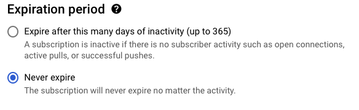
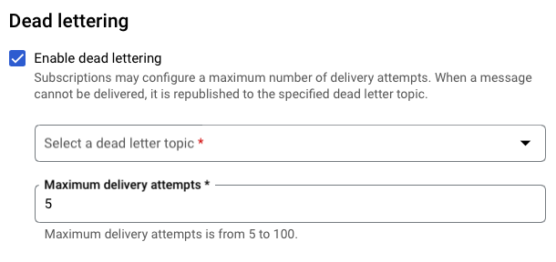

# UnFaaSener
[](https://github.com/ubc-cirrus-lab/unfaasener/actions/workflows/python-app.yml) [](https://github.com/ubc-cirrus-lab/unfaasener/blob/main/LICENSE)

UnFaaSener is a lightweight framework designed to empower serverless developers to decrease their expenses by harnessing non-serverless compute resources.
Whether it's your VMs, on-premise servers, or personal computers, UnFaaSener allows you to make the most of these underutilized resources.

UnFaaSener is not a new serverless platform.
It uses pub/sub services to glue serverless applications and offloading hosts.
UnFaaSener has been thoroughly tested and evaluated on [Google Cloud Functions](https://cloud.google.com/functions).

Our 2023 USENIX ATC paper provides in-depth insights into the design and evaluation of UnFaaSener: 
* [Paper PDF](https://www.usenix.org/system/files/atc23-sadeghian.pdf)
* [Presentation](https://www.youtube.com/watch?v=Yk9N5Ui6oaI)

## Setting Up and Building the Tool

**Before running the setup scripts, review the following notes:**

1. UnFaaSener uses [gcloud CLI](https://cloud.google.com/sdk/docs/install) for collecting serverless logs. 
Make sure you have it installed in your leader host.

2. Ensure that you have [Julia](https://julialang.org/downloads/platform/) installed before running the setup script, as the default solver is implemented in Julia (Our solver has been tested with `julia version 1.9.3`). 
Julia's solver offers superior performance, particularly for larger workflows or a higher number of offloading hosts. 
Nonetheless, you retain the flexibility to switch to the Gekko solver by modifyiing the value of the `solver` field within the [rankerConfig.ini](https://github.com/ubc-cirrus-lab/unfaasener/blob/main/scheduler/rankerConfig.ini) (set `solver = gekko` to use the Gekko solver and `solver = julia` to use the Julia solver).

3. In case of leader failure, the leaderFailure variable in the setup.sh needs to be set to 1 (```leaderFailure=1```) in order to retrieve host logs from the datastore.

Now, you are ready to set up the dependencies for the tool by simply running the following script:

```
./setup.sh 
```
Then, run the following script to build those components that need to be compiled:
```
./build.sh
```

## Deploying the System

To deploy the system, follow these steps:
1. **Giving the required credentials:** To create the necassary credentials for using UnFaaSener, follow the instructions [here](./scheduler/key/).
2. **Adding a new host:** To register a new host to UnFaaSener, you must assign a new Pub/Sub topic to the host and ensure that the host subscribes to this topic. To do this in Google Cloud Functions, follow these steps:
    1. **Create a Pub/Sub Topic:** 
        * Access the Pub/Sub service page on the Google Cloud Console.
        * Navigate to the *Topics* section and click on *CREATE TOPIC*. This topic will serve as the communication channel for the host.
        * The host topics follow the naming pattern `vmTopic+n`, where `n` represents the host number. For example, if you want to add the third host, name the topic as `vmTopic3`.
    2. **Configure the Host Subscription:**
        * To receive messages published to the topic, create a subscription for the host.
        * Go to the *Subscriptions* section and click on *CREATE SUBSCRIPTION*.
        * Provide a unique subscription ID for the host execution agent to use.
        * Select **never expire** for the expiration period if you want the host to be available indefinitely.
            
        * For providing a level of fault tolerance, enable dead lettering while creating the subscription. You need to choose the dead-letter topic for your host subscription, which is assigned to another host. We suggest using a round-robin approach to assign the dead-letter topic for host<sub>i</sub> to the topic of host<sub>(i + 1)%numhosts</sub>.
            
3. **Deployment Script:**
    * To ensure that all functions initially run as serverless functions by default, run [this](./scheduler/resetRoutingDecisions.py) script before running the system. 
    This script resets the routing decisions.
        ```
        python3 ./scheduler/resetRoutingDecisions.py [benchmark name] [number of offloading hosts]
        ``` 
    * Start the system using the [deployment script](./initialDeploy.sh). 
    This script launches the system, prepares the initial state, and starts the host agents.
    To run the script, simply use the following arguments:
        ```
        ./initialDeploy.sh [benchmark name] [number of offloading hosts] [optimization mode (latency/cost)]
        ``` 

## Acknowledgments

This work was supported by the Natural Sciences and Engineering Research Council of Canada (NSERC) and The University of British Columbia (UBC).
We are also thankful for cloud resources made available to us by the Digital Research Alliance of Canada, the Google Cloud Research Credits program, and the AWS Cloud Credit for Research program.

In addition to authors of our paper (Ghazal Sadeghian, Mohamed Elsakhawy, Mohanna Shahrad, Joe Hattori, and Mohammad Shahrad), we acknowledge Parshan Javanrood who played an important role in optimizing UnFaaSener's solver.
