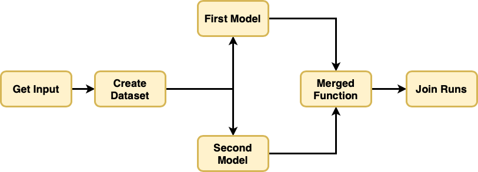
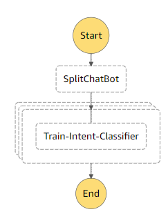
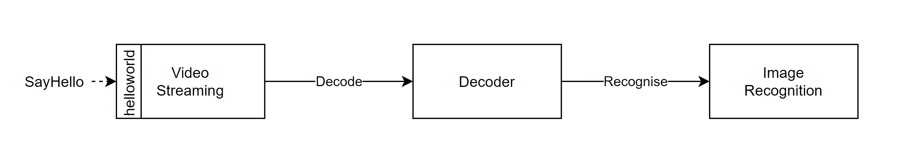

| Benchmark Application  | Language  | Function Dependency Graph | Summary | Original Source |
| ------------- | ----- |:-------------:| --- | --- |
| ImageProcessing | Python |  | [Workflow that performs image processing on the input image.] | [FunctionBench](https://github.com/kmu-bigdata/serverless-faas-workbench) |
| Text2SpeechCensoring | Python |  | [Workflow that turns short text segments into speech and censors any profanities within the text segment.] | [Eismann et al.](https://github.com/SimonEismann/FunctionsAndWorkflows) |
| RegressionTuning | Python |  | A regression problem using [Keras](https://www.tensorflow.org/tutorials/keras/regression), where we try to predict a numerical target y based on a numerical feature x. | [no-ops-machine-learning(Jacopo Tagliabue)](https://github.com/jacopotagliabue/no-ops-machine-learning) |
| ChatBot | Python |  | Trains a one-vs-all classifier for the ChatBots Intent Recognition Dataset, available on [Kaggle](https://www.kaggle.com/datasets/elvinagammed/chatbots-intent-recognition-dataset) | [OSDI '22: Orion](https://github.com/icanforce/Orion-OSDI22) |
| VideoAnalytics | Python |  | Performs object recognition on images generated from a video stream. | [vSwarm](https://github.com/ease-lab/vSwarm/tree/main/benchmarks/video-analytics) |
