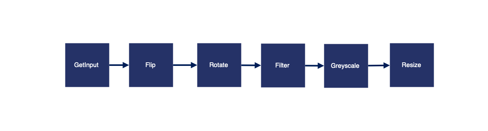

| Benchmark Application  | Language  | Function Dependency Graph | Summary | Original Source |
| ------------- | ----- |:-------------:| --- | --- |
| ImageProcessing | Python |  | [Workflow that performs image processing on the input image.] | [FunctionBench](https://github.com/kmu-bigdata/serverless-faas-workbench) |
| Text2SpeechCensoring | Python |  | [Workflow that turns short text segments into speech and censors any profanities within the text segment.] | [Eismann et al.](https://github.com/SimonEismann/FunctionsAndWorkflows) |
| RegressionTuning | Python |  | A regression problem using [Keras](https://www.tensorflow.org/tutorials/keras/regression), where we try to predict a numerical target y based on a numerical feature x. | [no-ops-machine-learning(Jacopo Tagliabue)](https://github.com/jacopotagliabue/no-ops-machine-learning) |
| VideoAnalytics | Python |  | Performs object recognition on images generated from a video stream. | [vSwarm](https://github.com/ease-lab/vSwarm/tree/main/benchmarks/video-analytics) |
| DNAVisualization | Python |  | Generates an image from DNA file. | [DNAvisualization.org](https://github.com/Benjamin-Lee/DNAvisualization.org) |

The benchmarks have been implemented in four primary categories:

1. All five benchmarks are supported for UnFaaSener with minor modifications to their base codes and are located in their respective subdirectories. 
In these benchmarks, you need to replace `***` with your [Google Cloud Project ID](https://updraftplus.com/faqs/where-do-i-find-my-google-project-id/).
2. All benchmarks have also been implemented for Google Cloud Workflows to facilitate comparison with UnFaaSener's results. You can find these benchmarks under the [gcp_workflows](./gcp_workflows) directory.
3. AWS SNS (Simple Notification Service)'s implementation supports ImageProcessing, RegressionTuning, and VideoAnalytics benchmarks. You can find these under the [aws_SNS](./aws_SNS) directory.
4. Finally, under [aws_step_functions](./aws_step_functions) directory you can find the implementation of ImageProcessing, RegressionTuning, VideoAnalytics, and DNAVisualization benchmarks adapted for AWS Step Functions.

The memory configuration of the functions used in our benchmarks is included [here](./BenhmarksMemoryConfigs.md). For more information on the contents of each benchmark, please refer to their respective directories.