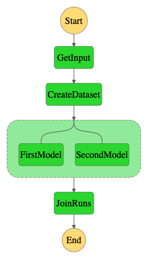

This directory contains the implementation of the RegressionTuning benchmark adapted for AWS Step Functions. The original code that was taken from this [github repository](https://github.com/jacopotagliabue/no-ops-machine-learning) was modified to work with AWS Step Functions.

The subdirectories under the [LambdaFunctions](./LambdaFunctions) folder contain the code of the Lambda functions that participate in the workflow, while the [json file](./state_machine.json) provides the state machine definition.

To use the benchmark, you'll need to edit `state_machine.json` with the appropriate paths/ARNs to the Lambda functions in your AWS account.

Finally, the figure below illustrates the high-level pattern of the state machine.

