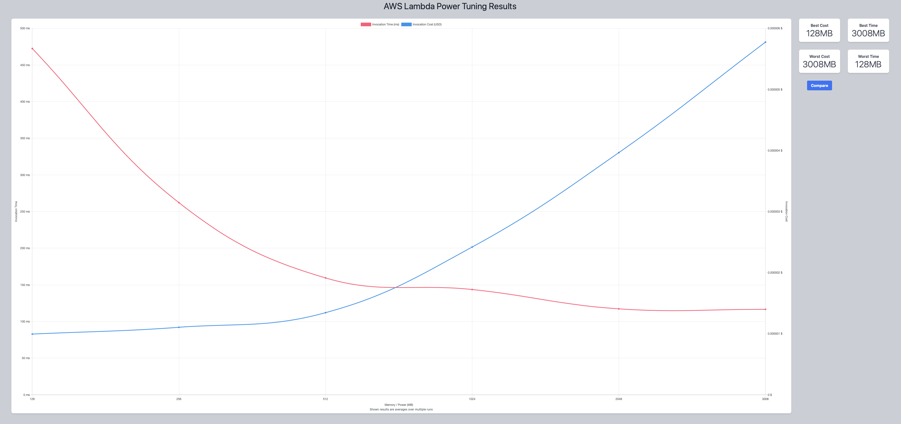
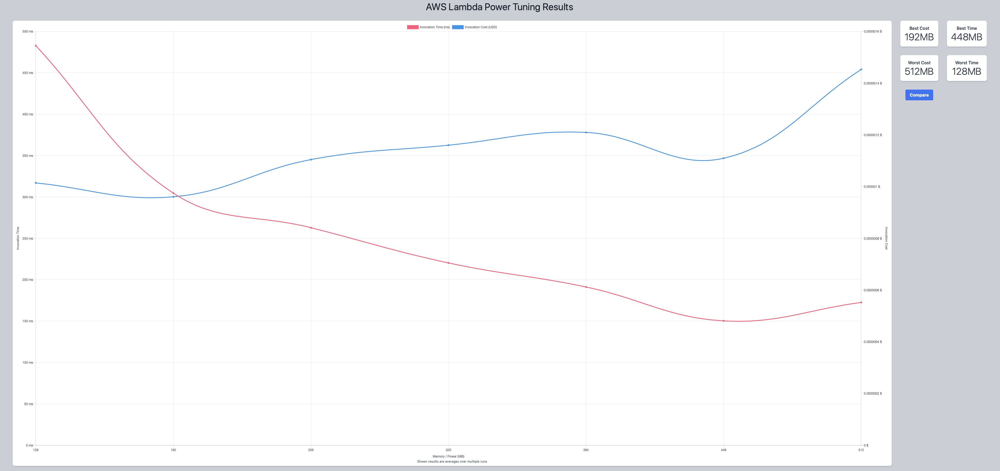
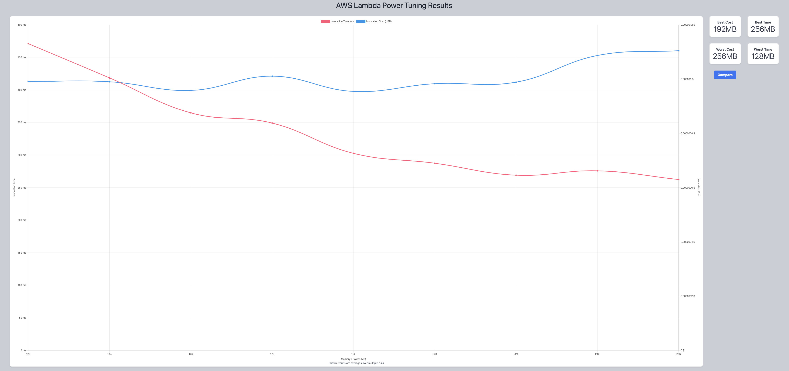
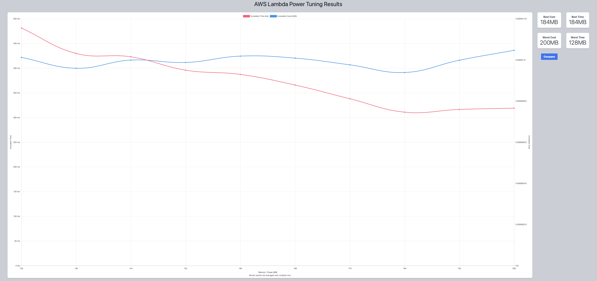
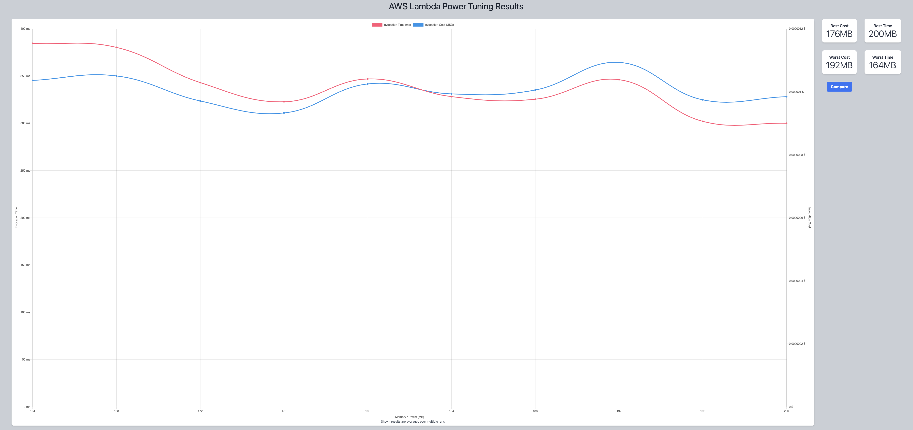
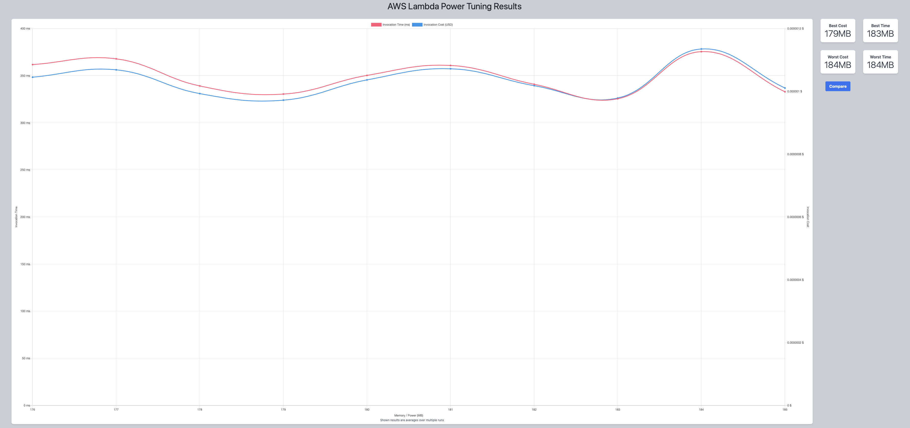

## First Run 
```
{
    "lambdaARN": "arn:aws:lambda:us-east-2:**********:function:ImageProcessingFilter",
    "powerValues": [128, 256, 512, 1024, 2048, 3008],
    "num": 10,
    "payload": "{}",
    "strategy": "cost"
}
```
Result of it is as below: 

```
{
  "power": 128,
  "cost": 9.933e-7,
  "duration": 472.455,
  "stateMachine": {
    "executionCost": 0.0003,
    "lambdaCost": 0.00023786280000000004,
    "visualization": "https://lambda-power-tuning.show/#gAAAAQACAAQACMAL;PTrsQ8YSg0OnbR9Dw5UPQyx56kKnDelC;h1GFNcRBlDV9Y7Q1ilkiNl8JhTbavcE2"
  }
}
```



## Second Run 
```
{
    "lambdaARN": "arn:aws:lambda:us-east-2:**********:function:ImageProcessingFilter",
    "powerValues": [128, 192, 256, 320, 384, 448, 512],
    "num": 10,
    "payload": "{}",
    "strategy": "cost"
}
```
Result of it is as below: 

```
{
  "power": 192,
  "cost": 9.6075e-7,
  "duration": 304.6433333333334,
  "stateMachine": {
    "executionCost": 0.00033,
    "lambdaCost": 0.00010344915,
    "visualization": "https://lambda-power-tuning.show/#gADAAAABQAGAAcABAAI=;w2XxQ1lSmENgbINDp01cQ34xP0PvThZDFI4sQw==;FSOINR7zgDXEQZQ147mbNYpZojUo9pQ1kgvDNQ=="
  }
}
```



## Third Run 
```
{
    "lambdaARN": "arn:aws:lambda:us-east-2:**********:function:ImageProcessingFilter",
    "powerValues": [128, 144, 160, 176, 192, 208, 224, 240, 256],
    "num": 10,
    "payload": "{}",
    "strategy": "cost"
}
```
Result of it is as below: 

```
{
  "power": 192,
  "cost": 9.5445e-7,
  "duration": 302.55333333333334,
  "stateMachine": {
    "executionCost": 0.00038,
    "lambdaCost": 0.0001240357125,
    "visualization": "https://lambda-power-tuning.show/#gACQAKAAsADAANAA4ADwAAAB;14PrQ9ow0UOFW7ZDDoSuQ9RGl0N3p49DKXyGQ7/YiUP5JYND;XwmFNUfchDXtmIA10KSHNacagDXA6IM1Lq+ENXLckTXEQZQ1"
  }
}
```



## Fourth Run 
```
{
    "lambdaARN": "arn:aws:lambda:us-east-2:**********:function:ImageProcessingFilter",
    "powerValues": [128, 136, 144, 152, 160, 168, 176, 184, 192, 200],
    "num": 10,
    "payload": "{}",
    "strategy": "cost"
}
```
Result of it is as below: 

```
{
  "power": 184,
  "cost": 9.388312500000001e-7,
  "duration": 310.865,
  "stateMachine": {
    "executionCost": 0.0004,
    "lambdaCost": 0.00013614103125,
    "visualization": "https://lambda-power-tuning.show/#gACIAJAAmACgAKgAsAC4AMAAyAA=;YKzwQ9rg1kOddtNDUvjFQ1miwUOW3LZDhfuoQ7hum0NxLZ5DhXufQw==;7dqHNQXGgDX6IIY1GouENWWziDWtZYc1P/6CNf4DfDXrBYY1+3yMNQ=="
  }
}
```



## Fifth Run 
```
{
    "lambdaARN": "arn:aws:lambda:us-east-2:**********:function:ImageProcessingFilter",
    "powerValues": [164, 168, 172, 176, 180, 184, 188, 192, 196, 200],
    "num": 10,
    "payload": "{}",
    "strategy": "cost"
}
```
Result of it is as below: 

```
{
  "power": 176,
  "cost": 9.326625e-7,
  "duration": 322.69166666666666,
  "stateMachine": {
    "executionCost": 0.0004,
    "lambdaCost": 0.00013250560312500002,
    "visualization": "https://lambda-power-tuning.show/#pACoAKwAsAC0ALgAvADAAMQAyAA=;RETAQ0sevkMzg6tDiVihQ3FtrUOuF6RDibiiQxsIrUN+AZdDLPmVQw==;7giLNTzyjDXbSYI1FFx6NZuJiTUFTYU17/SGNem0kjXgxYI13h6ENQ=="
  }
}
```



## Sixth Run 
```
{
    "lambdaARN": "arn:aws:lambda:us-east-2:**********:function:ImageProcessingFilter",
    "powerValues": [176, 177, 178, 179, 180, 181, 182, 183, 184, 185],
    "num": 10,
    "payload": "{}",
    "strategy": "cost"
}
```
Result of it is as below: 

```
{
  "power": 179,
  "cost": 9.7205390625e-7,
  "duration": 330.4916666666666,
  "stateMachine": {
    "executionCost": 0.0004,
    "lambdaCost": 0.0001389379359375,
    "visualization": "https://lambda-power-tuning.show/#sACxALIAswC0ALUAtgC3ALgAuQA=;VeW0Q8nvt0O4jqlD7z6lQ7Ekr0MDbbRDAHCqQzPDokPswbtDDnSmQw==;YEuMNRtujzUARIU1hXeCNXsfizWr4Y81P6mINRRegzUFWJg1oaeHNQ=="
  }
}
```



---
**Result**

The best size taken for this lambda function is 179.

---

