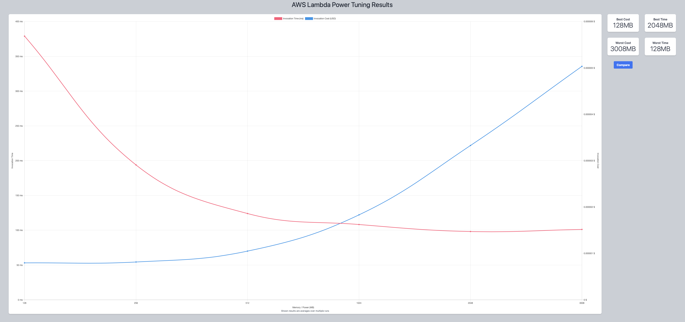
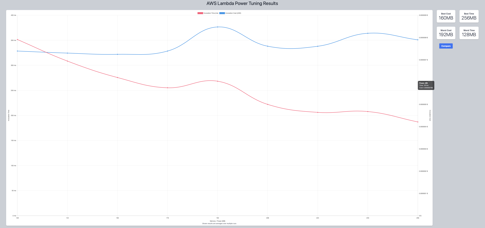
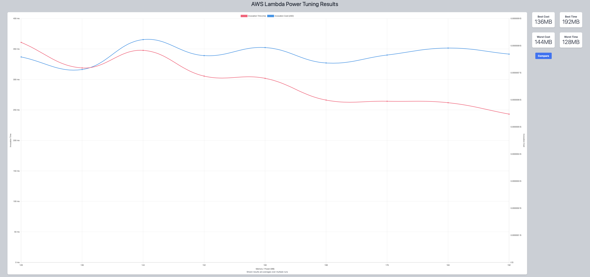
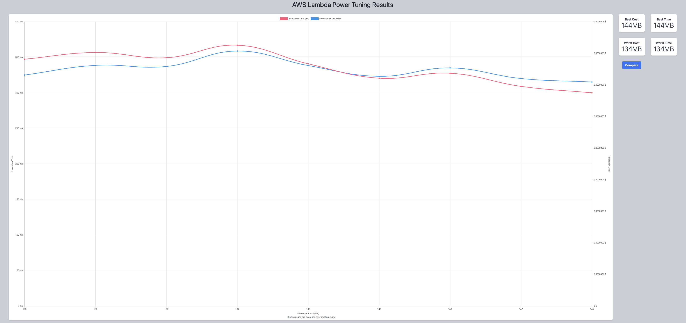
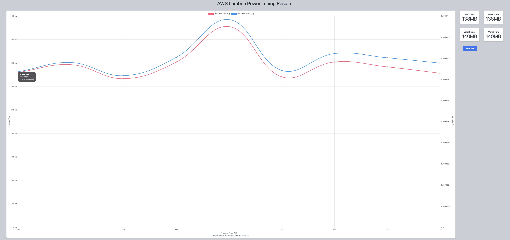

## First Run 
```
{
    "lambdaARN": "arn:aws:lambda:us-east-2:**********:function:ImageProcessingFlip",
    "powerValues": [128, 256, 512, 1024, 2048, 3008],
    "num": 10,
    "payload": "{}",
    "strategy": "cost"
}
```
Result of it is as below: 

```
{
  "power": 128,
  "cost": 7.959000000000001e-7,
  "duration": 378.9916666666666,
  "stateMachine": {
    "executionCost": 0.0003,
    "lambdaCost": 0.0001513722,
    "visualization": "https://lambda-power-tuning.show/#gAAAAQACAAQACMAL;7369QwfaQUOPAvhCbWDYQrw7xEL5RcpC;1aVVNaG4WjW67Yw1jsf1NR47XzYn56g2"
  }
}
```



## Second Run 
```
{
    "lambdaARN": "arn:aws:lambda:us-east-2:**********:function:ImageProcessingFlip",
    "powerValues": [128, 144, 160, 176, 192, 208, 224, 240, 256],
    "num": 10,
    "payload": "{}",
    "strategy": "cost"
}
```
Result of it is as below: 

```
{
  "power": 160,
  "cost": 7.245e-7,
  "duration": 275.66833333333335,
  "stateMachine": {
    "executionCost": 0.00038,
    "lambdaCost": 0.00010102391250000001,
    "visualization": "https://lambda-power-tuning.show/#gACQAKAAsADAANAA4ADwAAAB;jMWvQyJCmkOM1YlDvzh/Q9AphkMKF15D1CZOQxvIT0PQCTtD;cG1GNRT2QzVDe0I1cG1GNXN1YzWqRkw1oDRMNUDZWzXm9FM1"
  }
}
```



## Third Run 
```
{
    "lambdaARN": "arn:aws:lambda:us-east-2:**********:function:ImageProcessingFlip",
    "powerValues": [128, 136, 144, 152, 160, 168, 176, 184, 192],
    "num": 10,
    "payload": "{}",
    "strategy": "cost"
}
```
Result of it is as below: 

```
{
  "power": 136,
  "cost": 7.1176875e-7,
  "duration": 318.9483333333333,
  "stateMachine": {
    "executionCost": 0.00038,
    "lambdaCost": 0.00009564135000000001,
    "visualization": "https://lambda-power-tuning.show/#gACIAJAAmACgAKgAsAC4AMAA;A220Q2N5n0OW3K1DxsKYQwPtlkOJGIVD7CGEQ0/rgkOxJHND;PIBLNWAQPzW4sVw1+dZMNV3NVDX0i0U1SWdNNRhPVDXKUU41"
  }
}
```



## Fourth Run 
```
{
    "lambdaARN": "arn:aws:lambda:us-east-2:**********:function:ImageProcessingFlip",
    "powerValues": [128, 130, 132, 134, 136, 138, 140, 142, 144],
    "num": 10,
    "payload": "{}",
    "strategy": "cost"
}
```
Result of it is as below: 

```
{
  "power": 144,
  "cost": 7.087500000000001e-7,
  "duration": 299.80333333333334,
  "stateMachine": {
    "executionCost": 0.00038,
    "lambdaCost": 0.00010342145625,
    "visualization": "https://lambda-power-tuning.show/#gACCAIQAhgCIAIoAjACOAJAA;3o2tQ8ZCskO/mK5D6GS3Q5ZMqkPsMaBDA62jQ/l1mkPU5pVD;MixENfpjTDU3d0s1s5RYNaU9TDXZFkM1iTtKNVM9QTXuQD41"
  }
}
```



## Fifth Run 
```
{
    "lambdaARN": "arn:aws:lambda:us-east-2:**********:function:ImageProcessingFlip",
    "powerValues": [136, 137, 138, 139, 140, 141, 142, 143, 144],
    "num": 10,
    "payload": "{}",
    "strategy": "cost"
}
```
Result of it is as below: 

```
{
  "power": 138,
  "cost": 7.177078125e-7,
  "duration": 316.585,
  "stateMachine": {
    "executionCost": 0.00038,
    "lambdaCost": 0.00010366348125000002,
    "visualization": "https://lambda-power-tuning.show/#iACJAIoAiwCMAI0AjgCPAJAA;A+2kQ087rUPhSp5DtRGwQxGx1UMwRqBDIhKwQ0/bqkO1IaRD;AqdFNdhcUTWBqEA1jhdYNcXxgzWPVEc1gMFcNQpiVzUTpVA1"
  }
}
```




---
**Result**

The best size taken for this lambda function is 138.

---

