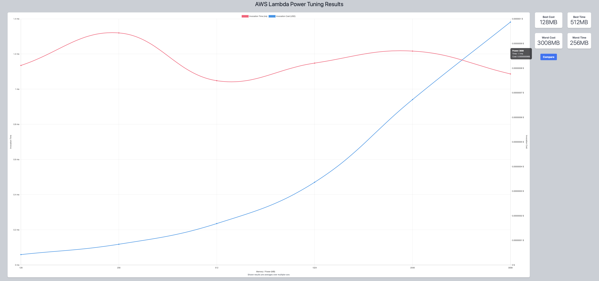
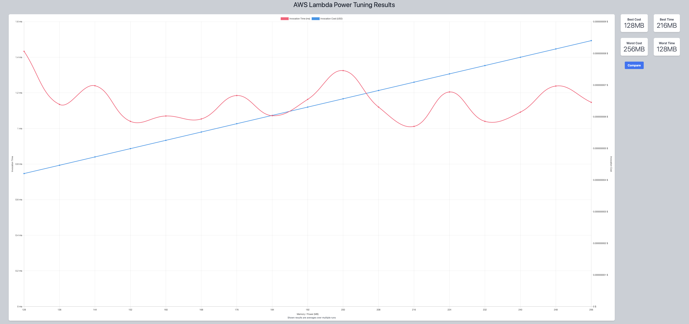
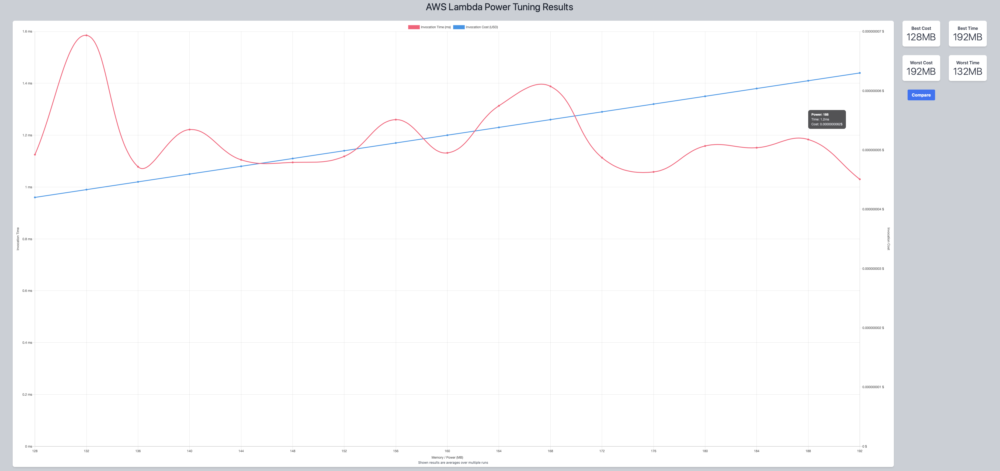
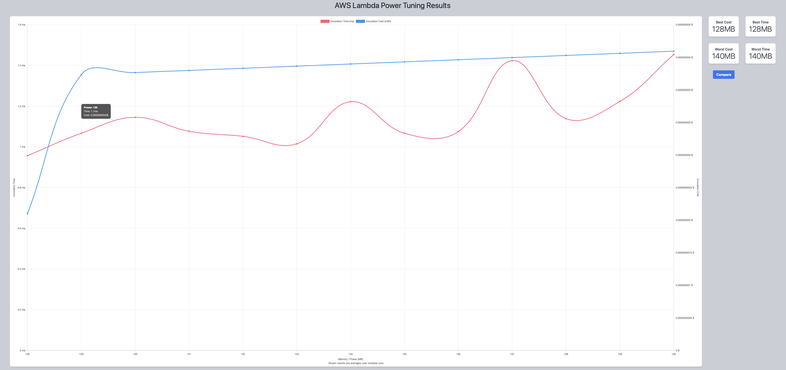
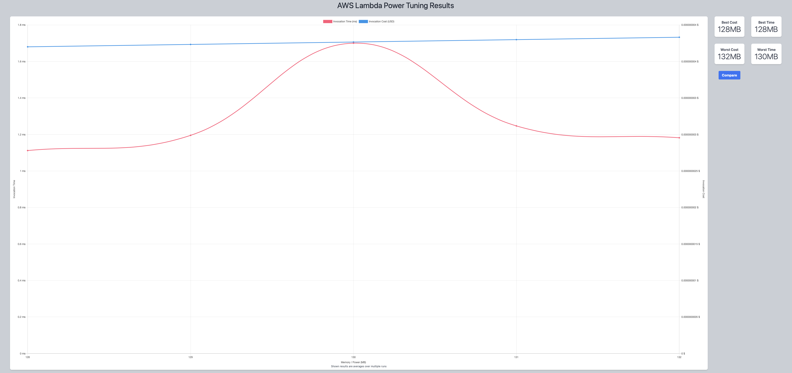

## First Run 
```
{
    "lambdaARN": "arn:aws:lambda:us-east-2:**********:function:ImageProcessingGetInput",
    "powerValues": [128, 256, 512, 1024, 2048, 3008],
    "num": 10,
    "payload": "{}",
    "parallelInvocation": true,
    "strategy": "cost"
}
```
Result of it is as below: 

```
{
  "power": 128,
  "cost": 4.2e-9,
  "duration": 1.135,
  "stateMachine": {
    "executionCost": 0.0003,
    "lambdaCost": 0.0000026313,
    "visualization": "https://lambda-power-tuning.show/#gAAAAQACAAQACMAL;rkeRP8P1qD/JL4Y/lvySP7y7mz/lF4s/;l0+QMZdPEDKXT5Ayl08QM5dPkDPm9NMz"
  }
}
```



## Second Run 
```
{
    "lambdaARN": "arn:aws:lambda:us-east-2:**********:function:ImageProcessingGetInput",
    "powerValues": [128, 136, 144, 152, 160, 168, 176, 184, 192, 200, 208, 216, 224, 232, 240, 248, 256],
    "num": 10,
    "payload": "{}",
    "parallelInvocation": true,
    "strategy": "cost"
}
```
Result of it is as below: 

```
{
  "power": 128,
  "cost": 4.2e-9,
  "duration": 1.4333333333333336,
  "stateMachine": {
    "executionCost": 0.00057,
    "lambdaCost": 0.0000012886125,
    "visualization": "https://lambda-power-tuning.show/#gACIAJAAmACgAKgAsAC4AMAAyADQANgA4ADoAPAA+AAAAQ==;d3e3P65HkT9SuJ4/uB6FP8P1iD+g04Y/FK6XP2AsiT8b6JQ/mpmpPylcjz9LfoE/cT2aP7gehT+8u4s/tYGeP/nFkj8=;l0+QMZFUmTGKWaIxhF6rMX1jtDF2aL0xcG3GMWlyzzFjd9gxXHzhMVaB6jFPhvMxSYv8MSHIAjKeSgcyGs0LMpdPEDI="
  }
}
```



## Third Run 
```
{
    "lambdaARN": "arn:aws:lambda:us-east-2:**********:function:ImageProcessingGetInput",
    "powerValues": [128, 132, 136, 140, 144, 148, 152, 156, 160, 164, 168, 172, 176, 180, 184, 188, 192],
    "num": 10,
    "payload": "{}",
    "parallelInvocation": true,
    "strategy": "cost"
}
```
Result of it is as below: 

```
{
  "power": 128,
  "cost": 4.2e-9,
  "duration": 1.125,
  "stateMachine": {
    "executionCost": 0.00057,
    "lambdaCost": 0.0000011235656249999998,
    "visualization": "https://lambda-power-tuning.show/#gACEAIgAjACQAJQAmACcAKAApACoAKwAsAC0ALgAvADAAA==;AACQP0jhyj/UBoo/k1+cP6RwjT/2KIw/jCWPP65HoT902pA/TxuoP+i0sT+1gY4/d3eHP0RElD/QaZM/d3eXPwrXgz8=;l0+QMRTSlDGRVJkxDdedMYpZojEH3KYxhF6rMQDhrzF9Y7Qx+uW4MXZovTHz6sExcG3GMe3vyjFpcs8x5vTTMWN32DE="
  }
}
```



## Fourth Run 
```
{
    "lambdaARN": "arn:aws:lambda:us-east-2:**********:function:ImageProcessingGetInput",
    "powerValues": [128, 129, 130, 131, 132, 133, 134, 135, 136, 137, 138, 139, 140],
    "num": 10,
    "payload": "{}",
    "parallelInvocation": true,
    "strategy": "cost"
}
```
Result of it is as below: 

```
{
  "power": 128,
  "cost": 2.1e-9,
  "duration": 0.9566666666666667,
  "stateMachine": {
    "executionCost": 0.00047,
    "lambdaCost": 7.339500000000002e-7,
    "visualization": "https://lambda-power-tuning.show/#gACBAIIAgwCEAIUAhgCHAIgAiQCKAIsAjAA=;G+h0P4mIiD9cj5I/N9CJPwOdhj+F64E/k1+cP4mIiD+amYk/yS+2P+i0kT8wlpw/1Aa6Pw==;l08QMTZwkTHWkJIxdbGTMRTSlDGz8pUxUhOXMfEzmDGRVJkxMHWaMc+VmzFutpwxDdedMQ=="
  }
}
```



## Fifth Run 
```
{
    "lambdaARN": "arn:aws:lambda:us-east-2:**********:function:ImageProcessingGetInput",
    "powerValues": [128, 129, 130, 131, 132],
    "num": 10,
    "payload": "{}",
    "parallelInvocation": true,
    "strategy": "cost"
}
```
Result of it is as below: 

```
{
  "power": 128,
  "cost": 4.2e-9,
  "duration": 1.1116666666666668,
  "stateMachine": {
    "executionCost": 0.00028,
    "lambdaCost": 2.9634609375e-7,
    "visualization": "https://lambda-power-tuning.show/#gACBAIIAgwCEAA==;GEuOP8P1mD+amdk/xpKfP9pAlz8=;l0+QMTZwkTHWkJIxdbGTMRTSlDE="
  }
}
```




---
**Result**

The best size taken for this lambda function is 128.

---

