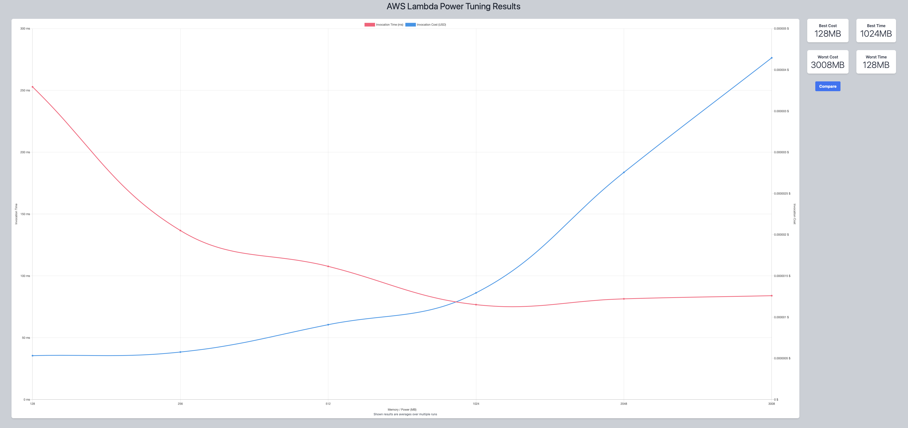
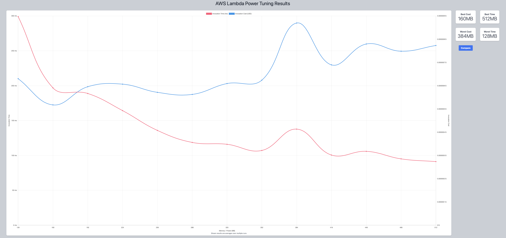
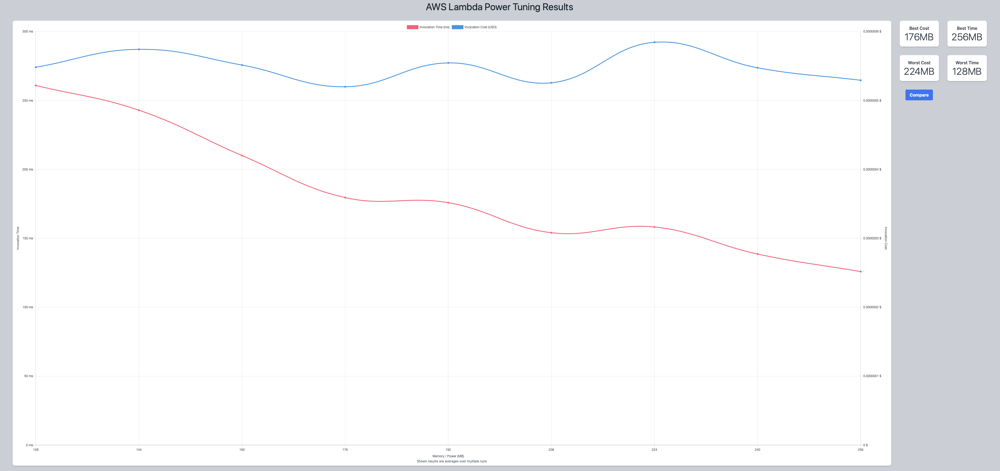
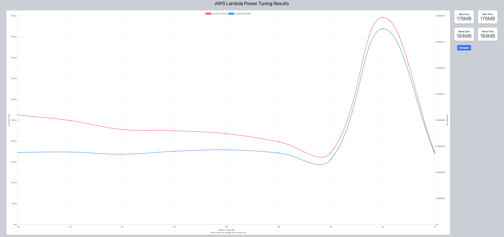
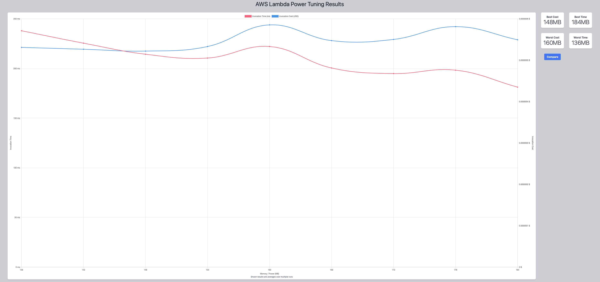
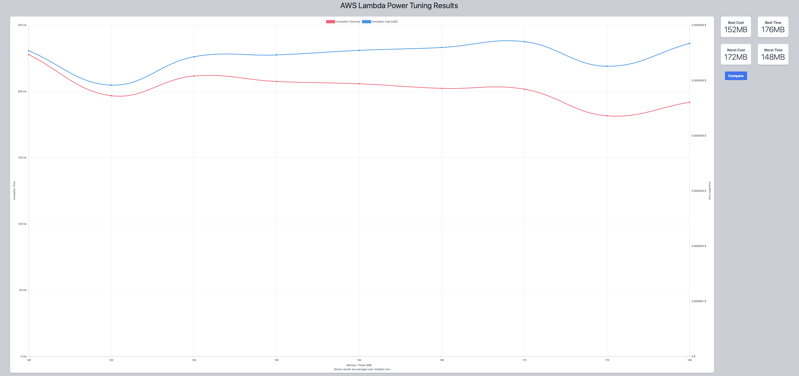
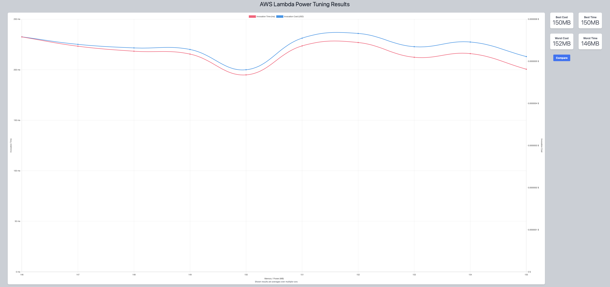

## First Run 
```
{
    "lambdaARN": "arn:aws:lambda:us-east-2:**********:function:ImageProcessingGrayScale",
    "powerValues": [128, 256, 512, 1024, 2048, 3008],
    "num": 10,
    "payload": "{}",
    "strategy": "cost"
}
```
Result of it is as below: 

```
{
  "power": 128,
  "cost": 5.313e-7,
  "duration": 252.87833333333333,
  "stateMachine": {
    "executionCost": 0.0003,
    "lambdaCost": 0.0001295658,
    "visualization": "https://lambda-power-tuning.show/#gAAAAQACAAQACMAL;2uB8Q4WrCEOnTddCsWSZQnG9okLe3adC;qJ4ONTB1GjVPhnM1wp+tNfrlODa3GIs2"
  }
}
```



## Second Run 
```
{
    "lambdaARN": "arn:aws:lambda:us-east-2:**********:function:ImageProcessingGrayScale",
    "powerValues": [128, 160, 192, 224, 256, 288, 320, 352, 384, 416, 448, 480, 512],
    "num": 10,
    "payload": "{}",
    "strategy": "cost"
}
```
Result of it is as below: 

```
{
  "power": 160,
  "cost": 5.17125e-7,
  "duration": 196.83666666666667,
  "stateMachine": {
    "executionCost": 0.00047,
    "lambdaCost": 0.00013126050000000002,
    "visualization": "https://lambda-power-tuning.show/#gACgAMAA4AAAASABQAFgAYABoAHAAeABAAI=;0ImVQzDWREPevTxDNzAkQxTOB0P2KO1CH8XnQgoX1kLUpglDnfbIQimc00Jx/b1C/SK2Qg==;RR0pNY/QCjUk0B81xsUiNZFUGTU+7xY1KXojNVZsJzW3YGk1Dgo5NVgjUTXC0kg1aXJPNQ=="
  }
}
```



## Third Run 
```
{
    "lambdaARN": "arn:aws:lambda:us-east-2:**********:function:ImageProcessingGrayScale",
    "powerValues": [128, 144, 160, 176, 192, 208, 224, 240, 256],
    "num": 10,
    "payload": "{}",
    "strategy": "cost"
}
```
Result of it is as below: 

```
{
  "power": 176,
  "cost": 5.1975e-7,
  "duration": 179.49666666666667,
  "stateMachine": {
    "executionCost": 0.00038,
    "lambdaCost": 0.0000814926,
    "visualization": "https://lambda-power-tuning.show/#gACQAKAAsADAANAA4ADwAAAB;UmiCQ3HdckMp/FFDJn8zQ2PJL0Nx/RlDuB4eQ9SGCkOamftC;JSETNf4aGjWd+RM184QLNRTSFDXOEQ01gtocNQfrEjVZDg41"
  }
}
```



## Fourth Run 
```
{
    "lambdaARN": "arn:aws:lambda:us-east-2:**********:function:ImageProcessingGrayScale",
    "powerValues": [128, 136, 144, 152, 160, 168, 176, 184, 192],
    "num": 10,
    "payload": "{}",
    "strategy": "cost"
}
```
Result of it is as below: 

```
{
  "power": 176,
  "cost": 4.9665e-7,
  "duration": 171.67333333333332,
  "stateMachine": {
    "executionCost": 0.00038,
    "lambdaCost": 0.000091263375,
    "visualization": "https://lambda-power-tuning.show/#gACIAJAAmACgAKgAsAC4AMAA;LDmDQ+H6eEOgs2ND7JFgQ6RwWUO8O0ZDYKwrQ7wr+EPhuixD;xEEUNUEjFTW/lxA1Ep4WNbicGTU0PBM1h1EFNY9eyTWuSBI1"
  }
}
```



## Fifth Run 
```
{
    "lambdaARN": "arn:aws:lambda:us-east-2:**********:function:ImageProcessingGrayScale",
    "powerValues": [136, 142, 148, 154, 160, 166, 172, 178, 184],
    "num": 10,
    "payload": "{}",
    "strategy": "cost"
}
```
Result of it is as below: 

```
{
  "power": 148,
  "cost": 5.22046875e-7,
  "duration": 214.36166666666665,
  "stateMachine": {
    "executionCost": 0.00038,
    "lambdaCost": 0.00009137687343750002,
    "visualization": "https://lambda-power-tuning.show/#iACOAJQAmgCgAKYArACyALgA;Jv9tQyKCYUOWXFZDRIRSQ9ogXkOMhUhD4dpCQ4VLRkO4PjVD;nowONXNVDTXKIgw1rRoPNaoiHTXL8RI197UTNcn/GzVXexM1"
  }
}
```



## Sixth Run 
```
{
    "lambdaARN": "arn:aws:lambda:us-east-2:**********:function:ImageProcessingGrayScale",
    "powerValues": [148, 152, 156, 160, 164, 168, 172, 176, 180],
    "num": 10,
    "payload": "{}",
    "strategy": "cost"
}
```
Result of it is as below: 

```
{
  "power": 152,
  "cost": 4.912687500000001e-7,
  "duration": 196.72500000000002,
  "stateMachine": {
    "executionCost": 0.00038,
    "lambdaCost": 0.000079511971875,
    "visualization": "https://lambda-power-tuning.show/#lACYAJwAoACkAKgArACwALQA;bcBjQ5q5REPGklNDMHZPQwq3TUNtQEpDbaBJQ/KLNUOryj9D;9psUNbvfAzVUphE11pASNQ/JFDXWMRY1ZAMZNc4RDTXxMxg1"
  }
}
```



## Seventh Run 
```
{
    "lambdaARN": "arn:aws:lambda:us-east-2:**********:function:ImageProcessingGrayScale",
    "powerValues": [146, 147, 148, 149, 150, 151, 152, 153, 154, 155],
    "num": 10,
    "payload": "{}",
    "strategy": "cost"
}
```
Result of it is as below: 

```
{
  "power": 150,
  "cost": 4.798828125000001e-7,
  "duration": 194.865,
  "stateMachine": {
    "executionCost": 0.0004,
    "lambdaCost": 0.00007763672109375002,
    "visualization": "https://lambda-power-tuning.show/#kgCTAJQAlQCWAJcAmACZAJoAmwA=;FG5oQ0hBX0M3UFpDWXJXQ3HdQkM6jV9DauNiQ1xPVEMY61dDAIBIQw==;4NAVNfsDETU6vg41LL0NNUzRADUo9hQ1z/QXNciFDzXMfhI1DDUJNQ=="
  }
}
```



---
**Result**

The best size taken for this lambda function is 150.

---

