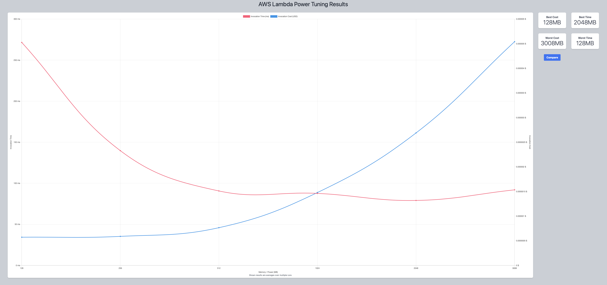
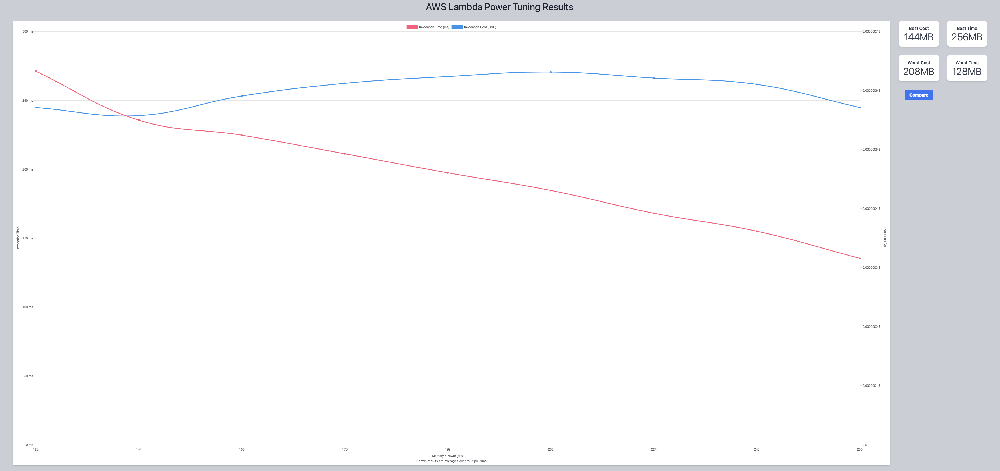
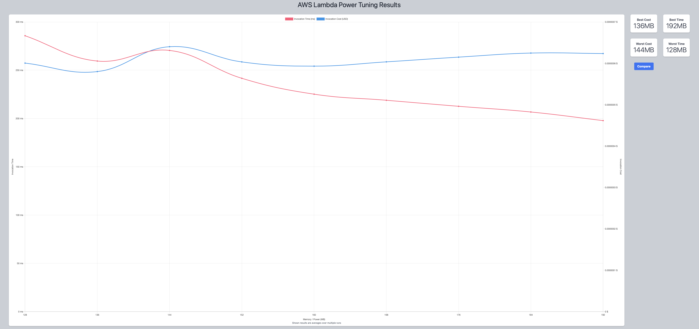
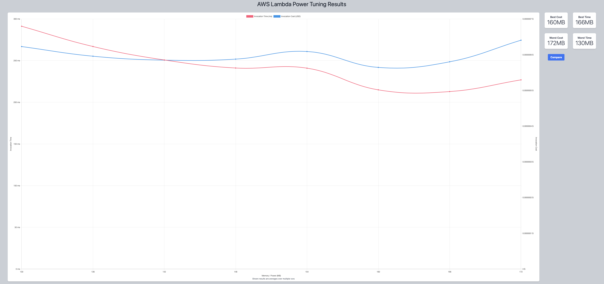
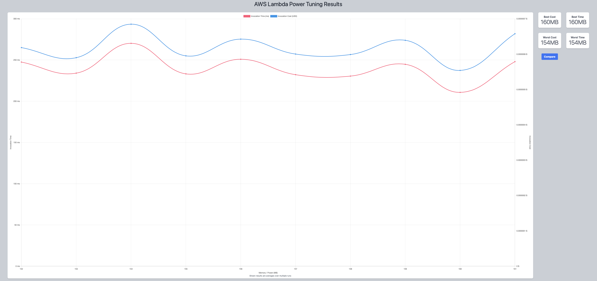

## First Run 
```
{
    "lambdaARN": "arn:aws:lambda:us-east-2:**********:function:ImageProcessingResize",
    "powerValues": [128, 256, 512, 1024, 2048, 3008],
    "num": 10,
    "payload": "{}",
    "strategy": "cost"
}
```
Result of it is as below: 

```
 {
  "power": 128,
  "cost": 5.712e-7,
  "duration": 271.50666666666666,
  "stateMachine": {
    "executionCost": 0.0003,
    "lambdaCost": 0.00014786415,
    "visualization": "https://lambda-power-tuning.show/#gAAAAQACAAQACMAL;2sCHQ6CzC0NxPbVCJj+vQlUVnkKr6rdC;kVQZNQ3XHTUrMU01cG3GNX1jNDYFWJg2"
  }
} 
```



## Second Run 
```
{
    "lambdaARN": "arn:aws:lambda:us-east-2:**********:function:ImageProcessingResize",
    "powerValues": [128, 144, 160, 176, 192, 208, 224, 240, 256],
    "num": 10,
    "payload": "{}",
    "strategy": "cost"
}
```
Result of it is as below: 

```
{
  "power": 144,
  "cost": 5.575500000000001e-7,
  "duration": 235.63833333333332,
  "stateMachine": {
    "executionCost": 0.00038,
    "lambdaCost": 0.0000779564625,
    "visualization": "https://lambda-power-tuning.show/#gACQAKAAsADAANAA4ADwAAAB;ZpaHQ2qja0PNrGBDETFTQ7VhRUPskThDzQwoQzPzGkOuRwdD;kVQZNYuqFTVxix41oVIkNVZsJzV3dyk187cmNVvUIzWRVBk1"
  }
}
```



## Third Run 
```
{
    "lambdaARN": "arn:aws:lambda:us-east-2:**********:function:ImageProcessingResize",
    "powerValues": [128, 136, 144, 152, 160, 168, 176, 184, 192],
    "num": 10,
    "payload": "{}",
    "strategy": "cost"
}
```
Result of it is as below: 

```
{
  "power": 136,
  "cost": 5.80125e-7,
  "duration": 259.54,
  "stateMachine": {
    "executionCost": 0.00038,
    "lambdaCost": 0.00008390248125000001,
    "visualization": "https://lambda-power-tuning.show/#gACIAJAAmACgAKgAsAC4AMAA;yd+OQx/FgUNZQodD8qtxQ3Q6YUNm5lpDG6hUQya/TkPG0kVD;6zghNeO5GzXJ3Cs1WP8hNdQ/HzVdCCI1DhklNYO9JzVWbCc1"
  }
}
```



## Fourth Run 
```
{
    "lambdaARN": "arn:aws:lambda:us-east-2:**********:function:ImageProcessingResize",
    "powerValues": [130, 136, 142, 148, 154, 160, 166, 172, 178, 184],
    "num": 10,
    "payload": "{}",
    "strategy": "cost"
}
```
Result of it is as below: 

```
{
  "power": 160,
  "cost": 5.64375e-7,
  "duration": 214.95166666666668,
  "stateMachine": {
    "executionCost": 0.00035,
    "lambdaCost": 0.000070108565625,
    "visualization": "https://lambda-power-tuning.show/#ggCIAI4AlACaAKAApgCsAA==;aqORQ2B8hUOFy3pDridxQ532cEOg81ZDseRUQ/LrYkM=;NC0nNTPrHzXS9xw1/rsdNWZzIzWOfxc1orcbNVbzKzU="
  }
}
```



## Fifth Run 
```
{
    "lambdaARN": "arn:aws:lambda:us-east-2:**********:function:ImageProcessingResize",
    "powerValues": [132, 136, 140, 144, 148, 152, 156, 160, 164],
    "num": 10,
    "payload": "{}",
    "strategy": "cost"
}
```
Result of it is as below: 

```
{
  "power": 156,
  "cost": 5.502656250000001e-7,
  "duration": 214.49,
  "stateMachine": {
    "executionCost": 0.00038,
    "lambdaCost": 0.000085336846875,
    "visualization": "https://lambda-power-tuning.show/#hACIAIwAkACUAJgAnACgAKQA;gn6JQ83cg0PhSoRDZpaDQ9SGaUN7dHZDcX1WQ502ZEPl12FD;q90fNTUfHjWdYyM1VmwnNR6FGDUxWCU197UTNf9cITUGOyM1"
  }
}
```


## Sixth Run 
```
{
    "lambdaARN": "arn:aws:lambda:us-east-2:**********:function:ImageProcessingResize",
    "powerValues": [152, 153, 154, 155, 156, 157, 158, 159, 160, 161],
    "num": 10,
    "payload": "{}",
    "strategy": "cost"
}
```
Result of it is as below: 

```
{
  "power": 160,
  "cost": 5.538750000000001e-7,
  "duration": 210.74499999999998,
  "stateMachine": {
    "executionCost": 0.0004,
    "lambdaCost": 0.00009123244921875,
    "visualization": "https://lambda-power-tuning.show/#mACZAJoAmwCcAJ0AngCfAKAAoQA=;3n13QzMTakMYG4dDqyppQ/boekOCLmhDB3pmQ4/CdEO4vlJDjwJ4Qw==;jwMmNbVYHjUezDc12bsfNZtxLDV6GiE157wgNf6OKzUArhQ1f40wNQ=="
  }
}
```


---
**Result**

The best size taken for this lambda function is 160.

---

