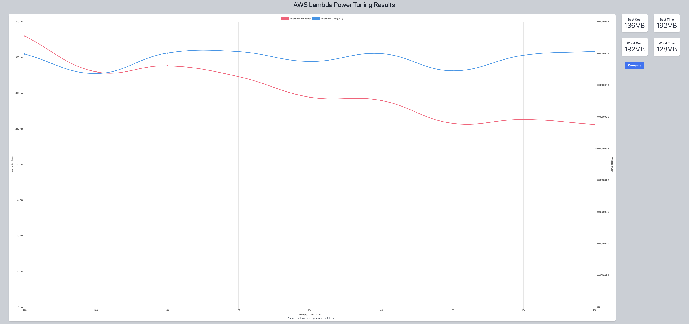

## First Run 
```
{
    "lambdaARN": "arn:aws:lambda:us-east-2:**********:function:ImageProcessingRotate",
    "powerValues": [128, 256, 512, 1024, 2048, 3008],
    "num": 10,
    "payload": "{}",
    "strategy": "cost"
}
```
Result of it is as below: 

```
{
  "power": 128,
  "cost": 7.644e-7,
  "duration": 363.0183333333334,
  "stateMachine": {
    "executionCost": 0.0003,
    "lambdaCost": 0.00017257905,
    "visualization": "https://lambda-power-tuning.show/#gAAAAQACAAQACMAL;WYK1Qw40TEM6jQJDKVzjQpOfzUJL/tpC;KzFNNXgfZzV1sZM144YANhdAaDZ2JrY2"
  }
}
```


## Second Run 
```
{
    "lambdaARN": "arn:aws:lambda:us-east-2:**********:function:ImageProcessingRotate",
    "powerValues": [128, 160, 192, 224, 256, 288, 320, 352, 384, 416, 448, 480, 512],
    "num": 10,
    "payload": "{}",
    "strategy": "cost"
}
```
Result of it is as below: 

```
{
  "power": 224,
  "cost": 7.60725e-7,
  "duration": 206.54833333333332,
  "stateMachine": {
    "executionCost": 0.00047,
    "lambdaCost": 0.00017996159999999998,
    "visualization": "https://lambda-power-tuning.show/#gACgAMAA4AAAASABQAFgAYABoAHAAeABAAI=;7HG3Q5bcn0OPYn9DYIxOQ21AOUOnzTJDYAwiQw70GkMUriFD1IYPQ6TQAkMb6AVD16P2Qg==;GuJONVx8YTVjd1g1oDRMNaizUTU3CWM1sbZlNYZIcDWN+4g1wOiDNUY7gTUdoo01Gs2LNQ=="
  }
}
```


## Third Run 
```
{
    "lambdaARN": "arn:aws:lambda:us-east-2:**********:function:ImageProcessingRotate",
    "powerValues": [128, 144, 160, 176, 192, 208, 224, 240, 256],
    "num": 10,
    "payload": "{}",
    "strategy": "cost"
}
```
Result of it is as below: 

```
{
  "power": 160,
  "cost": 7.5075e-7,
  "duration": 285.625,
  "stateMachine": {
    "executionCost": 0.00038,
    "lambdaCost": 0.00010263828750000002,
    "visualization": "https://lambda-power-tuning.show/#gACQAKAAsADAANAA4ADwAAAB;GIu2Q2PZpkMA0I5D6FSGQ9Bpe0MpnGRDAGBmQ0FnVUMiwkND;ylFONdLQUzUmh0k1/4BQNYUVVTWyxVE1r+FjNcAwYjXg+Vw1"
  }
}
```


## Fourth Run 
```
{
    "lambdaARN": "arn:aws:lambda:us-east-2:**********:function:ImageProcessingRotate",
    "powerValues": [128, 136, 144, 152, 160, 168, 176, 184, 192],
    "num": 10,
    "payload": "{}",
    "strategy": "cost"
}
```
Result of it is as below: 

```
{
  "power": 136,
  "cost": 7.363125000000001e-7,
  "duration": 329.6566666666667,
  "stateMachine": {
    "executionCost": 0.00038,
    "lambdaCost": 0.00009659960625,
    "visualization": "https://lambda-power-tuning.show/#gACIAJAAmACgAKgAsAC4AMAA;pPC9Qw7UpEPlB6lDv3ihQwAQk0PoxJBD2sCAQx91g0OCzn9D;JDZWNQKnRTWS/FY1QDhYNaXeTzVWkFY1S/pHNYoeVTVjd1g1"
  }
}
```



## Fifth Run 
```
{
    "lambdaARN": "arn:aws:lambda:us-east-2:**********:function:ImageProcessingRotate",
    "powerValues": [128, 130, 132, 134, 136, 138, 140, 142, 144],
    "num": 10,
    "payload": "{}",
    "strategy": "cost"
}
```
Result of it is as below: 

```
{
  "power": 144,
  "cost": 7.252875e-7,
  "duration": 306.6666666666667,
  "stateMachine": {
    "executionCost": 0.00038,
    "lambdaCost": 0.000101891409375,
    "visualization": "https://lambda-power-tuning.show/#gACCAIQAhgCIAIoAjACOAJAA;G9i2Q81ctEOW3LpDsZSuQ5Z8rUMbOKxDN7CrQxvoqUNVVZlD;ylFONT2uTjXpalk1a4xONaDVTzXkrFE1+hhUNUWgVDVhsUI1"
  }
}
```


## Sixth Run 
```
{
    "lambdaARN": "arn:aws:lambda:us-east-2:**********:function:ImageProcessingRotate",
    "powerValues": [136, 137, 138, 139, 140, 141, 142, 143, 144, 145],
    "num": 10,
    "payload": "{}",
    "strategy": "cost"
}
```
Result of it is as below: 

```
{
  "power": 136,
  "cost": 7.273875000000001e-7,
  "duration": 325.615,
  "stateMachine": {
    "executionCost": 0.0004,
    "lambdaCost": 0.00011216682421875001,
    "visualization": "https://lambda-power-tuning.show/#iACJAIoAiwCMAI0AjgCPAJAAkQA=;uM6iQ4lIpUMpvKZDd6eyQ7E0qUOuF6dDrhenQyKCqkPNnKdD/UKjQw==;sEFDNYW1RzV0/Uo1HidbNccDUTUbBlA1y39RNQpiVzWFFVU1C9FQNQ=="
  }
}

```


---
**Result**

The best size taken for this lambda function is 136.

---

