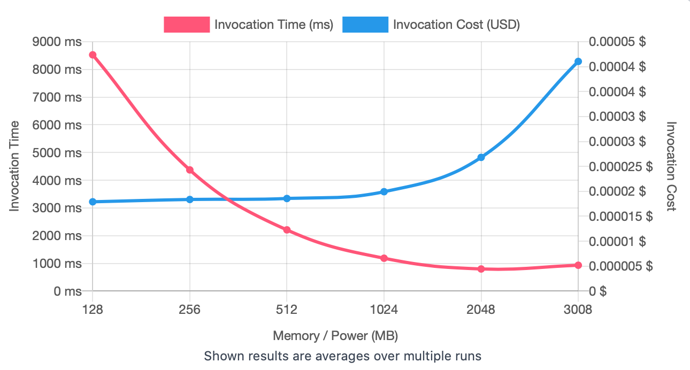
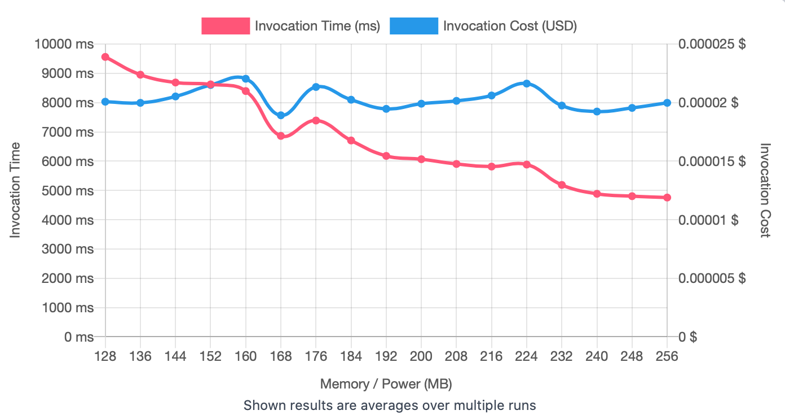
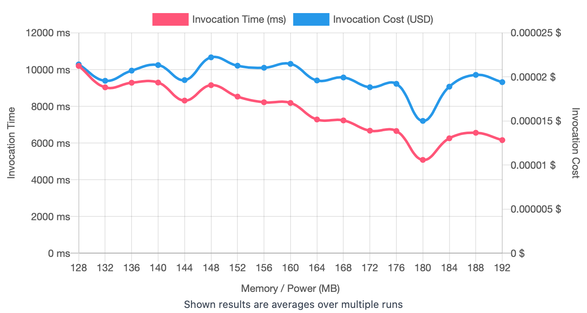
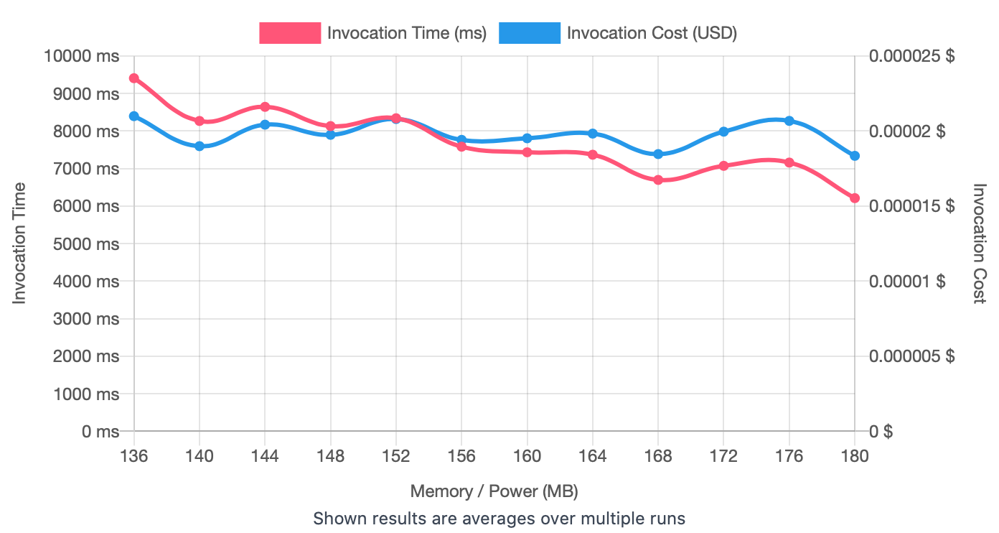
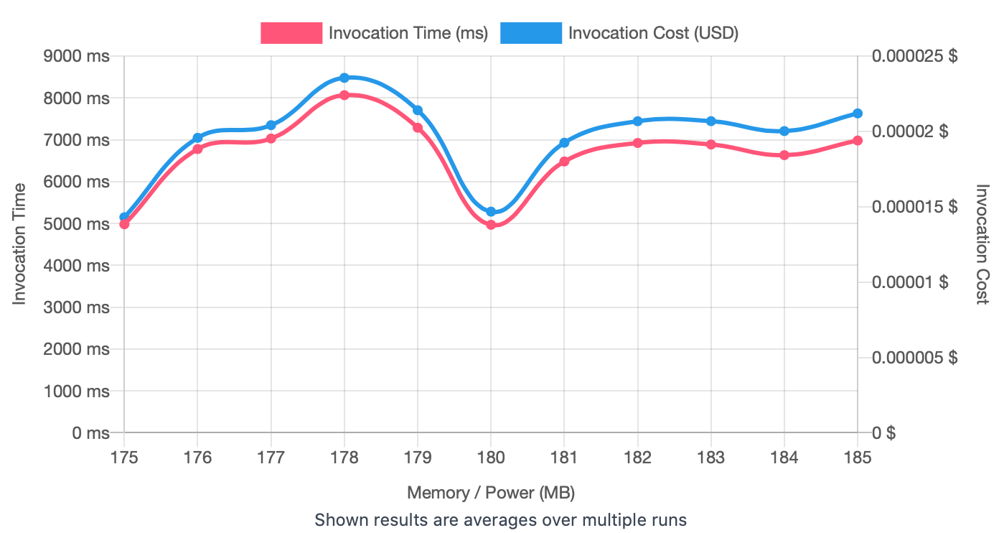

## First Run 
```
{
    "lambdaARN": "arn:aws:lambda:us-east-2:**********:function:ImageProcessingFlip",
    "powerValues": [128, 256, 512, 1024, 2048, 3008],
    "num": 20,
    "payload": "{}",
    "parallelInvocation": true,
    "strategy": "cost"
}
```
Result of it is as below: 

```
{
  "power": 128,
  "cost": 0.0000179046,
  "duration": 8525.678333333333,
  "stateMachine": {
    "executionCost": 0.0003,
    "lambdaCost": 0.0035318629500000007,
    "visualization": "https://lambda-power-tuning.show/#gAAAAQACAAQACMAL;tzYFRrejiEUHEwpFET+URHd3R0QpNGlE;1jGWN/kRmjfjuZs3LySnNw3s4DfjHkE4"
  }
}
```



## Second Run 
```
{
    "lambdaARN": "arn:aws:lambda:us-east-2:**********:function:ImageProcessingFlip",
    "powerValues": [128, 136, 144, 152, 160, 168, 176, 184, 192, 200, 208, 216, 224, 232, 240, 248, 256],
    "num": 20,
    "payload": "{}",
    "parallelInvocation": true,
    "strategy": "cost"
}
```
Result of it is as below: 

```
{
  "power": 168,
  "cost": 0.00001891614375,
  "duration": 6862.004166666666,
  "stateMachine": {
    "executionCost": 0.00057,
    "lambdaCost": 0.0072747604125,
    "visualization": "https://lambda-power-tuning.show/#gACIAJAAmACgAKgAsAC4AMAAyADQANgA4ADoAPAA+AAAAQ==;CV8VRhrmC0Z6uwdGQLoGRiUqA0YJcNZFA93mRZSO0UWHFcFFw469Rbh/uEUfs7VFwdu3RVQeokUMpphF0BuWRTiilEU=;4mioN76XpzfjKKw3pWK0N9TbuDccrp438vOyNxjRqTdNRqM3pvemNzYCqTf/3Kw3i2S1N/ylpTctWqE3TvejN2+Zpzc="
  }
}

```



## Third Run 
```
{
    "lambdaARN": "arn:aws:lambda:us-east-2:**********:function:ImageProcessingFlip",
    "powerValues": [128, 132, 136, 140, 144, 148, 152, 156, 160, 164, 168, 172, 176, 180, 184, 188, 192],
    "num": 20,
    "payload": "{}",
    "parallelInvocation": true,
    "strategy": "cost"
}
```
Result of it is as below: 

```
{
  "power": 180,
  "cost": 0.000015016640625000002,
  "duration": 5084.888333333333,
  "stateMachine": {
    "executionCost": 0.00057,
    "lambdaCost": 0.007170329906250002,
    "visualization": "https://lambda-power-tuning.show/#gACEAIgAjACQAJQAmACcAKAApACoAKwAsAC0ALgAvADAAA==;1GYfRustDUaBGBFGuD8RRjvsAUY3BA9Gs0wFRu57AEZayv9FCq/jRf0Q4kXtktBFfgfQRRvnnkU3oMNFdwXNRSySwEU=;H7izNzknpDdW0603iRyzN6XOpDc9dLo3UHuyN2KLsDeqQbQ3C3OkN/pHpzcJAp43Hj+hN/vvezdJjJ43vMGpNxHaojc="
  }
}

```



## Fourth Run 
```
{
    "lambdaARN": "arn:aws:lambda:us-east-2:**********:function:ImageProcessingFlip",
    "powerValues": [136, 140, 144, 148, 152, 156, 160, 164, 168, 172, 176, 180],
    "num": 20,
    "payload": "{}",
    "parallelInvocation": true,
    "strategy": "cost"
}
```
Result of it is as below: 

```
{
  "power": 180,
  "cost": 0.00001835071875,
  "duration": 6213.039166666666,
  "stateMachine": {
    "executionCost": 0.00045,
    "lambdaCost": 0.0049459176375,
    "visualization": "https://lambda-power-tuning.show/#iACMAJAAlACYAJwAoACkAKgArACwALQA;pQMTRuA3AUZ1FQdGdij+RWxVAkYMB+1FOFjoRSlT5kWxWNFFmAzdRW3K30VQKMJF;6RuwN8pXnzfgWKs3mK2lN8+BrjfM2KI3z72jNy1epjdQ6Zo383OnN416rTfe75k3"
  }
}

```



## Fifth Run 
```
{
    "lambdaARN": "arn:aws:lambda:us-east-2:**********:function:ImageProcessingFlip",
    "powerValues": [175, 176, 177, 178, 179, 180, 181, 182, 183, 184, 185],
    "num": 20,
    "payload": "{}",
    "parallelInvocation": true,
    "strategy": "cost"
}
```
Result of it is as below: 

```
{
  "power": 175,
  "cost": 0.000014300917968750002,
  "duration": 4980.858333333334,
  "stateMachine": {
    "executionCost": 0.00043,
    "lambdaCost": 0.004500621250781251,
    "visualization": "https://lambda-power-tuning.show/#rwCwALEAsgCzALQAtQC2ALcAuAC5AA==;3qabRaDP00W8pdtF9wb8RY+440VVPptFuoHKRVRW2EUkMNdF8j/PRakq2kU=;+u1vN2wtpDd8Oas3OZLFNy2KszcBJHY3d3GhNwVorTfTc603YPGnN1HEsTc="
  }
}
```




---
**Result**

The best size taken for this lambda function is 175.

---

