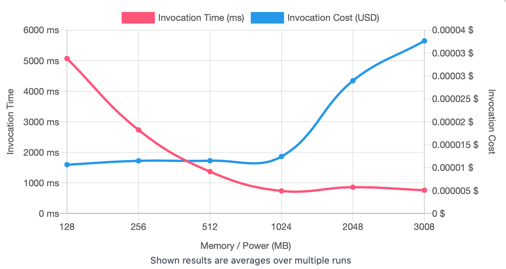
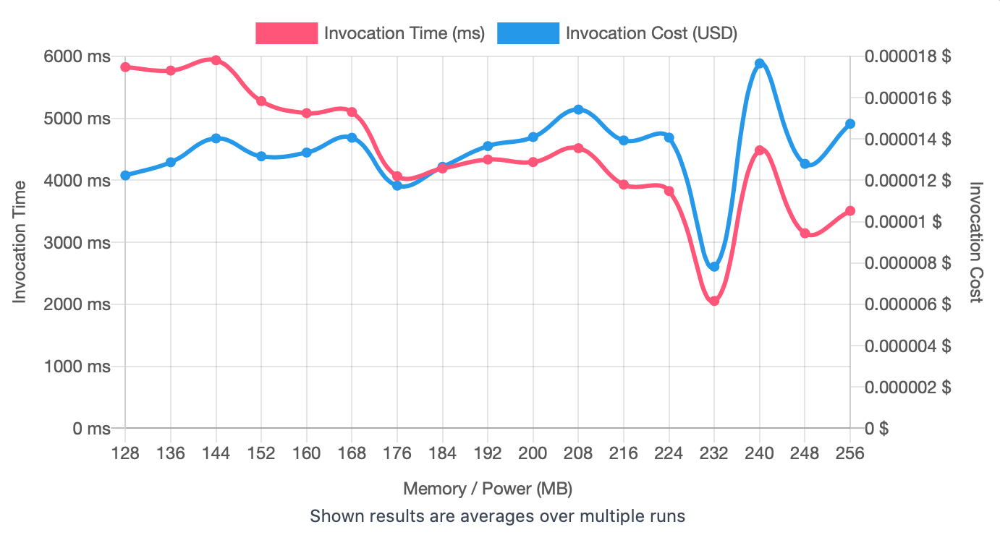
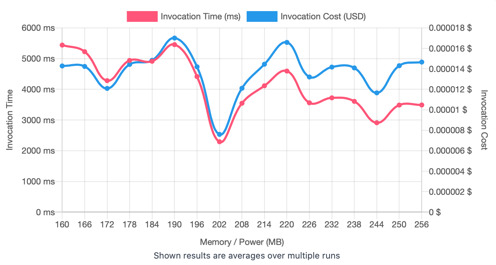
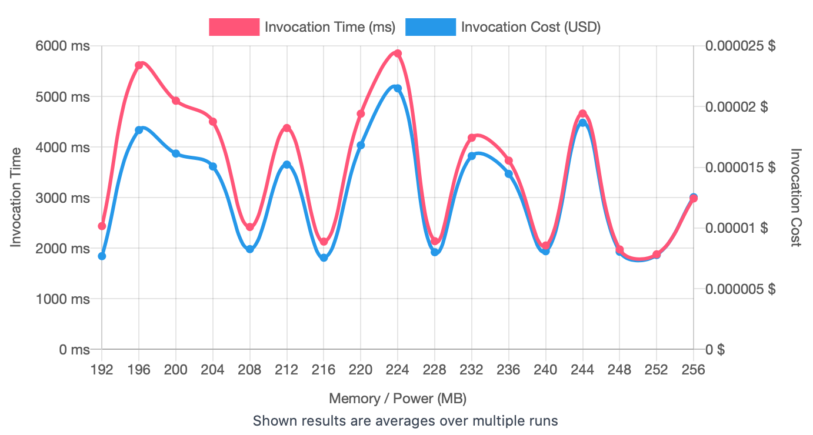
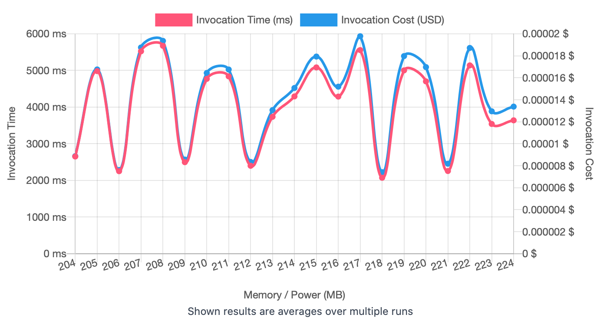

## First Run 
```
{
    "lambdaARN": "arn:aws:lambda:us-east-2:**********:function:ImageProcessingGrayScale",
    "powerValues": [128, 256, 512, 1024, 2048, 3008],
    "num": 20,
    "payload": "{}",
    "parallelInvocation": true,
    "strategy": "cost"
}
```
Result of it is as below: 

```
{
  "power": 128,
  "cost": 0.000010649100000000001,
  "duration": 5070.465000000001,
  "stateMachine": {
    "executionCost": 0.0003,
    "lambdaCost": 0.0032470756500000003,
    "visualization": "https://lambda-power-tuning.show/#gAAAAQACAAQACMAL;uHOeRdf8KkWnVatEIsI4RJZMV0SFkz5E;iakyN1TKQDeQNkE3CZNQNwD28je67h04"
  }
}

```



## Second Run 
```
{
    "lambdaARN": "arn:aws:lambda:us-east-2:**********:function:ImageProcessingGrayScale",
    "powerValues": [128, 136, 144, 152, 160, 168, 176, 184, 192, 200, 208, 216, 224, 232, 240, 248, 256],
    "num": 20,
    "payload": "{}",
    "parallelInvocation": true,
    "strategy": "cost"
}
```
Result of it is as below: 

```
{
  "power": 232,
  "cost": 0.000007821843750000002,
  "duration": 2054.7358333333336,
  "stateMachine": {
    "executionCost": 0.00057,
    "lambdaCost": 0.005190020325000001,
    "visualization": "https://lambda-power-tuning.show/#gACIAJAAmACgAKgAsAC4AMAAyADQANgA4ADoAPAA+AAAAQ==;Bxq2RZhWtEXUkrlFk/akRXHfnkWwbJ9FvyV+RVL8gkUge4dFkTmGRU84jUW8uHVFXEVvRcZrAEXsJYxFA5hERZ1GW0U=;P1VNN1YIWDc0Zms3IN1cN3zmXzd/7Ws3ygVFNxhPVDdiJmU3735sN91jgTcvxmk39BRsN5A6AzfkI5Q30cBWN15Cdzc="
  }
}

```



## Third Run 
```
{
    "lambdaARN": "arn:aws:lambda:us-east-2:**********:function:ImageProcessingGrayScale",
    "powerValues": [160, 166, 172, 178, 184, 190, 196, 202, 208, 214, 220, 226, 232, 238, 244, 250, 256],
    "num": 20,
    "payload": "{}",
    "parallelInvocation": true,
    "strategy": "cost"
}
```
Result of it is as below: 

```
{
  "power": 202,
  "cost": 0.000007599145312500001,
  "duration": 2292.0025,
  "stateMachine": {
    "executionCost": 0.00057,
    "lambdaCost": 0.0052562138343750005,
    "visualization": "https://lambda-power-tuning.show/#oACmAKwAsgC4AL4AxADKANAA1gDcAOIA6ADuAPQA+gAAAQ==;xgmqRR9Qo0U62YVFCnCaRcOSmUVvg6pFmwKKRQpAD0WxuF1FSaWARbqWj0X2ll5FG7BoRR+GYUWF8DVFcQNaRbgwWkU=;rqpvN5zUbjd80Uo3TS5yNxrteDfBsY43NUtuNyn8/jaIIUs3u4FyNy8gizedlF036M5tN8FsbDfdkkM3fhZwN7UPdjc="
  }
}

```



## Fourth Run 
```
{
    "lambdaARN": "arn:aws:lambda:us-east-2:**********:function:ImageProcessingGrayScale",
    "powerValues": [192, 196, 200, 204, 208, 212, 216, 220, 224, 228, 232, 236, 240, 244, 248, 252, 256],
    "num": 20,
    "payload": "{}",
    "parallelInvocation": true,
    "strategy": "cost"
}
```
Result of it is as below: 

```
{
  "power": 216,
  "cost": 0.000007551731250000001,
  "duration": 2130.9883333333332,
  "stateMachine": {
    "executionCost": 0.00057,
    "lambdaCost": 0.004959098025000001,
    "visualization": "https://lambda-power-tuning.show/#wADEAMgAzADQANQA2ADcAOAA5ADoAOwA8AD0APgA/AAAAQ==;alQYRXSIr0XmmJlF2a+MRRg7F0WsvohF0C8FRXeXkUUn07ZFmrkFRWbAgkX2RmlFN1YARYW0kUUOFPdEDurqRIKDOkU=;D9gANxyLlzdBUIc3/Mp8N+qMCjeVWn834WT9NkEQjTcbYLQ38kwGN5qfhTc2fnI3FrAHNyiWnDde9AY3LGcCNwFWUjc="
  }
}

```



## Fifth Run 
```
{
    "lambdaARN": "arn:aws:lambda:us-east-2:**********:function:ImageProcessingGrayScale",
    "powerValues": [204, 205, 206, 207, 208, 209, 210, 211, 212, 213, 214, 215, 216, 217, 218, 219, 220, 221, 222, 223, 224],
    "num": 20,
    "payload": "{}",
    "parallelInvocation": true,
    "strategy": "cost"
}
```
Result of it is as below: 

```
{
  "power": 218,
  "cost": 0.000007410637500000002,
  "duration": 2071.379166666667,
  "stateMachine": {
    "executionCost": 0.00068,
    "lambdaCost": 0.0064952117671875,
    "visualization": "https://lambda-power-tuning.show/#zADNAM4AzwDQANEA0gDTANQA1QDWANcA2ADZANoA2wDcAN0A3gDfAOAA;Jq8lRRi2m0UiowxFVJisRd5DsUUw/xtF/ROVRaQ4l0U96xVFY3xpRTcjhkUH3p5FkfaFRVWkrUURdgFFqVWcRTzskkWd+QxFHZagRUQ4XUVEdWNF;YdsUNyyWjDdyRf82116dN2Flojexlg83cuOJN3yMjDdN/Qs3PglbN7PffDfcbpY3YuF+N131pTfkqPg2W8qWN41djjfQOwk34gKdN+9JWTfHbWA3"
  }
}

```



---
**Result**

The best size taken for this lambda function is 218.

---

