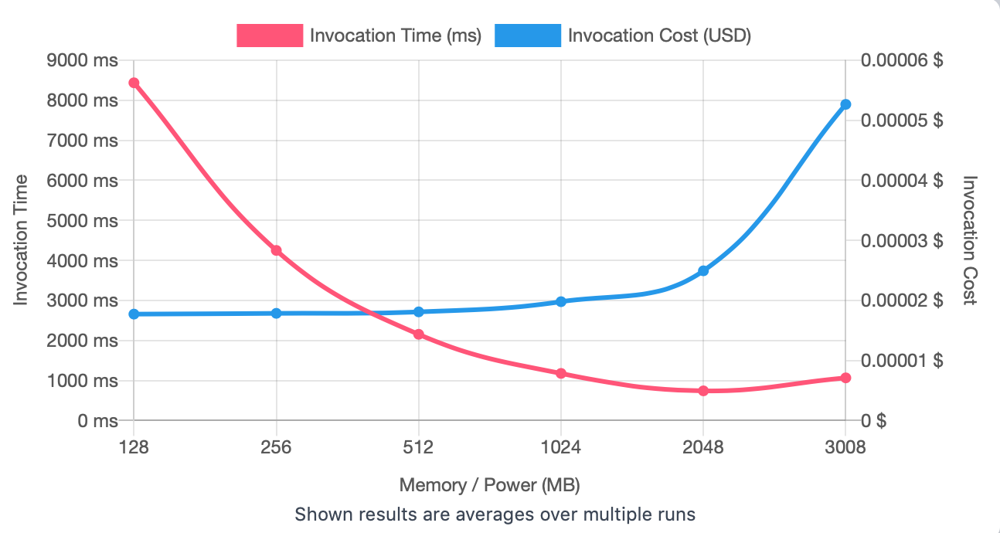
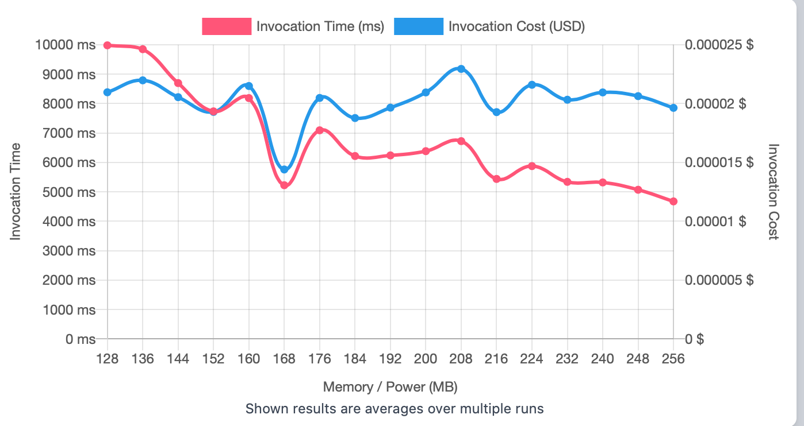
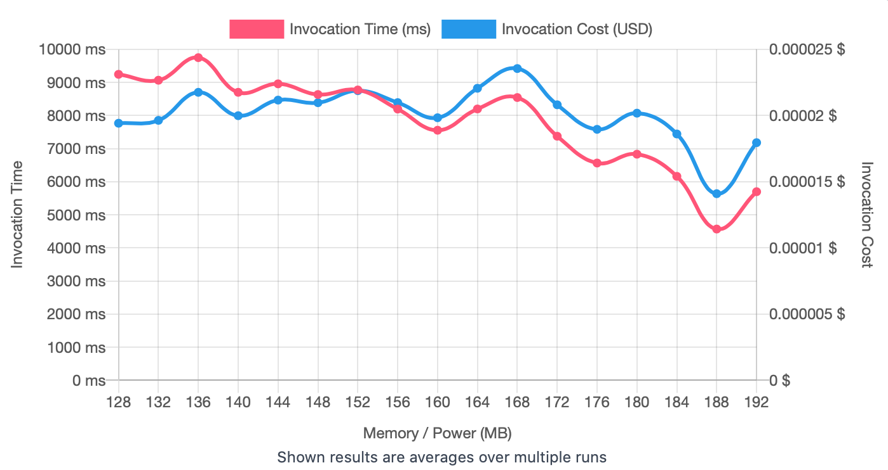
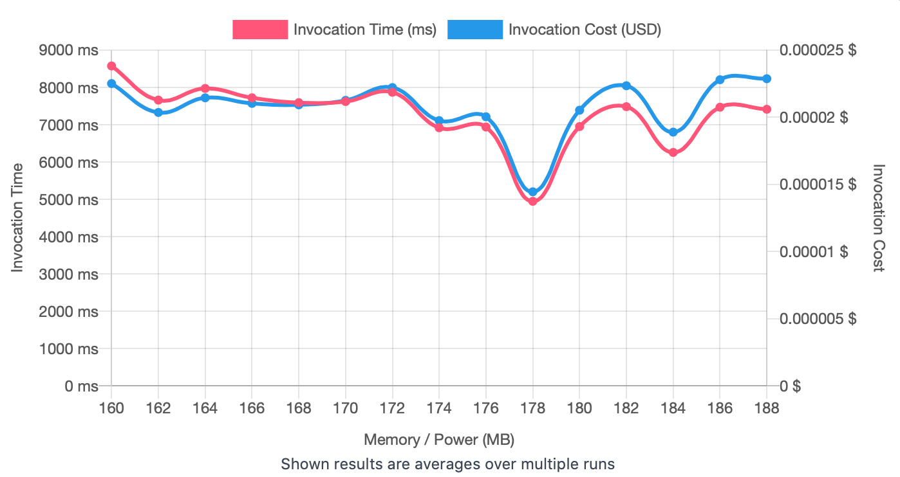
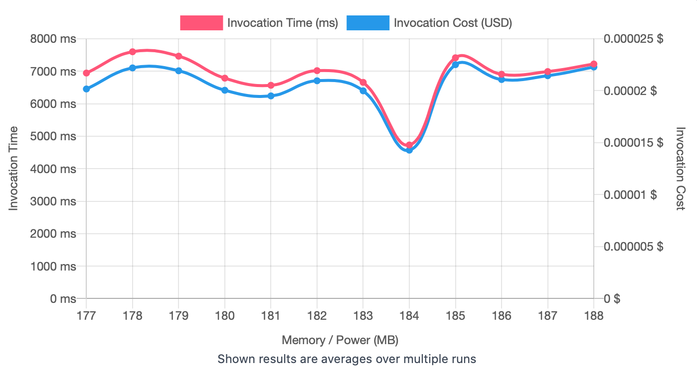

## First Run 
```
{
    "lambdaARN": "arn:aws:lambda:us-east-2:**********:function:ImageProcessingRotate",
    "powerValues": [128, 256, 512, 1024, 2048, 3008],
    "num": 20,
    "payload": "{}",
    "parallelInvocation": true,
    "strategy": "cost"
}
```
Result of it is as below: 

```
{
  "power": 128,
  "cost": 0.000017719800000000003,
  "duration": 8437.4,
  "stateMachine": {
    "executionCost": 0.0003,
    "lambdaCost": 0.00345259635,
    "visualization": "https://lambda-power-tuning.show/#gAAAAQACAAQACMAL;mtUDRlTPhEXymwZFVSuTRDdQOUTlSYVE;+6SUN5W8lTe2x5c3jwOmN1gj0Tdv21w4"
  }
}
```



## Second Run 
```
{
    "lambdaARN": "arn:aws:lambda:us-east-2:**********:function:ImageProcessingRotate",
    "powerValues": [128, 136, 144, 152, 160, 168, 176, 184, 192, 200, 208, 216, 224, 232, 240, 248, 256],
    "num": 20,
    "payload": "{}",
    "parallelInvocation": true,
    "strategy": "cost"
}
```
Result of it is as below: 

```
{
  "power": 168,
  "cost": 0.000014404162500000003,
  "duration": 5225.589166666668,
  "stateMachine": {
    "executionCost": 0.00057,
    "lambdaCost": 0.00730311435,
    "visualization": "https://lambda-power-tuning.show/#gACIAJAAmACgAKgAsAC4AMAAyADQANgA4ADoAPAA+AAAAQ==;5/QbRvflGUYW5wdGqcTxRYXi/0W3TKNFvKbdRTpTwkX++8JFgoTHRQMh0kVB+KlFUKK3RcHhpkW8QaZFZXqeRTcckkU=;+9evN/5cuDeyYKw33NmhN5RStDdoqXE3sc6rNwN8nTfw4qQ3dr+vN72CwDcxt6E3TC21N5aIqjffwK83+hytN9y+pDc="
  }
}
```



## Third Run 
```
{
    "lambdaARN": "arn:aws:lambda:us-east-2:**********:function:ImageProcessingRotate",
    "powerValues": [160, 166, 172, 178, 184, 190, 196, 202, 208, 214, 220, 226, 232, 238, 244, 250, 256],
    "num": 20,
    "payload": "{}",
    "parallelInvocation": true,
    "strategy": "cost"
}
```
Result of it is as below: 

```
{
  "power": 188,
  "cost": 0.000014098678125000002,
  "duration": 4570.769166666667,
  "stateMachine": {
    "executionCost": 0.00057,
    "lambdaCost": 0.0071275305937500005,
    "visualization": "https://lambda-power-tuning.show/#gACEAIgAjACQAJQAmACcAKAApACoAKwAsAC0ALgAvADAAA==;wXwQRpywDUbBWxhGCfwHRkEADEa69QZG2xsJRucWAEY9JuxFLCIARtiFBUZeheZF4TXNRY+N1UVPpMBFJ9aORVkZskU=;2umiN7HApDehgrY3frSnNwKXsTeh8a83pZC3N/oBsDfnZ6Y3+hm5N8qXxTcboK43CxGfN8dLqTfyHZw3XYlsNxKeljc="
  }
}

```



## Fourth Run 
```
{
    "lambdaARN": "arn:aws:lambda:us-east-2:**********:function:ImageProcessingRotate",
    "powerValues": [160, 162, 164, 166, 168, 170, 172, 174, 176, 178, 180, 182, 184, 186, 188],
    "num": 20,
    "payload": "{}",
    "parallelInvocation": true,
    "strategy": "cost"
}
```
Result of it is as below: 

```
{
  "power": 178,
  "cost": 0.000014455546875000002,
  "duration": 4949.150833333332,
  "stateMachine": {
    "executionCost": 0.00053,
    "lambdaCost": 0.0065748692296875005,
    "visualization": "https://lambda-power-tuning.show/#oACiAKQApgCoAKoArACuALAAsgC0ALYAuAC6ALwA;9f4FRhhm70XVJ/lFal7xRdVE7UWfNe5FYfn1RZ862EVX29hFNamaRY8+2UXV5+lFvJrDRb916UVQvedF;J9i8N/7NqjeU9LM3G3awN/uOrzezWbI3xle6N1W2pTf2Gag3GoZyNxw4rDe1e7s3zoWeN9A+vzfz4L83"
  }
}

```



## Fifth Run 
```
{
    "lambdaARN": "arn:aws:lambda:us-east-2:**********:function:ImageProcessingRotate",
    "powerValues": [177, 178, 179, 180, 181, 182, 183, 184, 185, 186, 187, 188],
    "num": 20,
    "payload": "{}",
    "parallelInvocation": true,
    "strategy": "cost"
}
```
Result of it is as below: 

```
{
  "power": 184,
  "cost": 0.000014281706250000001,
  "duration": 4730.014166666667,
  "stateMachine": {
    "executionCost": 0.00045,
    "lambdaCost": 0.005112447965625,
    "visualization": "https://lambda-power-tuning.show/#sQCyALMAtAC1ALYAtwC4ALkAugC7ALwA;tQjZRVmF7UV5ROlFgiHURTU7zUUbWNtF1Q/QRR3Qk0Uiv+dFJNvXRfd12kUxuuFF;5DOpN1Q0ujdw5rc3ZS6oN0ScozcC1q83Wa+nN3abbzcb0bw3X9WwN5jrszc26bo3"
  }
}

```




---
**Result**

The best size taken for this lambda function is 184.

---

