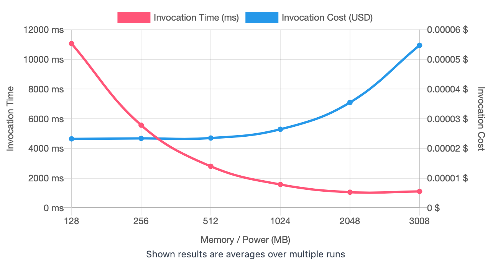
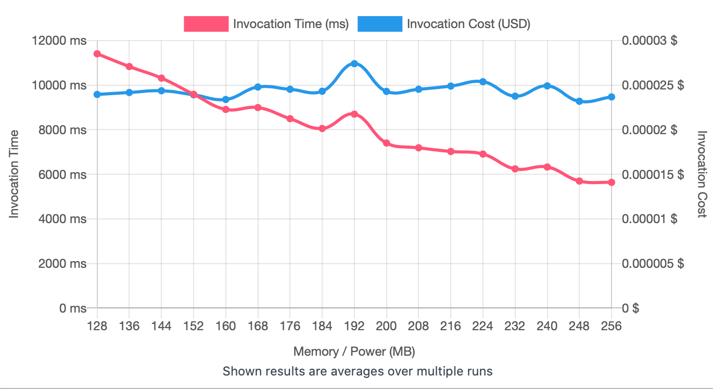
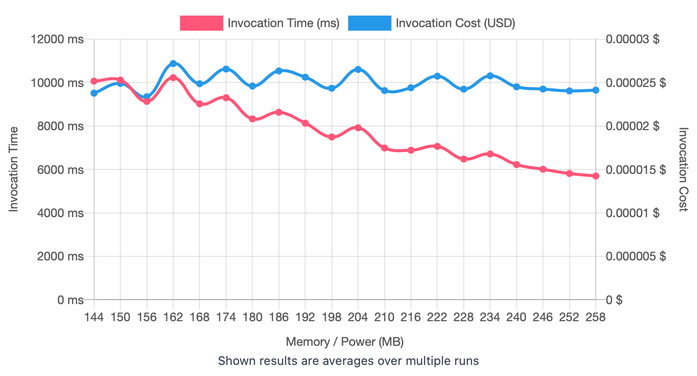
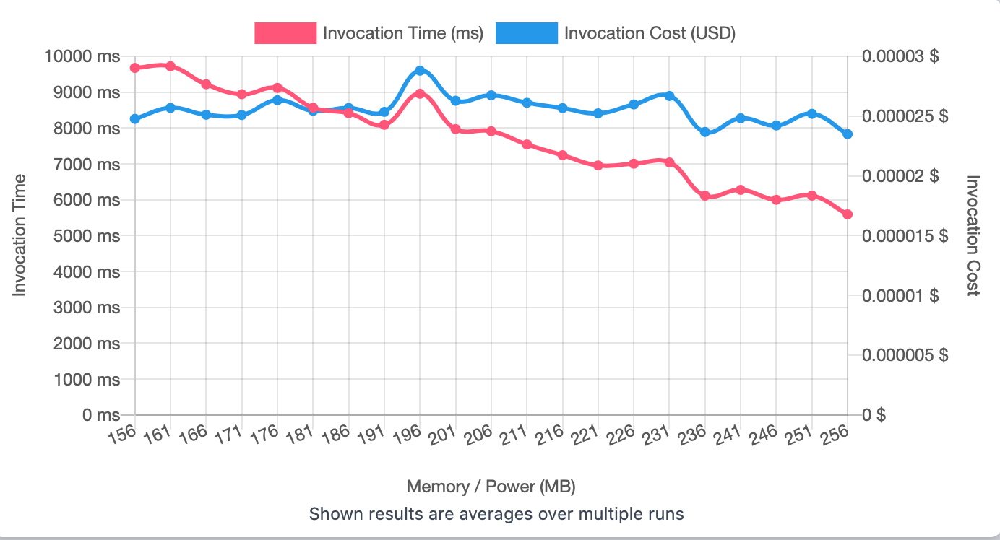
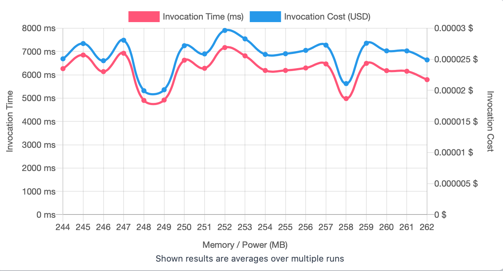

## First Run 
```
{
    "lambdaARN": "arn:aws:lambda:us-east-2:**********:function:ImageProcessingFilter",
    "powerValues": [128, 256, 512, 1024, 2048, 3008],
    "num": 20,
    "payload": "{}",
    "parallelInvocation": true,
    "strategy": "cost"
}
```
Result of it is as below: 

```
{
  "power": 128,
  "cost": 0.000023247000000000003,
  "duration": 11069.559166666666,
  "stateMachine": {
    "executionCost": 0.0003,
    "lambdaCost": 0.0043612548000000004,
    "visualization": "https://lambda-power-tuning.show/#gAAAAQACAAQACMAL;PfYsRugmrkUsCy9FZhzFRM0ehERZqopE;jQLDN0pZxDfbXsU3kz7eNyj2FDj3wWU4"
  }
}

```



## Second Run 
```
{
    "lambdaARN": "arn:aws:lambda:us-east-2:**********:function:ImageProcessingFilter",
    "powerValues": [128, 136, 144, 152, 160, 168, 176, 184, 192, 200, 208, 216, 224, 232, 240, 248, 256],
    "num": 20,
    "payload": "{}",
    "parallelInvocation": true,
    "strategy": "cost"
}
```
Result of it is as below: 

```
{
  "power": 248,
  "cost": 0.00002318780625,
  "duration": 5698.316666666666,
  "stateMachine": {
    "executionCost": 0.00057,
    "lambdaCost": 0.00861054140625,
    "visualization": "https://lambda-power-tuning.show/#gACIAJAAmACgAKgAsAC4AMAAyADQANgA4ADoAPAA+AAAAQ==;Cj8yRlRJKUZgMiFGSdgVRqQ8C0ZhiQxGmcMERmW/+0UE7AdGkWDnRWaw4EWrh9tFUt/XRU8Yw0UxwsVFiRKyRWM0sEU=;1vbIN7HMyjeUdsw3kKLINzw+xDds+c83s9DNN8MAzDfK4+U30tLLN7jZzTdF1dA39PXUN5Rdxzc7DNE3b4PCN5Osxjc="
  }
}
```



## Third Run 
```
{
    "lambdaARN": "arn:aws:lambda:us-east-2:**********:function:ImageProcessingFilter",
    "powerValues": [144, 150, 156, 162, 168, 174, 180, 186, 192, 198, 204, 210, 216, 222, 228, 234, 240, 246, 252, 258],
    "num": 20,
    "payload": "{}",
    "parallelInvocation": true,
    "strategy": "cost"
}
```
Result of it is as below: 

```
{
  "power": 156,
  "cost": 0.000023382450000000002,
  "duration": 9135.924166666668,
  "stateMachine": {
    "executionCost": 0.00065,
    "lambdaCost": 0.010529248668750001,
    "visualization": "https://lambda-power-tuning.show/#kACWAJwAogCoAK4AtAC6AMAAxgDMANIA2ADeAOQA6gDwAPYA/AACAQ==;2FUdRmceHkayvw5GvdgfRtYBDUZ/ZRFGfy0CRlzqBkYbMP5FZkbqRaKQ90VPftpFSTzXRffd3EVylcpFxt/RReyWwkV91btFxMW1RdkoskU=;cZHHN2nq0DduJcQ3jBrkN/6q0Dd02d43xmfON7cK3TfO9dY30krMN3Nx3jcTFMo3rsLMN6Ly1zd+bcs34UjYN8CtzTf/gcs3QL7JN5Z2yjc="
  }
}

```



## Fourth Run 
```
{
    "lambdaARN": "arn:aws:lambda:us-east-2:**********:function:ImageProcessingFilter",
    "powerValues": [156, 161, 166, 171, 176, 181, 186, 191, 196, 201, 206, 211, 216, 221, 226, 231, 236, 241, 246, 251, 256],
    "num": 20,
    "payload": "{}",
    "parallelInvocation": true,
    "strategy": "cost"
}
```
Result of it is as below: 

```
{
  "power": 256,
  "cost": 0.0000234948,
  "duration": 5593.240833333333,
  "stateMachine": {
    "executionCost": 0.00068,
    "lambdaCost": 0.011526674446875001,
    "visualization": "https://lambda-power-tuning.show/#nAChAKYAqwCwALUAugC/AMQAyQDOANMA2ADdAOIA5wDsAPEA9gD7AAAB;vzEXRhbqF0bMEBBG8bkLRnN2DkaF3QVGA3kDRm3V/EVD7wtGGhb5RTo590XsuOtFyFLiRXZx2UVc59pFqwLcRQcJv0VvHMRFpnm7Rdwhv0Xtya5F;4sLPN4Vw1zddqdI34HbSN2/b3DdObtU3BGnXNxqv1DetlfE373/cN+dP4Df6Eds3SFDXN+eo0zcU4dk3E9jfN56UxjcyKdA3qSLLN0lO0zezFsU3"
  }
}

```



## Fifth Run 
```
{
    "lambdaARN": "arn:aws:lambda:us-east-2:**********:function:ImageProcessingFilter",
    "powerValues": [244, 245, 246, 247, 248, 249, 250, 251, 252, 253, 254, 255, 256, 257, 258, 259, 260, 261, 262],
    "num": 20,
    "payload": "{}",
    "parallelInvocation": true,
    "strategy": "cost"
}
```
Result of it is as below: 

```
{
  "power": 248,
  "cost": 0.0000199450125,
  "duration": 4901.751666666667,
  "stateMachine": {
    "executionCost": 0.00063,
    "lambdaCost": 0.010460896523437499,
    "visualization": "https://lambda-power-tuning.show/#9AD1APYA9wD4APkA+gD7APwA/QD+AP8AAAEBAQIBAwEEAQUBBgE=;XM3DRWwT1kWW079FE3nYRQMumUWwv5lFDCnPRd5PxEWJHeBFH//URStlwUWKdsFFOLvERQ4rykVNsJtFNefKRSAkwUWfUMBFrgm1RQ==;lWrSN/4A5zdj188304HrN5dPpzc1mqg3Sx3kN20B2TefvPg3BFTtNyhZ2DctRdk3V9LdN6zX5Dfz7rA3dHHnNy8s3TffFt03ZevQNw=="
  }
}

```



---
**Result**

The best size taken for this lambda function is 248.

---

