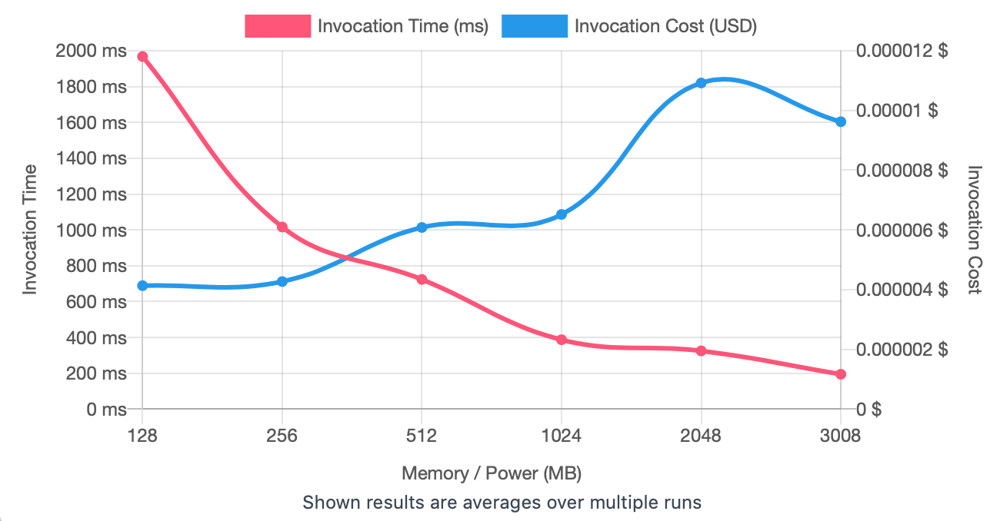
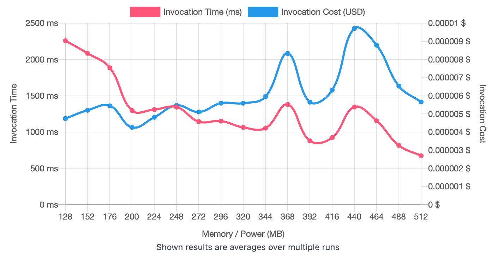
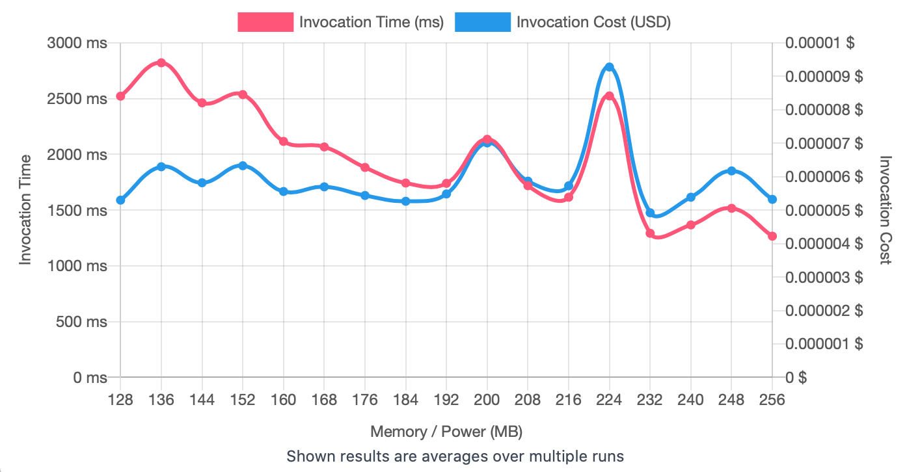

## First Run 
```
{
    "lambdaARN": "arn:aws:lambda:us-east-2:**********:function:ImageProcessingFilter",
    "powerValues": [128, 256, 512, 1024, 2048, 3008],
    "num": 20,
    "payload": "{}",
    "parallelInvocation": true,
    "strategy": "cost"
}
```
Result of it is as below: 

```
{
  "power": 128,
  "cost": 0.0000041328000000000005,
  "duration": 1967.4308333333336,
  "stateMachine": {
    "executionCost": 0.0003,
    "lambdaCost": 0.00141080205,
    "visualization": "https://lambda-power-tuning.show/#gAAAAQACAAQACMAL;ye31RLgifkSr4jREd6fBQ6taokMHmkJD;e6yKNgxTjzaMEMw2objaNgs1NzeLcyE3"
  }
}

```



## Second Run 
```
{
    "lambdaARN": "arn:aws:lambda:us-east-2:**********:function:ImageProcessingFilter",
    "powerValues": [128, 152, 176, 200, 224, 248, 272, 296, 320, 344, 368, 392, 416, 440, 464, 488, 512]
    "num": 20,
    "payload": "{}",
    "parallelInvocation": true,
    "strategy": "cost"
}
```
Result of it is as below: 

```
{
  "power": 200,
  "cost": 0.0000042525,
  "duration": 1295.6608333333334,
  "stateMachine": {
    "executionCost": 0.00057,
    "lambdaCost": 0.002730697725000001,
    "visualization": "https://lambda-power-tuning.show/#gACYALAAyADgAPgAEAEoAUABWAFwAYgBoAG4AdAB6AEAAg==;JiMNRddIAkXDi+tEJvWhRBi9o0RS2KdE5eWORLHIj0TG6IREcbODRJ1irES8f1tEtdlmRHEVqETeNZBEfvlLRMkvKEQ=;yi2fNhl3rjZ6orY2srCONhiKoTY/Wrc2ekyrNtGNuzZgb7s2VZnHNpjICzc/eL02tJrTNsfkIjeJYhM35zbbNp6wvTY="
  }
}

```



## Third Run 
```
{
    "lambdaARN": "arn:aws:lambda:us-east-2:**********:function:ImageProcessingFilter",
    "powerValues": [128, 136, 144, 152, 160, 168, 176, 184, 192, 200, 208, 216, 224, 232, 240, 248, 256],
    "num": 20,
    "payload": "{}",
    "parallelInvocation": true,
    "strategy": "cost"
}
```
Result of it is as below: 

```
{
  "power": 232,
  "cost": 0.00000492148125,
  "duration": 1292.2183333333335,
  "stateMachine": {
    "executionCost": 0.00057,
    "lambdaCost": 0.0024906601125000006,
    "visualization": "https://lambda-power-tuning.show/#gACIAJAAmACgAKgAsAC4AMAAyADQANgA4ADoAPAA+AAAAQ==;JqQdRflYMEWa6RlFbYgeRYlKBEX5LgFFyVvrRGDg2UQzj9lE8noFRR/V1kT2/MlEPcUdRf2GoUT25KpEao+9RO9MnkQ=;DcixNkZH0zZvP8M2dUnUNld3ujZPKr8233C2Nm6nsDZ9BLg2tCzrNk/VxDb6J8A2na4bNzQjpTavvbQ2mRvPNnqOsjY="
  }
}

```




---
**Result**

The best size taken for this lambda function is 232.

---

