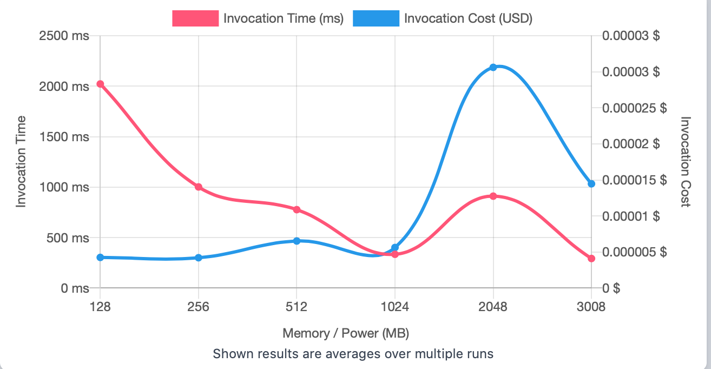
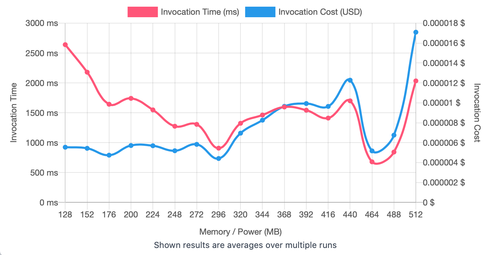
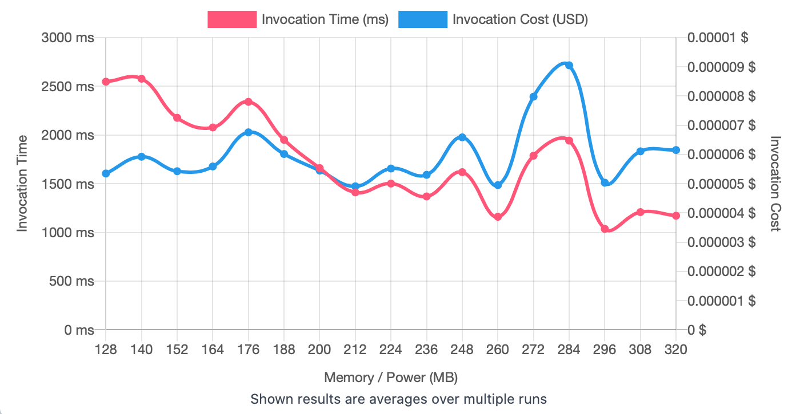
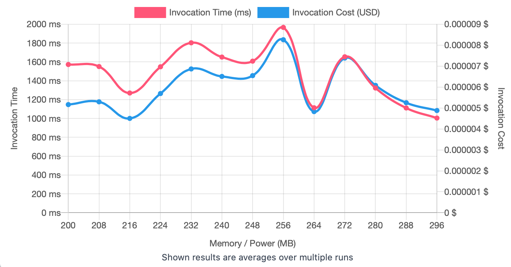

## First Run 
```
{
    "lambdaARN": "arn:aws:lambda:us-east-2:**********:function:ImageProcessingFlip",
    "powerValues": [128, 256, 512, 1024, 2048, 3008],
    "num": 20,
    "payload": "{}",
    "parallelInvocation": true,
    "strategy": "cost"
}
```
Result of it is as below: 

```
{
  "power": 256,
  "cost": 0.0000042084,
  "duration": 1001.9425000000001,
  "stateMachine": {
    "executionCost": 0.0003,
    "lambdaCost": 0.00184471245,
    "visualization": "https://lambda-power-tuning.show/#gAAAAQACAAQACMAL;18X8RFJ8ekQpLEJEADinQ5OfY0Q9UpJD;noyONuE1jTbJANs2J9i8Ns9iADhLl3I3"
  }
}
```



## Second Run 
```
{
    "lambdaARN": "arn:aws:lambda:us-east-2:**********:function:ImageProcessingFlip",
    "powerValues": [128, 152, 176, 200, 224, 248, 272, 296, 320, 344, 368, 392, 416, 440, 464, 488, 512]
    "num": 20,
    "payload": "{}",
    "parallelInvocation": true,
    "strategy": "cost"
}
```
Result of it is as below: 

```
{
  "power": 296,
  "cost": 0.00000441433125,
  "duration": 908.2874999999999,
  "stateMachine": {
    "executionCost": 0.00057,
    "lambdaCost": 0.0033788937000000007,
    "visualization": "https://lambda-power-tuning.show/#gACYALAAyADgAPgAEAEoAUABWAFwAYgBoAG4AdAB6AEAAg==;sQclRUQ8CEXeac1EnbzZRK6bwUQOcp9E4VyjRGYSY0TNmqVEFOK2RE+vx0TU7sBEroGwRI+O1ESa7SlE3uFSRHdH/kQ=;oxi6NhtqtjbZSJ82h8u/NtkCvzaUNK42sLTDNtEelDa8aek29J4KN4bdITdimCY3fMshN04CTjfMsa02jbziNhZljzc="
  }
}

```



## Third Run 
```
{
    "lambdaARN": "arn:aws:lambda:us-east-2:**********:function:ImageProcessingFlip",
    "powerValues": [128, 140, 152, 164, 176, 188, 200, 212, 224, 236, 248, 260, 272, 284, 296, 308, 320],
    "num": 20,
    "payload": "{}",
    "parallelInvocation": true,
    "strategy": "cost"
}
```
Result of it is as below: 

```
{
  "power": 212,
  "cost": 0.0000049111125,
  "duration": 1411.1425000000002,
  "stateMachine": {
    "executionCost": 0.00057,
    "lambdaCost": 0.0026376213937500006,
    "visualization": "https://lambda-power-tuning.show/#gACMAJgApACwALwAyADUAOAA7AD4AAQBEAEcASgBNAFAAQ==;4TwfRe8iIUU9DQhF8t0BRd5MEkWM2fNEdIbPRI9ksEQst7tE1zOrRJZaykRqG5FEH33fRFLa8kQmkYFEsRCXRA54kkQ=;BouzNq/DxjbYKbY2WJu7NtjQ4jbt6sk2fOC2NiPKpDYnN7k2Cv2xNogI3Ta2LKY2VN0FNw3jFzdS+qg23/3MNt51zjY="
  }
}

```



## Fourth Run 
```
{
    "lambdaARN": "arn:aws:lambda:us-east-2:**********:function:ImageProcessingFlip",
    "powerValues": [200, 208, 216, 224, 232, 240, 248, 256, 264, 272, 280, 288, 296],
    "num": 20,
    "payload": "{}",
    "parallelInvocation": true,
    "strategy": "cost"
}
```
Result of it is as below: 

```
{
  "power": 216,
  "cost": 0.000004504106250000001,
  "duration": 1270.4966666666667,
  "stateMachine": {
    "executionCost": 0.00047,
    "lambdaCost": 0.0019554856125000002,
    "visualization": "https://lambda-power-tuning.show/#yADQANgA4ADoAPAA+AAAAQgBEAEYASABKAE=;CqXERGPpwUTlz55EbZbBROxt4USugc5ErhPJRHfZ9UTDQYtEA9/ORA5wpUTU8opEGyR7RA==;VEytNgO2sTb6IZc22QK/NpJm5jYzZdo2B6vbNnGaCje/C6I2bdD3Ng4VzDY8TbA2csOjNg=="
  }
}

```




---
**Result**

The best size taken for this lambda function is 216.

---

