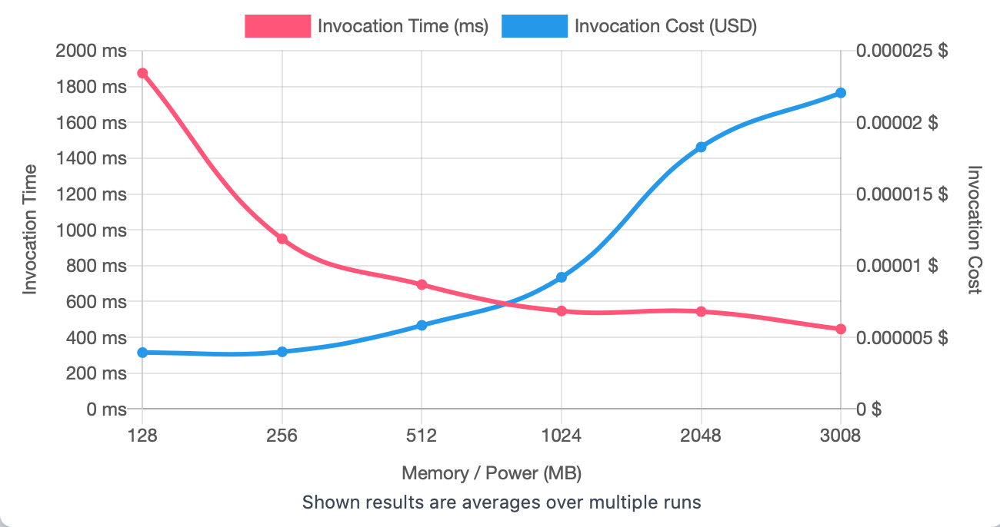
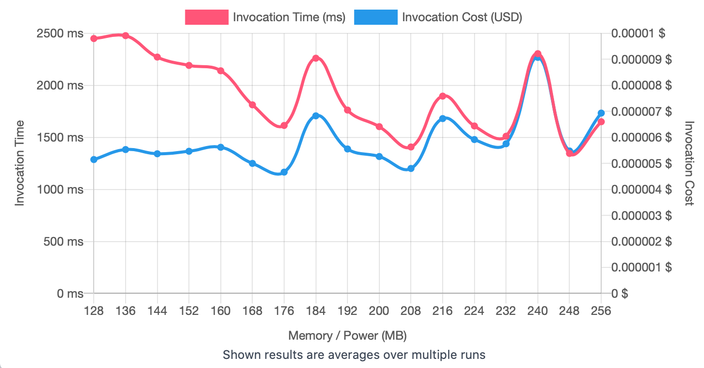
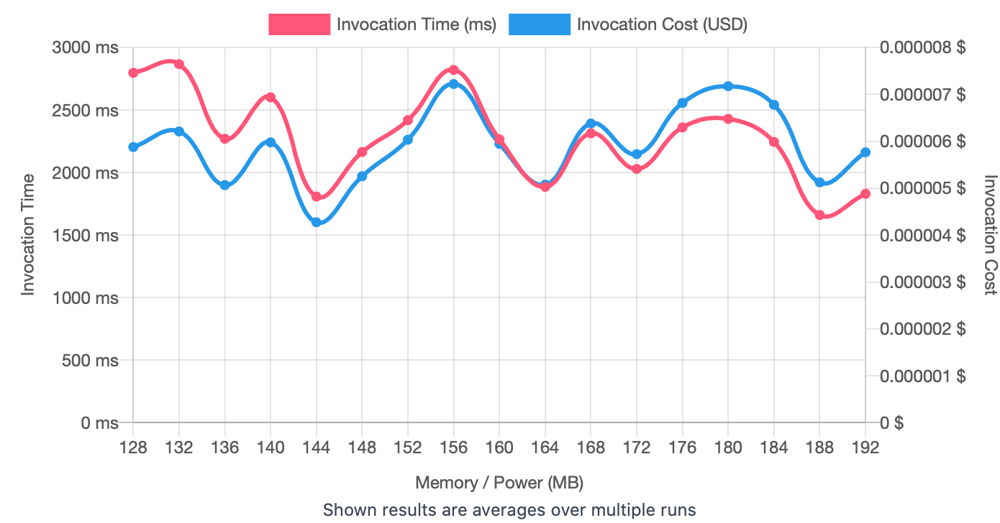

## First Run 
```
{
    "lambdaARN": "arn:aws:lambda:us-east-2:**********:function:ImageProcessingGrayScale",
    "powerValues": [128, 256, 512, 1024, 2048, 3008],
    "num": 20,
    "payload": "{}",
    "parallelInvocation": true,
    "strategy": "cost"
}
```
Result of it is as below: 

```
{
  "power": 128,
  "cost": 0.0000039375,
  "duration": 1874.7841666666666,
  "stateMachine": {
    "executionCost": 0.0003,
    "lambdaCost": 0.0017773665000000002,
    "visualization": "https://lambda-power-tuning.show/#gAAAAQACAAQACMAL;GFnqRCxxbUSxiC1Enb4IRMbuB0QmL99D;3h6ENtfhhTYK5MM2CC0aN5FUmTdPDLk3"
  }
}
```



## Second Run 
```
{
    "lambdaARN": "arn:aws:lambda:us-east-2:**********:function:ImageProcessingGrayScale",
    "powerValues": [128, 136, 144, 152, 160, 168, 176, 184, 192, 200, 208, 216, 224, 232, 240, 248, 256]
    "num": 20,
    "payload": "{}",
    "parallelInvocation": true,
    "strategy": "cost"
}
```
Result of it is as below: 

```
{
  "power": 176,
  "cost": 0.000004663312500000001,
  "duration": 1614.6725,
  "stateMachine": {
    "executionCost": 0.00057,
    "lambdaCost": 0.00235067083125,
    "visualization": "https://lambda-power-tuning.show/#gACIAJAAmACgAKgAsAC4AMAAyADQANgA4ADoAPAA+AAAAQ==;eyUZRejiGkXsAA5FOv8IRWbFBUW1oeJEhdXJRH5TDUWFTdxEp2PIRNDvr0S8F+1EoDnJRCLivEToDBBF8jWoRGNLzkQ=;QbWsNj2ZuTagL7Q2KWu3NoKUvDZHxKc2jXmcNp4f5TbGV7o25pmwNus4oTbIkeE2f4jGNoEbwTbbRBg3GcO3NlOs6DY="
  }
}

```



## Third Run 
```
{
    "lambdaARN": "arn:aws:lambda:us-east-2:**********:function:ImageProcessingGrayScale",
    "powerValues": [128, 132, 136, 140, 144, 148, 152, 156, 160, 164, 168, 172, 176, 180, 184, 188, 192],
    "num": 20,
    "payload": "{}",
    "parallelInvocation": true,
    "strategy": "cost"
}
```
Result of it is as below: 

```
{
  "power": 144,
  "cost": 0.0000042737625,
  "duration": 1808.1849999999997,
  "stateMachine": {
    "executionCost": 0.00057,
    "lambdaCost": 0.002429099071875,
    "visualization": "https://lambda-power-tuning.show/#gACEAIgAjACQAJQAmACcAKAApACoAKwAsAC0ALgAvADAAA==;19AuRRQnM0Vm3g1FFJgiRewF4kSgOQdF8ikXRZZFMEVjjw1FdKzrRJ2TEEUUkv1EcYwTRa7LF0WkRAxFxpDPRH695EQ=;vSjFNpdV0DZ786k2eonINldnjzZ9T7A2w2nKNk1D8jaIgMc2yUWqNkgC1jZlHsA26sDkNs+w8DbLZuM2f+erNq5swTY="
  }
}

```




---
**Result**

The best size taken for this lambda function is 144.

---

