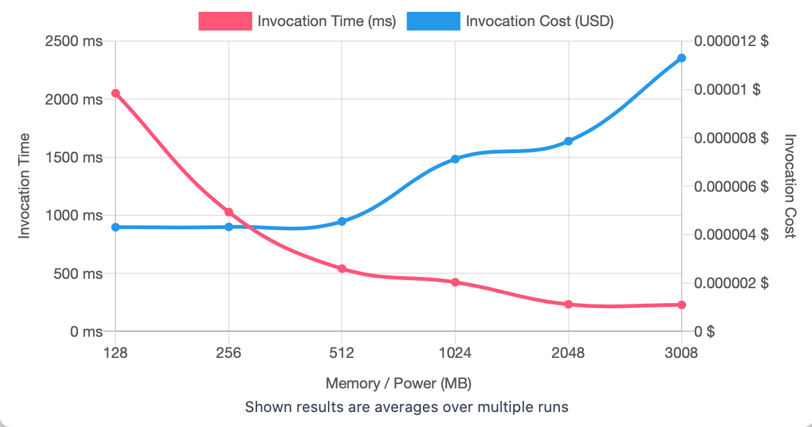
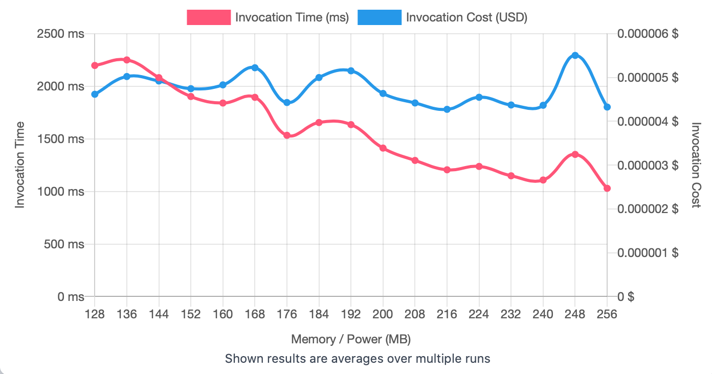
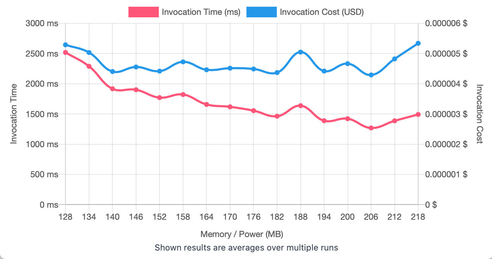

## First Run 
```
{
    "lambdaARN": "arn:aws:lambda:us-east-2:**********:function:ImageProcessingResize",
    "powerValues": [128, 256, 512, 1024, 2048, 3008],
    "num": 20,
    "payload": "{}",
    "parallelInvocation": true,
    "strategy": "cost"
}
```
Result of it is as below: 

```
{
  "power": 128,
  "cost": 0.000004307100000000001,
  "duration": 2050.7774999999997,
  "stateMachine": {
    "executionCost": 0.0003,
    "lambdaCost": 0.0010877475000000002,
    "visualization": "https://lambda-power-tuning.show/#gAAAAQACAAQACMAL;cSwARe92gERmEgdE6IzTQ+VXaUOPEmRD;tYWQNuffkDYZfJg20gPvNsDoAzcSmj03"
  }
}

```



## Second Run 
```
{
    "lambdaARN": "arn:aws:lambda:us-east-2:**********:function:ImageProcessingResize",
    "powerValues": [128, 136, 144, 152, 160, 168, 176, 184, 192, 200, 208, 216, 224, 232, 240, 248, 256]
    "num": 20,
    "payload": "{}",
    "parallelInvocation": true,
    "strategy": "cost"
}
```
Result of it is as below: 

```
{
  "power": 216,
  "cost": 0.0000042737625,
  "duration": 1205.7816666666665,
  "stateMachine": {
    "executionCost": 0.00057,
    "lambdaCost": 0.0017950075500000001,
    "visualization": "https://lambda-power-tuning.show/#gACIAJAAmACgAKgAsAC4AMAAyADQANgA4ADoAPAA+AAAAQ==;w2AJRWOtDEXvJAJFY9ftREgV5kQi3OxESLe/RHvkzkTXZcxEA4OwRM3YoUQDuZZEEbOaRB+Vj0S8lYpE1ACpRAqtgEQ=;dfOaNlOHqDbSH6U2czyfNu8nojYJQq82eaCUNoO9pzZe66w2bZKbNohIlDZXZ482MqmYNg+/kjaPhZI2wLe4Ng8okTY="
  }
}

```



## Third Run 
```
{
    "lambdaARN": "arn:aws:lambda:us-east-2:**********:function:ImageProcessingResize",
    "powerValues": [128, 134, 140, 146, 152, 158, 164, 170, 176, 182, 188, 194, 200, 206, 212, 218],
    "num": 20,
    "payload": "{}",
    "parallelInvocation": true,
    "strategy": "cost"
}
```
Result of it is as below: 

```
{
  "power": 206,
  "cost": 0.000004292203125,
  "duration": 1269.1666666666663,
  "stateMachine": {
    "executionCost": 0.00055,
    "lambdaCost": 0.001644838584375,
    "visualization": "https://lambda-power-tuning.show/#gACGAIwAkgCYAJ4ApACqALAAtgC8AMIAyADOANQA2gA=;FGodRcMSD0UwqO9EH6PtRMlp3UQ6xeNEOkvPRNBTykSxXMJEVe22RA6czEQOmK1EMLaxRFWlnkS1Xa1E/Yy6RA==;5X+xNlvtqDYn0pM2wN6YNkdGlDY8kJ42S8eVNsiDlzZYqZY2Jq6SNqBrqTZ4V5Q2GZCcNr4FkDY336E2miyzNg=="
  }
}

```




---
**Result**

The best size taken for this lambda function is 206.

---

