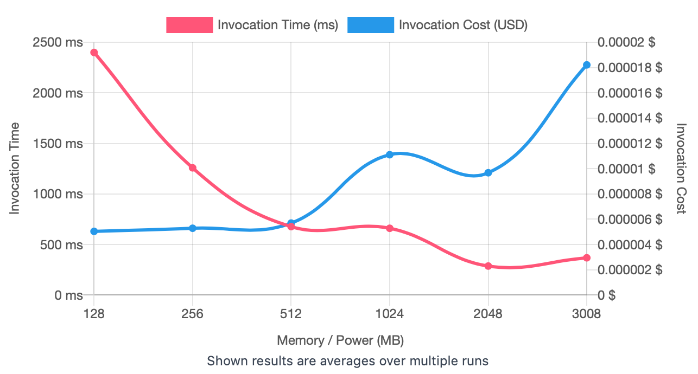
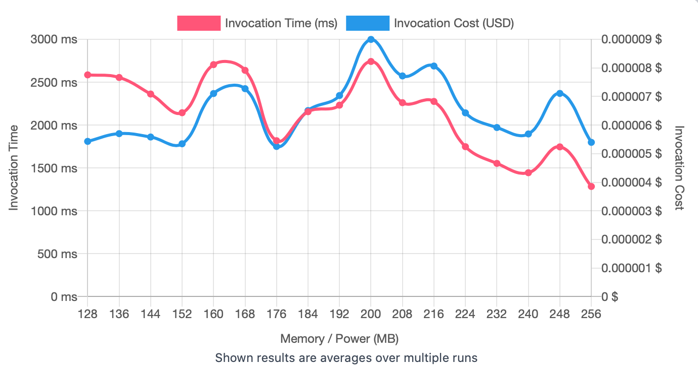
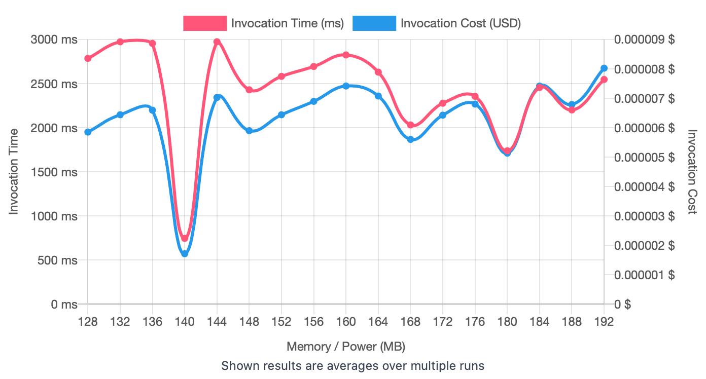
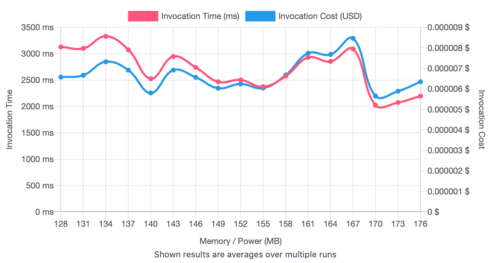
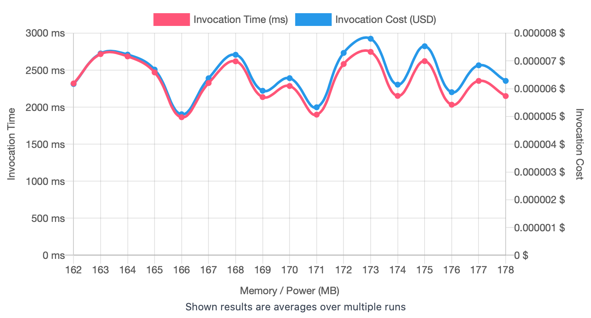

## First Run 
```
{
    "lambdaARN": "arn:aws:lambda:us-east-2:**********:function:ImageProcessingResize",
    "powerValues": [128, 256, 512, 1024, 2048, 3008],
    "num": 20,
    "payload": "{}",
    "parallelInvocation": true,
    "strategy": "cost"
}
```
Result of it is as below: 

```
{
  "power": 128,
  "cost": 0.000005040000000000001,
  "duration": 2399.4133333333334,
  "stateMachine": {
    "executionCost": 0.0003,
    "lambdaCost": 0.0015767629500000003,
    "visualization": "https://lambda-power-tuning.show/#gAAAAQACAAQACMAL;nfYVRddHnUS8RylEHyklRAeSj0M6RbhD;RR2pNtttsTZlGb82wU46N4pZIjcAwpg3"
  }
}

```



## Second Run 
```
{
    "lambdaARN": "arn:aws:lambda:us-east-2:**********:function:ImageProcessingResize",
    "powerValues": [128, 144, 160, 176, 192, 208, 224, 240, 256],
    "num": 20,
    "payload": "{}",
    "parallelInvocation": true,
    "strategy": "cost"
}
```
Result of it is as below: 

```
{
  "power": 176,
  "cost": 0.000005252362500000001,
  "duration": 1818.2483333333332,
  "stateMachine": {
    "executionCost": 0.00057,
    "lambdaCost": 0.0026653252500000004,
    "visualization": "https://lambda-power-tuning.show/#gACIAJAAmACgAKgAsAC4AMAAyADQANgA4ADoAPAA+AAAAQ==;AJghRQquH0W/ohNFLP4FRZoRKUUs5SRF8kfjRKu8BkUKgQtFllkrRYlSDUXGPg5FloTaRA4uwkQfkbREQUXaRIKIoEQ=;gDi2NuBJvzYQUrs28mazNnRY7jb8EPQ2cz2wNvJi2jYsBew2oPIWNy2BATdhUQc3c6zXNrZ4xjYL6r42K4LuNuEXtTY="
  }
}

```



## Third Run 
```
{
    "lambdaARN": "arn:aws:lambda:us-east-2:**********:function:ImageProcessingResize",
    "powerValues": [128, 132, 136, 140, 144, 148, 152, 156, 160, 164, 168, 172, 176, 180, 184, 188, 192],
    "num": 20,
    "payload": "{}",
    "parallelInvocation": true,
    "strategy": "cost"
}
```
Result of it is as below: 

```
{
  "power": 140,
  "cost": 0.000001715765625,
  "duration": 746.3666666666668,
  "stateMachine": {
    "executionCost": 0.00057,
    "lambdaCost": 0.0024940414406250003,
    "visualization": "https://lambda-power-tuning.show/#gACEAIgAjACQAJQAmACcAKAApACoAKwAsAC0ALgAvADAAA==;UiMuRSLhOUVgwDhFd5c6RIzvOUVB3xdFfmUhRU9kKEU6ljBFT2kkRR8B/kQYXg5FSEUTRURa2UQ9gxlFe5kJRcM1H0U=;T2LENqsu2Da5Yt02QknmNdLV6zaR+8U21CLYNjVx5zZI6vg2cYjtNlMFvDYWstc2s13kNnpRrDYj4Pg2EOXjNkSoBjc="
  }
}

```



## Fourth Run 
```
{
    "lambdaARN": "arn:aws:lambda:us-east-2:**********:function:ImageProcessingResize",
    "powerValues": [128, 131, 134, 137, 140, 143, 146, 149, 152, 155, 158, 161, 164, 167, 170, 173, 176],
    "num": 20,
    "payload": "{}",
    "parallelInvocation": true,
    "strategy": "cost"
}
```
Result of it is as below: 

```
{
  "power": 170,
  "cost": 0.0000056450625,
  "duration": 2023.255,
  "stateMachine": {
    "executionCost": 0.00057,
    "lambdaCost": 0.0026497922390625,
    "visualization": "https://lambda-power-tuning.show/#gACDAIYAiQCMAI8AkgCVAJgAmwCeAKEApACnAKoArQCwAA==;PapDRSncQUUYPlBFG0dARfnVHUV0LThF4U0rRYw2GkUYZhxFbWEURbXhIEUOHDdFGGMyRZMdQUUp6PxEWZkBRRRQCUU=;rp/cNgm03zbvyvU2URDoNv+twjZH/uc2qU3cNvZvyjYjcdE2WafKNs/43zYh2AE3zOAAN7IJDje4ar02eIXFNvT11DY="
  }
}

```



## Fifth Run 
```
{
    "lambdaARN": "arn:aws:lambda:us-east-2:**********:function:ImageProcessingResize",
    "powerValues": [162,163, 164, 165, 166, 167, 168, 169, 170, 171, 172, 173, 174, 175, 176, 177, 178],
    "num": 20,
    "payload": "{}",
    "parallelInvocation": true,
    "strategy": "cost"
}
```
Result of it is as below: 

```
{
  "power": 166,
  "cost": 0.000005079210937500001,
  "duration": 1864.4608333333333,
  "stateMachine": {
    "executionCost": 0.00057,
    "lambdaCost": 0.00260409254765625,
    "visualization": "https://lambda-power-tuning.show/#ogCjAKQApQCmAKcAqACpAKoAqwCsAK0ArgCvALAAsQCyAA==;Og0RRdrTKUWP3idFbVsaRb8O6URSZxFFarojRZ2KBUXe5A5Fw2XtRBhrIUUftytFmoYGRezfI0V3Nf5E9jITRZZjBkU=;cf3ONivk8zaef/I2dVvgNhduqjYh7tU2JE/yNsvQxjajB9Y2tduyNjOT9DYD2wI39jrONhiZ/DYwEsU27JDlNnfG0jY="
  }
}

```



---
**Result**

The best size taken for this lambda function is 166.

---

