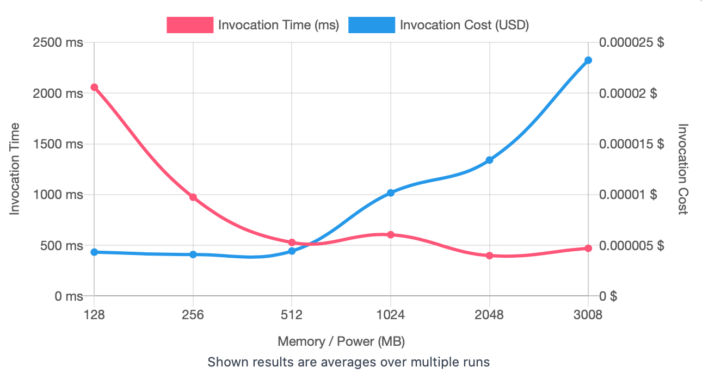
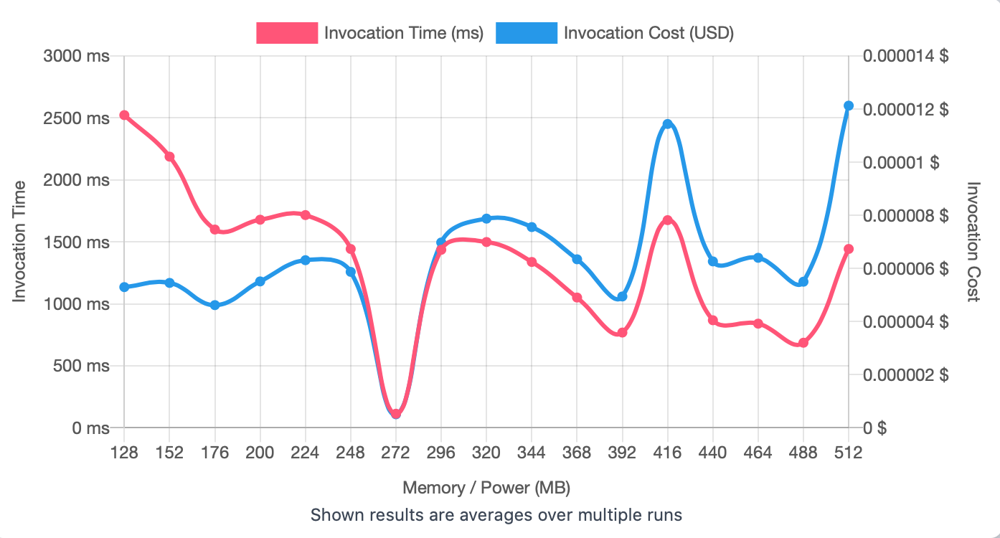
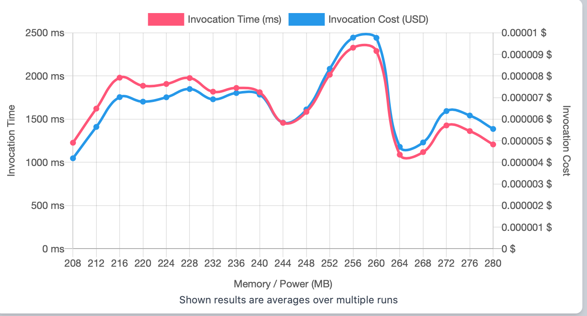
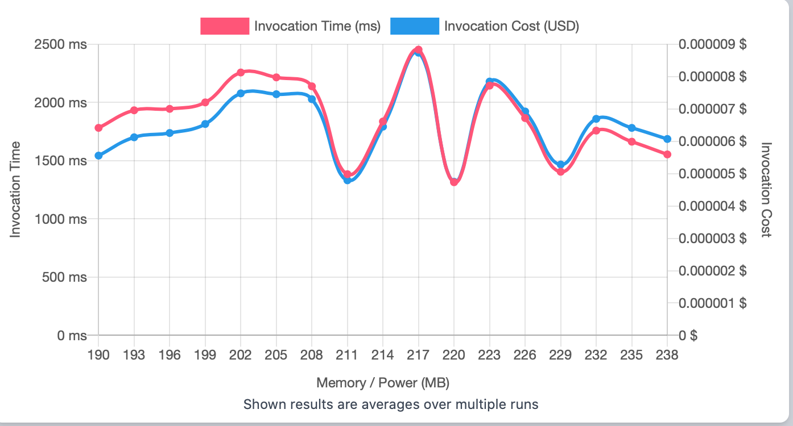
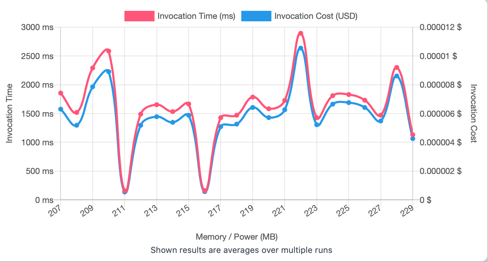

## First Run 
```
{
    "lambdaARN": "arn:aws:lambda:us-east-2:**********:function:ImageProcessingRotate",
    "powerValues": [128, 256, 512, 1024, 2048, 3008],
    "num": 20,
    "payload": "{}",
    "parallelInvocation": true,
    "strategy": "cost"
}
```
Result of it is as below: 

```
{
  "power": 256,
  "cost": 0.000004090800000000001,
  "duration": 973.7191666666668,
  "stateMachine": {
    "executionCost": 0.0003,
    "lambdaCost": 0.0018973038000000002,
    "visualization": "https://lambda-power-tuning.show/#gAAAAQACAAQACMAL;4aQARQduc0R+9QNEnQoXRKQox0O8E+tD;BRaRNrRDiTYU0pQ2DIYqNw3sYDfK+8I3"
  }
}

```



## Second Run 
```
{
    "lambdaARN": "arn:aws:lambda:us-east-2:**********:function:ImageProcessingRotate",
    "powerValues": [128, 152, 176, 200, 224, 248, 272, 296, 320, 344, 368, 392, 416, 440, 464, 488, 512],
    "num": 20,
    "payload": "{}",
    "parallelInvocation": true,
    "strategy": "cost"
}
```
Result of it is as below: 

```
{
  "power": 272,
  "cost": 5.08725e-7,
  "duration": 113.3875,
  "stateMachine": {
    "executionCost": 0.00057,
    "lambdaCost": 0.0030214807875,
    "visualization": "https://lambda-power-tuning.show/#gACYALAAyADgAPgAEAEoAUABWAFwAYgBoAG4AdAB6AEAAg==;iawdRSy9CEUK9cdEIuDRRCyF1kQsWbREZsbiQlWLs0RgYrtE6EanROxbg0TlH0BE/WrRRNf/WET5HVJEM5crRIJktEQ=;DcixNnoVtzZ/BZs2BPi4Nka60zZHAcU2UY8INUUo6jbeHgQ3+pH9Nq7q1Dam8qU22Og/N3U/0ja60dY2Ko+4NjyASzc="
  }
}

```



## Third Run 
```
{
    "lambdaARN": "arn:aws:lambda:us-east-2:**********:function:ImageProcessingRotate",
    "powerValues": [208, 212, 216, 220, 224, 228, 232, 236, 240, 244, 248, 252, 256, 260, 264, 268, 272, 276, 280],
    "num": 20,
    "payload": "{}",
    "parallelInvocation": true,
    "strategy": "cost"
}
```
Result of it is as below: 

```
{
  "power": 208,
  "cost": 0.00000419055,
  "duration": 1227.6466666666668,
  "stateMachine": {
    "executionCost": 0.00063,
    "lambdaCost": 0.0032619310500000003,
    "visualization": "https://lambda-power-tuning.show/#0ADUANgA3ADgAOQA6ADsAPAA9AD4APwAAAEEAQgBDAEQARQBGAE=;sXSZRLzdykRxrfdECuXrRE+N7kRIIfdEiVrjRBvE6EREhOJEYEq2RAckxkTU8PtEGIYRRbUTD0UpKohEMOyLRAqBskRVV6pEAPqWRA==;jZyMNidqvTY7res2HKjkNlVn6zaNRPg2AVHoNs0J8jbciO82BvrDNiyH2DYf1gs3gxwkN3PiIzeeaZ42Ij2lNkP51TanF882sjO6Ng=="
  }
}

```



## Fourth Run 
```
{
    "lambdaARN": "arn:aws:lambda:us-east-2:**********:function:ImageProcessingRotate",
    "powerValues": [190, 193, 196, 199, 202, 205, 208, 211, 214, 217, 220, 223, 226, 229, 232, 235, 238],
    "num": 20,
    "payload": "{}",
    "parallelInvocation": true,
    "strategy": "cost"
}
```
Result of it is as below: 

```
{
  "power": 220,
  "cost": 0.0000047499375,
  "duration": 1315.1416666666667,
  "stateMachine": {
    "executionCost": 0.00057,
    "lambdaCost": 0.0027062705085937502,
    "visualization": "https://lambda-power-tuning.show/#vgDBAMQAxwDKAM0A0ADTANYA2QDcAN8A4gDlAOgA6wDuAA==;EcneRH6n8USCKvNEmiX6RCIbDUVSgQpFEbIFRSkErURZpOVEZmUZRYlkpERVDwZFH0npRB+lr0Rm0ttEk/HPRKBBwkQ=;Y366Nkx7zTZu+NE2rlHbNswX+zbxMfo2JQr1NkbgoDa8h9g2zaISN6dhnzaLqQM3tEfoNlo/sTZHp+A2ukTXNkW8yzY="
  }
}

```



## Fifth Run 
```
{
    "lambdaARN": "arn:aws:lambda:us-east-2:**********:function:ImageProcessingRotate",
    "powerValues": [207, 208, 209, 210, 211, 212, 213, 214, 215, 216, 217, 218, 219, 220, 221, 222, 223, 224, 225, 226, 227, 228, 229],
    "num": 20,
    "payload": "{}",
    "parallelInvocation": true,
    "strategy": "cost"
}
```
Result of it is as below: 

```
{
  "power": 211,
  "cost": 5.434898437500001e-7,
  "duration": 156.62333333333333,
  "stateMachine": {
    "executionCost": 0.00073,
    "lambdaCost": 0.0034700045132812505,
    "visualization": "https://lambda-power-tuning.show/#zwDQANEA0gDTANQA1QDWANcA2ADZANoA2wDcAN0A3gDfAOAA4QDiAOMA5ADlAA==;nQboRETYvUSCRQ9FSJshRZOfHENEJrpE0KnORNChv0ToLtBEVRUgQ7huskSd4LdEakPfRKvgxUTy6ddEOvc0Rd5dskRcU+JEjMHkREF/2EQK6bdEjNcPReyDjUQ=;0pzTNq3urTYa6QM3WXoVN1bkETWI5K02b/HBNnu3tDY4L8U2eCcZNWWWqjZup7A21nDXNs7WvzbyOtI2WfYwN3IurzaqUd82EcviNvh71zZz8rc2nXcQN+rUjjY="
  }
}

```




---
**Result**

The best size taken for this lambda function is 211.

---

