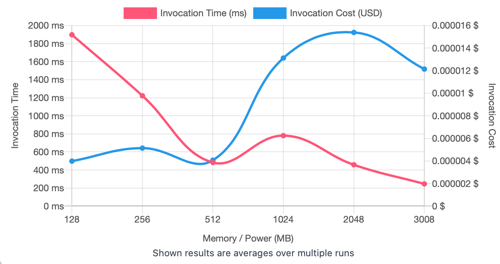
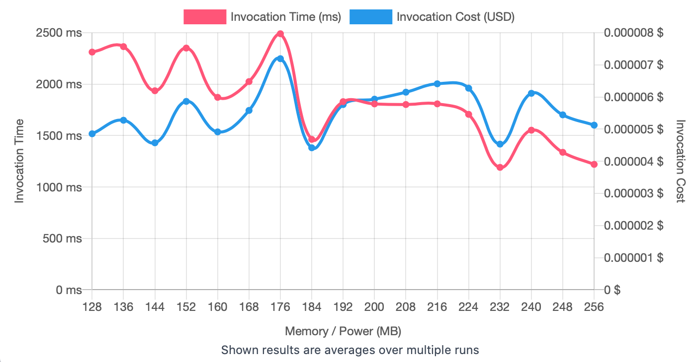
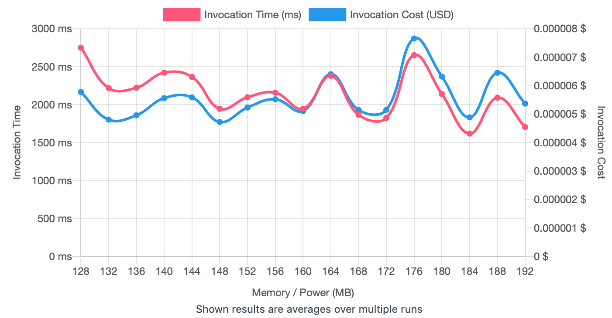

## First Run 
```
{
    "lambdaARN": "arn:aws:lambda:us-east-2:**********:function:ImageProcessingRotate",
    "powerValues": [128, 256, 512, 1024, 2048, 3008],
    "num": 20,
    "payload": "{}",
    "parallelInvocation": true,
    "strategy": "cost"
}
```
Result of it is as below: 

```
{
  "power": 128,
  "cost": 0.0000039858,
  "duration": 1897.7533333333333,
  "stateMachine": {
    "executionCost": 0.0003,
    "lambdaCost": 0.0014823847500000003,
    "visualization": "https://lambda-power-tuning.show/#gAAAAQACAAQACMAL;GzjtRJ3EmERIifFDFB5DRDDe5EMH6nVD;w72FNg9brDY9a4g2aCFcNzIXgTdVrUs3"
  }
}
```



## Second Run 
```
{
    "lambdaARN": "arn:aws:lambda:us-east-2:**********:function:ImageProcessingRotate",
    "powerValues": [128, 136, 144, 152, 160, 168, 176, 184, 192, 200, 208, 216, 224, 232, 240, 248, 256]
    "num": 20,
    "payload": "{}",
    "parallelInvocation": true,
    "strategy": "cost"
}
```
Result of it is as below: 

```
{
  "power": 184,
  "cost": 0.0000044194500000000005,
  "duration": 1463.0716666666667,
  "stateMachine": {
    "executionCost": 0.00057,
    "lambdaCost": 0.00227650119375,
    "visualization": "https://lambda-power-tuning.show/#gACIAJAAmACgAKgAsAC4AMAAyADQANgA4ADoAPAA+AAAAQ==;LH0QRU/NE0W8+fFEmusSRbj86UT5Gf1EYKUbRUvitkQDu+RE9vjhRFk04URIDeJEhUHVRPLRlERjA8JEHyWnRPJ5mEQ=;2umiNkgQsTaleJk2H7nENvDipDbqR7s2XFnxNslKlDaubME2yQ/HNk1WzjYDG9c2mH7SNkQcmDbqLs02f6u2NtPuqzY="
  }
}

```



## Third Run 
```
{
    "lambdaARN": "arn:aws:lambda:us-east-2:**********:function:ImageProcessingRotate",
    "powerValues": [128, 132, 136, 140, 144, 148, 152, 156, 160, 164, 168, 172, 176, 180, 184, 188, 192],
    "num": 20,
    "payload": "{}",
    "parallelInvocation": true,
    "strategy": "cost"
}
```
Result of it is as below: 

```
{
  "power": 148,
  "cost": 0.000004722703125000001,
  "duration": 1944.7941666666666,
  "stateMachine": {
    "executionCost": 0.00057,
    "lambdaCost": 0.00218377333125,
    "visualization": "https://lambda-power-tuning.show/#gACEAIgAjACQAJQAmACcAKAApACoAKwAsAC0ALgAvADAAA==;e+QrRRSqCkVB7ApFgkgXRfnJE0VqGfNEFAkDRcPOBkWuJfNE4bYURQBG6URIB+REPbolRQq+BUUmP8pEmrECRQDs1EQ=;6djBNh4/oTarbqY2WJa6NqZ6uza2d542JnivNlo9uTaJZ6s2Qt/WNhurrDZ+zaw2W3kAN7QN1DYk5KM2qYLYNlUbtDY="
  }
}

```




---
**Result**

The best size taken for this lambda function is 148.

---

