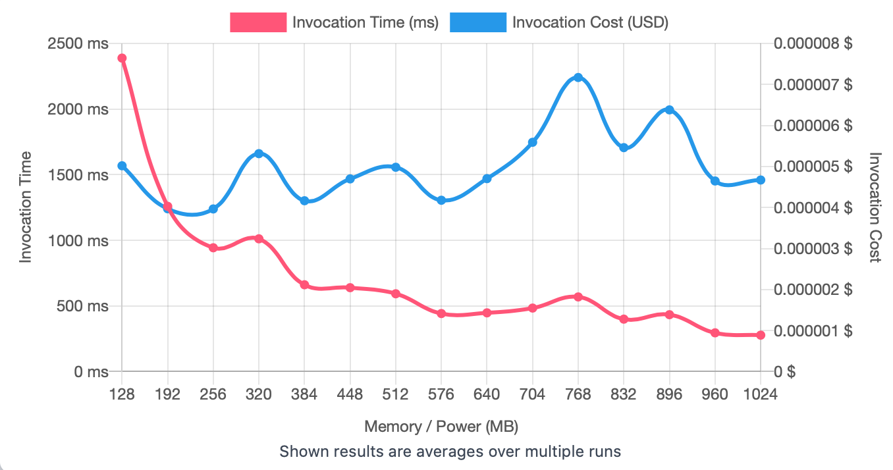
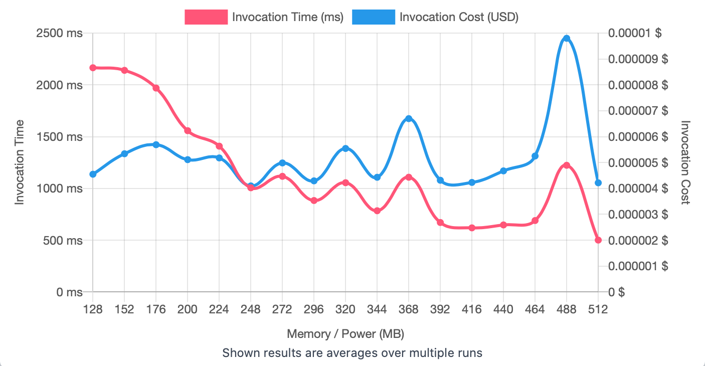

## First Run 
```
{
    "lambdaARN": "arn:aws:lambda:us-east-2:**********:function:ImageProcessingFilter",
    "powerValues": [128, 192, 256, 320, 384, 448, 512, 576, 640, 704, 768, 832, 896, 960, 1024],
    "num": 20,
    "payload": "{}",
    "parallelInvocation": true,
    "strategy": "cost"
}
```
Result of it is as below: 

```
{
  "power": 256,
  "cost": 0.0000039648000000000006,
  "duration": 943.1525000000001,
  "stateMachine": {
    "executionCost": 0.00053,
    "lambdaCost": 0.00225812055,
    "visualization": "https://lambda-power-tuning.show/#gADAAAABQAGAAcABAAJAAoACwAIAA0ADgAPAAwAE;UkcVRWZinUTDyWtEdMp8RBs8JUQpvB9EQSsURMP13EMAoN9DXMfxQzAeDkSMjcdDgo7YQz1ik0PDnYpD;2FaoNnMthTZfCYU2U0ayNhG7izbrl502LySnNkwnjDYN1502dJO7Nq2Q8DYLNbc2ERLWNvzmmzZutpw2"
  }
}
```



## Second Run 
```
{
    "lambdaARN": "arn:aws:lambda:us-east-2:**********:function:ImageProcessingFilter",
    "powerValues": [128, 152, 176, 200, 224, 248, 272, 296, 320, 344, 368, 392, 416, 440, 464, 488, 512]
    "num": 20,
    "payload": "{}",
    "parallelInvocation": true,
    "strategy": "cost"
}
```
Result of it is as below: 

```
{
  "power": 248,
  "cost": 0.000004097231250000001,
  "duration": 1006.3966666666666,
  "stateMachine": {
    "executionCost": 0.00057,
    "lambdaCost": 0.002258647125,
    "visualization": "https://lambda-power-tuning.show/#gACYALAAyADgAPgAEAEoAUABWAFwAYgBoAG4AdAB6AEAAg==;flYHRX7HBUXvIPZEza7CRHsEsERjmXtEapuLRLXVXEQ36INEoCtERO+GikQmuydEoNsaRE/bIUQ9eixEd+uYRIWL+kM=;LaCYNq4mszbF3r42W4mrNlO/rTbzeok2f0GnNvILkDaZBro2XaiUNqmq4Da8zJA2T/yNNpH1nDa1P7A2LWkkNwl+jTY="
  }
}
```



## Third Run 
```
{
    "lambdaARN": "arn:aws:lambda:us-east-2:**********:function:ImageProcessingFilter",
    "powerValues": [200, 208, 216, 224, 232, 240, 248, 256, 264, 272, 280, 288, 296, 304, 312],
    "num": 20,
    "payload": "{}",
    "parallelInvocation": true,
    "strategy": "cost"
}
```
Result of it is as below: 

```
{
  "power": 240,
  "cost": 0.0000040044375,
  "duration": 1016.7991666666667,
  "stateMachine": {
    "executionCost": 0.00053,
    "lambdaCost": 0.001840808025,
    "visualization": "https://lambda-power-tuning.show/#yADQANgA4ADoAPAA+AAAAQgBEAEYASABKAEwATgB;zWLfRHfPqUS/PM9EYHK/REGLh0QmM35E1JyRRLUxgESWUH5EjF+SRMO1dUS1zWhEyUd3RGrbVURZImlE;E9zENpOcmzZ8JsU2Meq8No2SijbbXYY2GA2fNr+XkDbZ8pM2dFevNjGFlzZ/w5M2uVGhNgJBjzbCP6A2"
  }
}
```


---
**Result**

The best size taken for this lambda function is 240.

---

