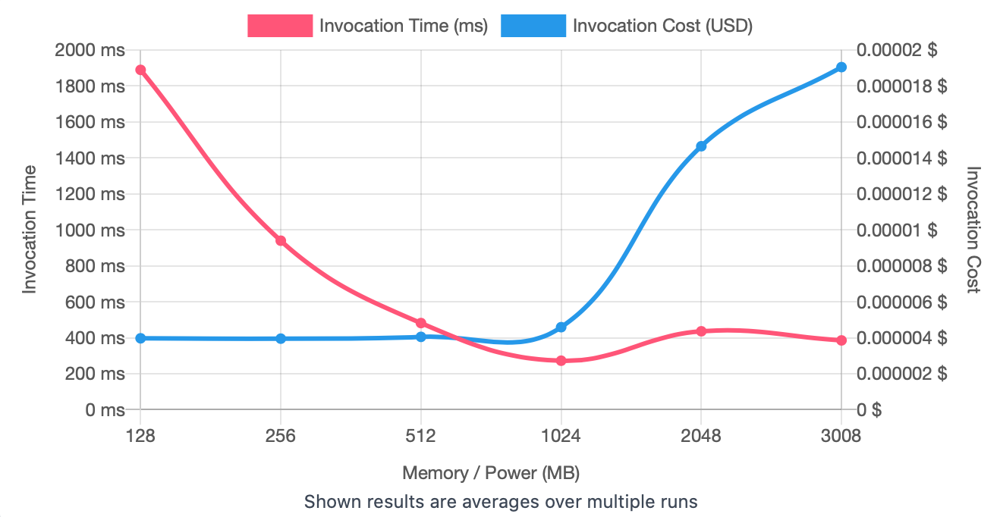
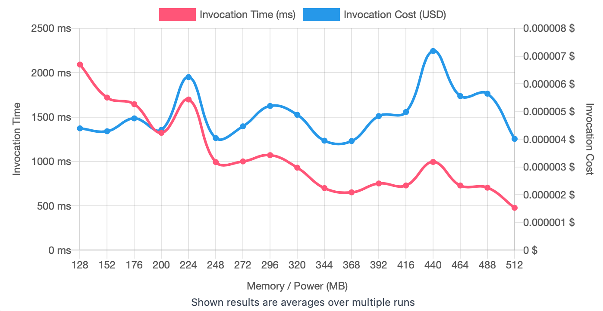

## First Run 
```
{
    "lambdaARN": "arn:aws:lambda:us-east-2:**********:function:ImageProcessingFlip",
    "powerValues": [128, 256, 512, 1024, 2048, 3008],
    "num": 20,
    "payload": "{}",
    "parallelInvocation": true,
    "strategy": "cost"
}
```
Result of it is as below: 

```
{
  "power": 256,
  "cost": 0.000003948,
  "duration": 939.6525,
  "stateMachine": {
    "executionCost": 0.0003,
    "lambdaCost": 0.0015614896500000001,
    "visualization": "https://lambda-power-tuning.show/#gAAAAQACAAQACMAL;9jbsRMPpakTo1PBDVRWIQ+j02UOTj8BD;cy2FNhB5hDbt2oc24OSZNo7HdTehy583"
  }
}

```



## Second Run 
```
{
    "lambdaARN": "arn:aws:lambda:us-east-2:**********:function:ImageProcessingFlip",
    "powerValues": [128, 152, 176, 200, 224, 248, 272, 296, 320, 344, 368, 392, 416, 440, 464, 488, 512]
    "num": 20,
    "payload": "{}",
    "parallelInvocation": true,
    "strategy": "cost"
}
```
Result of it is as below: 

```
{
  "power": 368,
  "cost": 0.00000393645,
  "duration": 651.6383333333332,
  "stateMachine": {
    "executionCost": 0.00057,
    "lambdaCost": 0.0021882393750000005,
    "visualization": "https://lambda-power-tuning.show/#gACYALAAyADgAPgAEAEoAUABWAFwAYgBoAG4AdAB6AEAAg==;gr0CRaf91kTUpM1E4VSlRP081ETlS3hE2gR6RDDehUR+eWhEzeQuRNroIkRt8DtEVU02RHeLeER3QzZEqyYwRN617kM=;TWmTNmDsjzZ1ep82tqmRNnti0TaYtIc26uKVNqCErjZb1KM2nI+ENtkVhDaAR6I2NC2nNowC8TZXd7o2FWW9Nk66hjY="
  }
}
```



## Third Run 
```
{
    "lambdaARN": "arn:aws:lambda:us-east-2:**********:function:ImageProcessingFlip",
    "powerValues": [256, 272, 288, 304, 320, 336, 352, 368, 384, 400, 416, 432, 448, 464, 480, 496, 512],
    "num": 20,
    "payload": "{}",
    "parallelInvocation": true,
    "strategy": "cost"
}
```
Result of it is as below: 

```
{
  "power": 288,
  "cost": 0.000003954825,
  "duration": 836.0466666666667,
  "stateMachine": {
    "executionCost": 0.00057,
    "lambdaCost": 0.0021568015875000003,
    "visualization": "https://lambda-power-tuning.show/#AAEQASABMAFAAVABYAFwAYABkAGgAbABwAHQAeAB8AEAAg==;0EuhRCyBjkT9AlFECu9wRFxPRET5QTlE6FhMRLWtPUQb7FNEsRQcRL8cUkSChhJEKfgcRNeDDkRcywNEq3IPRCxBF0Q=;WPC1NnrZqjaws4Q2+lOhNl12ijYyP4k2bIKeNg7DmTbeQrM2J6CJNrmYwDY+mYs2bOGaNjHakTbzhIs28bqcNjTOqjY="
  }
}

```


---
**Result**

The best size taken for this lambda function is 288.

---

