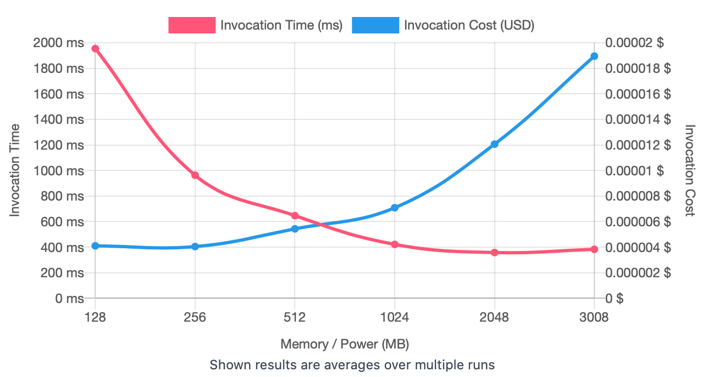
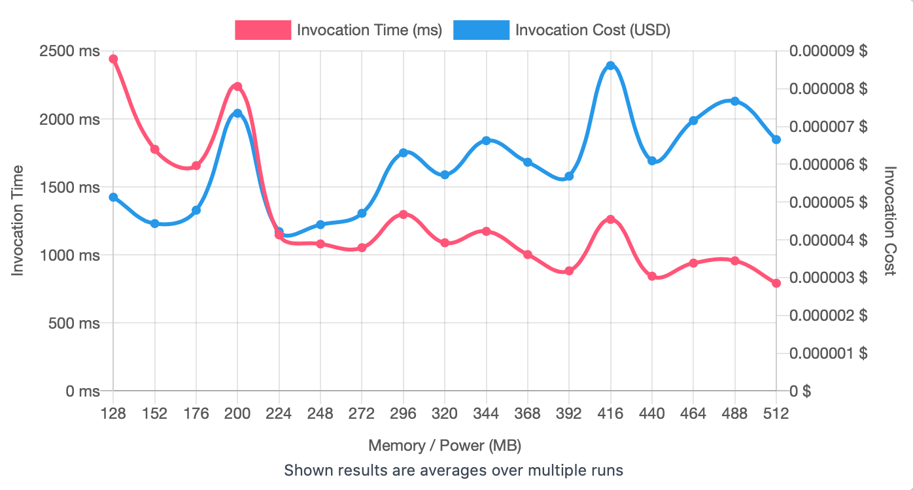

## First Run 
```
{
    "lambdaARN": "arn:aws:lambda:us-east-2:**********:function:ImageProcessingFlip",
    "powerValues": [128, 256, 512, 1024, 2048, 3008],
    "num": 20,
    "payload": "{}",
    "parallelInvocation": true,
    "strategy": "cost"
}
```
Result of it is as below: 

```
{
  "power": 256,
  "cost": 0.0000040488,
  "duration": 963.3116666666666,
  "stateMachine": {
    "executionCost": 0.0003,
    "lambdaCost": 0.0018475359000000003,
    "visualization": "https://lambda-power-tuning.show/#gAAAAQACAAQACMAL;nUT0RPLTcETyuyFE2vjSQ0sWs0M6lb9D;+sGJNu3ahzaUXLY2M+PtNp1fSjet9543"
  }
}

```



## Second Run 
```
{
    "lambdaARN": "arn:aws:lambda:us-east-2:**********:function:ImageProcessingFlip",
    "powerValues": [128, 152, 176, 200, 224, 248, 272, 296, 320, 344, 368, 392, 416, 440, 464, 488, 512]
    "num": 20,
    "payload": "{}",
    "parallelInvocation": true,
    "strategy": "cost"
}
```
Result of it is as below: 

```
{
  "power": 224,
  "cost": 0.0000042189,
  "duration": 1147.9291666666668,
  "stateMachine": {
    "executionCost": 0.00057,
    "lambdaCost": 0.0026677775249999997,
    "visualization": "https://lambda-power-tuning.show/#gACYALAAyADgAPgAEAEoAUABWAFwAYgBoAG4AdAB6AEAAg==;EZkYRSYV3kRZDs9EGPMLRbx9j0QDKYdEVa+DRII4okSgLYhE77SSROiwekQ61VxEhaudRDPvUkR0+mpEgkpvRKTwRUQ=;5xKsNmKxlDZLi6A2BaD2NhOQjTY4uJM2i9KdNueB0zbnA8A23lLeNlExyza2w742M4EQN0BvzDZtG/A2WK4ANx473zY="
  }
}

```



## Third Run 
```
{
    "lambdaARN": "arn:aws:lambda:us-east-2:**********:function:ImageProcessingFlip",
    "powerValues": [192, 196, 200, 204, 208, 212, 216, 220, 224, 228, 232, 236, 240, 244, 248, 252, 256],
    "num": 20,
    "payload": "{}",
    "parallelInvocation": true,
    "strategy": "cost"
}
```
Result of it is as below: 

```


```


## Fourth Run 
```
{
    "lambdaARN": "arn:aws:lambda:us-east-2:**********:function:ImageProcessingFlip",
    "powerValues": [136, 140, 144, 148, 152, 156, 160, 164, 168, 172, 176, 180],
    "num": 20,
    "payload": "{}",
    "parallelInvocation": true,
    "strategy": "cost"
}
```
Result of it is as below: 

```


```


## Fifth Run 
```
{
    "lambdaARN": "arn:aws:lambda:us-east-2:**********:function:ImageProcessingFlip",
    "powerValues": [175, 176, 177, 178, 179, 180, 181, 182, 183, 184, 185],
    "num": 20,
    "payload": "{}",
    "parallelInvocation": true,
    "strategy": "cost"
}
```
Result of it is as below: 

```

```


---
**Result**

The best size taken for this lambda function is 175.

---

