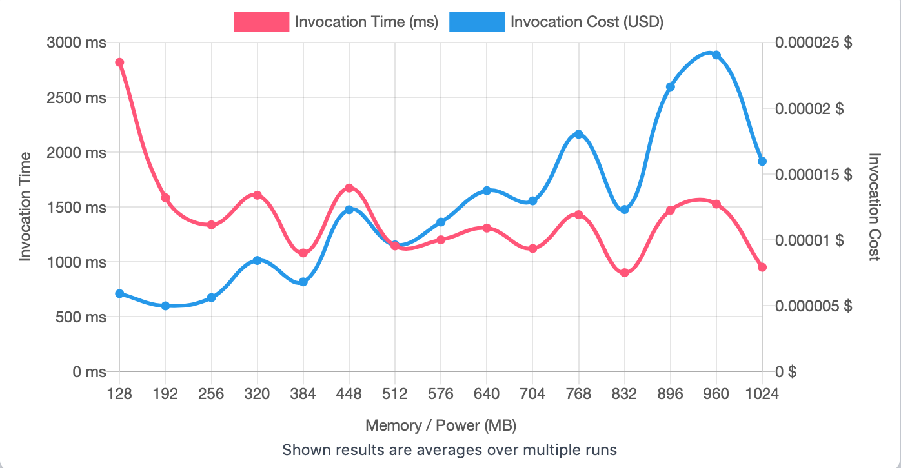
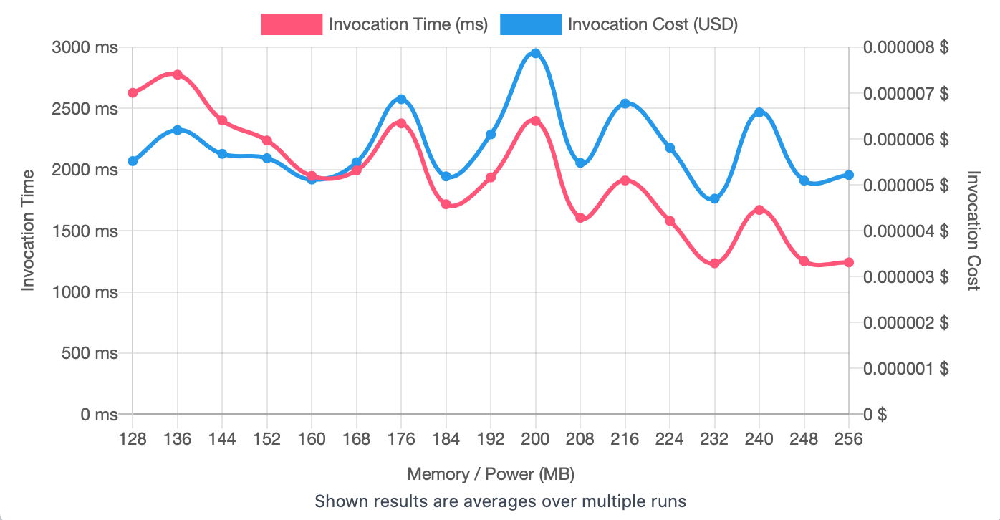

## First Run 
```
{
    "lambdaARN": "arn:aws:lambda:us-east-2:**********:function:ImageProcessingGrayScale",
    "powerValues": [128, 192, 256, 320, 384, 448, 512, 576, 640, 704, 768, 832, 896, 960, 1024],
    "num": 20,
    "payload": "{}",
    "parallelInvocation": true,
    "strategy": "cost"
}
```
Result of it is as below: 

```
{
  "power": 192,
  "cost": 0.000004992750000000001,
  "duration": 1584.074166666667,
  "stateMachine": {
    "executionCost": 0.00053,
    "lambdaCost": 0.005011818,
    "visualization": "https://lambda-power-tuning.show/#gADAAAABQAGAAcABAAJAAoACwAIAA0ADgAPAAwAE;7zYwRWACxkSMO6dExvLIRHc1h0TXHdFEBzaPRH4plkQbgqNES0iMRCnOskRBV2FE4eC3RFncvkQstW1E;mLXGNmWHpzb/j7w2HaINNya65DZITU43E4EhNxuSPjcumGY3hJxZN2tAlzftkE43HIS1N4W/yTfrBYY3"
  }
}
```



## Second Run 
```
{
    "lambdaARN": "arn:aws:lambda:us-east-2:**********:function:ImageProcessingGrayScale",
    "powerValues": [128, 136, 144, 152, 160, 168, 176, 184, 192, 200, 208, 216, 224, 232, 240, 248, 256]
    "num": 20,
    "payload": "{}",
    "parallelInvocation": true,
    "strategy": "cost"
}
```
Result of it is as below: 

```
{
  "power": 232,
  "cost": 0.00000470071875,
  "duration": 1234.18,
  "stateMachine": {
    "executionCost": 0.00057,
    "lambdaCost": 0.00237313190625,
    "visualization": "https://lambda-power-tuning.show/#gACIAJAAmACgAKgAsAC4AMAAyADQANgA4ADoAPAA+AAAAQ==;UjQkRaB5LUV0JRZFB9wLRZOD80RZHPlEOp0URVmg1kREBvJEhdkVRW26yERE3O5E3o3FRMNFmkQAxNBEJmucRII4m0Q=;Ii65NqDVzzbPfb42iES7Ni6rqzZIUrg2kmbmNjoFrjbqu8w2rwIEN+zktzbzO+M2BvXCNt66nTYDxtw2xe2qNokIrzY="
  }
}
```



## Third Run 
```
{
    "lambdaARN": "arn:aws:lambda:us-east-2:**********:function:ImageProcessingGrayScale",
    "powerValues": [180, 184, 188, 192, 196, 200, 204, 208, 212, 216, 220, 224, 228, 232, 236, 240],
    "num": 20,
    "payload": "{}",
    "parallelInvocation": true,
    "strategy": "cost"
}
```
Result of it is as below: 

```
{
  "power": 216,
  "cost": 0.000005648737500000001,
  "duration": 1593.8233333333335,
  "stateMachine": {
    "executionCost": 0.00055,
    "lambdaCost": 0.0027656850375,
    "visualization": "https://lambda-power-tuning.show/#tAC4ALwAwADEAMgAzADQANQA2ADcAOAA5ADoAOwA8AA=;hdMHRUsXLEXhAglFsTYFRcN78US14BVFdGEoRa77NEV+Ie1EWTrHRH7WB0XDWgJFhbnkRLX3ykRPzdBEiTMCRQ==;L2zXNs16Czed9uI2SFjhNrh10DbGEAQ33lMXN3LNJTdLgt02SYq9NqulAzdvnQA3DrHlNmRpzzYLGNk2bqsJNw=="
  }
}

```


---
**Result**

The best size taken for this lambda function is 216.

---

