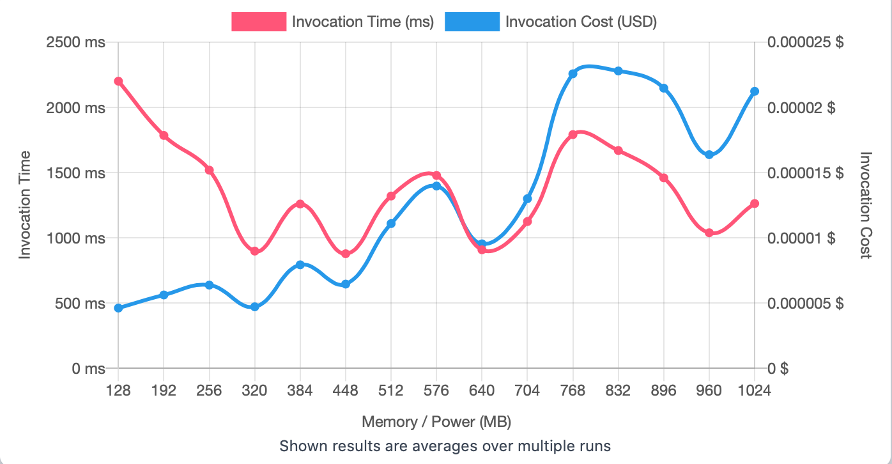

## First Run 
```
{
    "lambdaARN": "arn:aws:lambda:us-east-2:**********:function:ImageProcessingResize",
    "powerValues": [128, 192, 256, 320, 384, 448, 512, 576, 640, 704, 768, 832, 896, 960, 1024],
    "num": 20,
    "payload": "{}",
    "parallelInvocation": true,
    "strategy": "cost"
}
```
Result of it is as below: 

```
{
  "power": 128,
  "cost": 0.0000046242000000000006,
  "duration": 2201.1433333333334,
  "stateMachine": {
    "executionCost": 0.00053,
    "lambdaCost": 0.0046176144,
    "visualization": "https://lambda-power-tuning.show/#gADAAAABQAGAAcABAAJAAoACwAIAA0ADgAPAAwAE;S5IJRYko30S1671EZrpgRJp1nURSrFtEsRalROzTuESdNmNEZq6MRL/030R7stBE4Ya2RFzxgUSk8J1E;kymbNh3GvDYkNtY2WF6eNnMtBTeQyNg2rSo6N9N8ajdRISA3VzFaN3ZovTf3OL833Si0N8hniTc/IrI3"
  }
}
```



## Second Run 
```
{
    "lambdaARN": "arn:aws:lambda:us-east-2:**********:function:ImageProcessingResize",
    "powerValues": [128, 136, 144, 152, 160, 168, 176, 184, 192, 200, 208, 216, 224, 232, 240, 248, 256]
    "num": 20,
    "payload": "{}",
    "parallelInvocation": true,
    "strategy": "cost"
}
```
Result of it is as below: 

```
{
  "power": 184,
  "cost": 6.309187500000001e-7,
  "duration": 208.13000000000002,
  "stateMachine": {
    "executionCost": 0.00057,
    "lambdaCost": 0.002437016925,
    "visualization": "https://lambda-power-tuning.show/#gACIAJAAmACgAKgAsAC4AMAAyADQANgA4ADoAPAA+AAAAQ==;RMA2Rbx7NUUD9ilFj2QORdoaCUVV/hRF7K0fRUghUENcvwxFrlgIRVIwtkRLHuxE/XDzRA6A2EThdslEhT/VRAoFhUQ=;rBvONulq2Tbrntc2zbK+NpU/wTaae9w2yIz3NmhcKTVHB+42Pz3wNpPypjZCnuA2fDbwNjJV3TZ2+tQ2NenoNscWljY="
  }
}

```


## Third Run 
```
{
    "lambdaARN": "arn:aws:lambda:us-east-2:**********:function:ImageProcessingResize",
    "powerValues": [128, 132, 136, 140, 144, 148, 152, 156, 160, 164, 168, 172, 176, 180, 184, 188, 192],
    "num": 20,
    "payload": "{}",
    "parallelInvocation": true,
    "strategy": "cost"
}
```
Result of it is as below: 

```
{
  "power": 184,
  "cost": 0.000004977918750000001,
  "duration": 1648.2483333333332,
  "stateMachine": {
    "executionCost": 0.00057,
    "lambdaCost": 0.002605995984375,
    "visualization": "https://lambda-power-tuning.show/#gACEAIgAjACQAJQAmACcAKAApACoAKwAsAC0ALgAvADAAA==;yRoxRRRNTkX5nz5FLOuFRau8QUXykzBFOkQYRcnGP0UOPBFFG1oeRc3XFkXoPN9E8u4VRT2a8ETyB85ET1HfRFX/A0U=;I7LHNhvf7zYwWeQ2ZyklN4m+9TYcP+Y2V+vLNsbHAzflssw2jcbkNuJB3zYlHKk2cW/oNsS/vjb/B6c20PG4Nh473zY="
  }
}
```


---
**Result**

The best size taken for this lambda function is 184.

---

