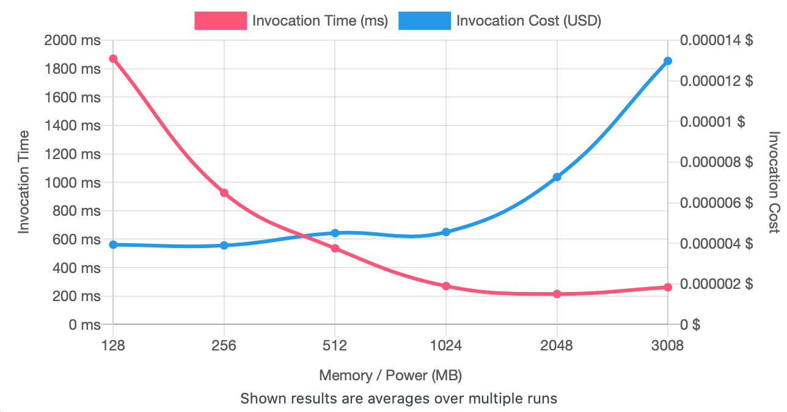
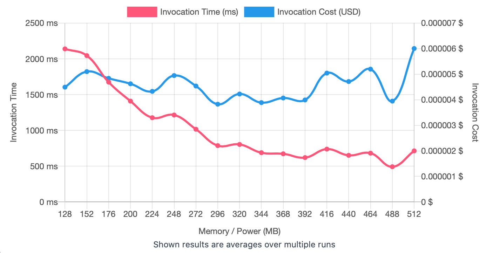

## First Run 
```
{
    "lambdaARN": "arn:aws:lambda:us-east-2:**********:function:ImageProcessingRotate",
    "powerValues": [128, 256, 512, 1024, 2048, 3008],
    "num": 20,
    "payload": "{}",
    "parallelInvocation": true,
    "strategy": "cost"
}
```
Result of it is as below: 

```
{
  "power": 256,
  "cost": 0.000003893400000000001,
  "duration": 926.7683333333333,
  "stateMachine": {
    "executionCost": 0.0003,
    "lambdaCost": 0.0011134326000000001,
    "visualization": "https://lambda-power-tuning.show/#gAAAAQACAAQACMAL;asXpRCyxZ0SC3gVExkqHQ+8eV0PvBoND;ttaDNg2kgjZSE5c2QcSYNk+G8zaYwFk3"
  }
}

```



## Second Run 
```
{
    "lambdaARN": "arn:aws:lambda:us-east-2:**********:function:ImageProcessingRotate",
    "powerValues": [128, 152, 176, 200, 224, 248, 272, 296, 320, 344, 368, 392, 416, 440, 464, 488, 512]
    "num": 20,
    "payload": "{}",
    "parallelInvocation": true,
    "strategy": "cost"
}
```
Result of it is as below: 

```
{
  "power": 296,
  "cost": 0.000003826725,
  "duration": 787.8400000000001,
  "stateMachine": {
    "executionCost": 0.00057,
    "lambdaCost": 0.00213990853125,
    "visualization": "https://lambda-power-tuning.show/#gACYALAAyADgAPgAEAEoAUABWAFwAYgBoAG4AdAB6AEAAg==;JrsFRR+r/0RVe9FE7DewRBQ6k0Sx+JdEvBt+RMP1RET2GElEgjIsRApXKEQ9DhtEDrA4RFkCI0SkkCpEVUX2Q/KDMkQ=;K8uWNqwzqzaPYqI23z2bNh5DkTaPA6Y2PUiYNlFngDY2z402VnqCNs6KiDaJAoY21zypNpwrnjb4da42K3GENiaHyTY="
  }
}

```



## Third Run 
```
{
    "lambdaARN": "arn:aws:lambda:us-east-2:**********:function:ImageProcessingRotate",
    "powerValues": [[128, 140, 152, 164, 176, 188, 200, 212, 224, 236, 248, 260, 272, 284, 296, 308, 320],
    "num": 20,
    "payload": "{}",
    "parallelInvocation": true,
    "strategy": "cost"
}
```
Result of it is as below: 

```
{
  "power": 320,
  "cost": 0.000003911250000000001,
  "duration": 744.6558333333334,
  "stateMachine": {
    "executionCost": 0.00057,
    "lambdaCost": 0.0018600969187499998,
    "visualization": "https://lambda-power-tuning.show/#gACMAJgApACwALwAyADUAOAA7AD4AAQBEAEcASgBNAFAAQ==;GMclRXGd8kRx6wJFB5DhRBGt8ESdrrhE+UvXRNqUsUQmIbRES2yLRFzLiUS1FaZE1C5kRIydcURgcHBEmvFBRPkpOkQ=;GvG6NvGXlTZPTa82sPWiNmubujb99pg2ALS9NgfXpTYS0bE2N/2QNi2WljZ5OL42prWINvIulza0wZw2EZODNmI9gzY="
  }
}
```


---
**Result**

The best size taken for this lambda function is 320.

---

