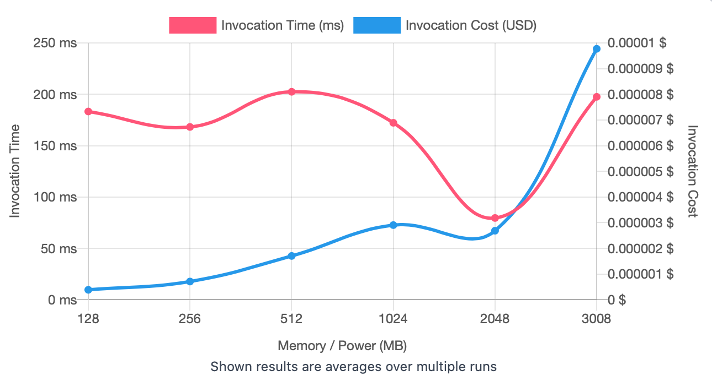
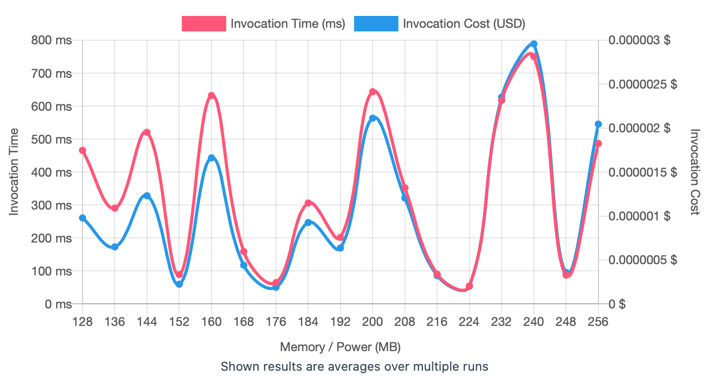
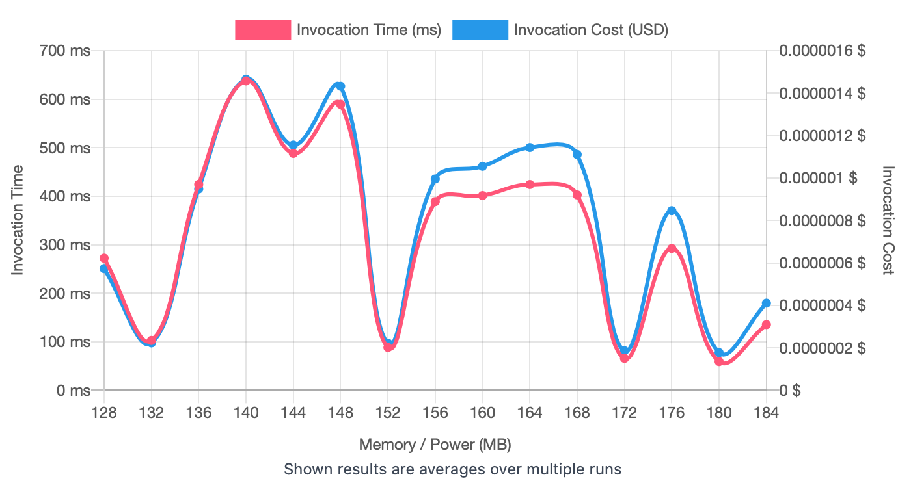
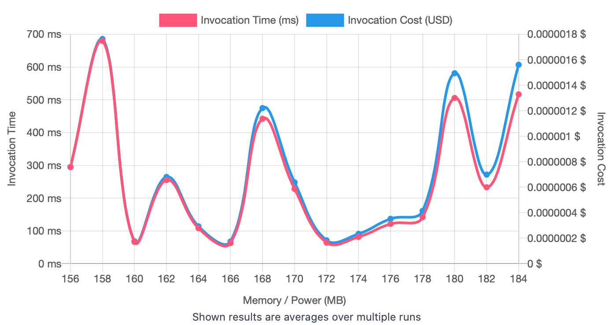
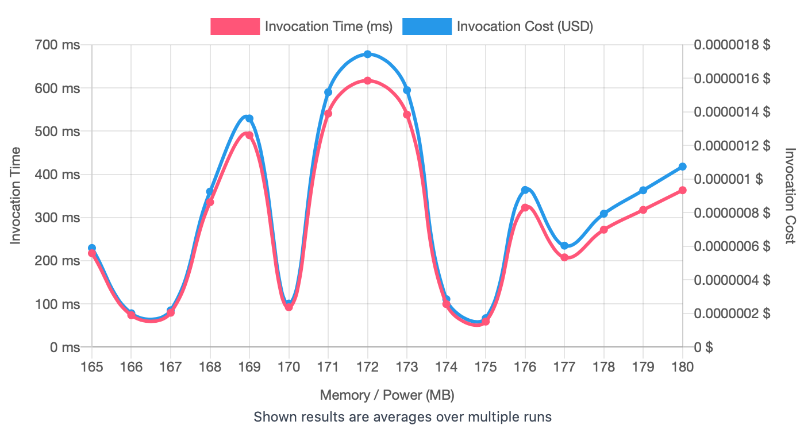

## First Run 
```
{
    "lambdaARN": "arn:aws:lambda:us-east-2:**********:function:RegressionTuningCreateDataset",
    "powerValues": [128, 256, 512, 1024, 2048, 3008],
    "num": 20,
    "payload": "{}",
    "parallelInvocation": true,
    "strategy": "cost"
}
```
Result of it is as below: 

```
{
  "power": 128,
  "cost": 3.864e-7,
  "duration": 183.2675,
  "stateMachine": {
    "executionCost": 0.0003,
    "lambdaCost": 0.00075146505,
    "visualization": "https://lambda-power-tuning.show/#gAAAAQACAAQACMAL;e0Q3Q48yKEMAcEpDDkQsQ6Qwn0Llh0VD;aXLPNBaJPjU63uQ1kgtDNn1jNDZq7yM3"
  }
}
```



## Second Run 
```
{
    "lambdaARN": "arn:aws:lambda:us-east-2:417140135939:function:RegressionTuningCreateDataset",
    "powerValues": [128, 136, 144, 152, 160, 168, 176, 184, 192, 200, 208, 216, 224, 232, 240, 248, 256],
    "num": 20,
    "payload": "{}",
  	"parallelInvocation": true,
    "strategy": "cost"
}
```
Result of it is as below: 

```
  "power": 176,
  "cost": 1.9057500000000002e-7,
  "duration": 65.06750000000001,
  "stateMachine": {
    "executionCost": 0.00057,
    "lambdaCost": 0.0005545615687500001,
    "visualization": "https://lambda-power-tuning.show/#gACIAJAAmACgAKgAsAC4AMAAyADQANgA4ADoAPAA+AAAAQ==;WeroQ3FNkUPyIwJEgg6yQr8MHkQAMB9DjyKCQiYXmUOxxElD2vAgRNcTsEOxBLVCLHlZQgpXGkTelTtESx6vQhhL80M=;cViDNSBLLjUdNKU16fxwNAAF3zWUwuw026BMNDTGeDU0zio1Ns8NNiyuoTV8Ia00sgdZNJDbHTbycUY2BDrANLRDCTY="
  }
}
```



## Third Run 
```
{
    "lambdaARN": "arn:aws:lambda:us-east-2:417140135939:function:RegressionTuningCreateDataset",
    "powerValues": [128, 132, 136, 140, 144, 148, 152, 156, 160, 164, 168, 172, 176, 180, 184],
    "num": 20,
    "payload": "{}",
  	"parallelInvocation": true,
    "strategy": "cost"
}
```
Result of it is as below: 

```
{
  "power": 180,
  "cost": 1.7718750000000002e-7,
  "duration": 59.12333333333333,
  "stateMachine": {
    "executionCost": 0.00053,
    "lambdaCost": 0.000397355503125,
    "visualization": "https://lambda-power-tuning.show/#gACEAIgAjACQAJQAmACcAKAApACoAKwAsAC0ALgA;XB+IQ3FdzUKWHNRDgmofRKsa9EN7YBNEljywQq5vwkM3oMhDmgHUQwdKyUPagINCyR+SQ0t+bEK1UQdD;4OQZNRiCbzRkjX41+q7ENYQOmzWMR8A1b09uNHOghTUdoo015nqZNbkVlTVL+kc0QRtjNe5APjSQadw0"
  }
}
```



## Fourth Run 
```
{
    "lambdaARN": "arn:aws:lambda:us-east-2:417140135939:function:RegressionTuningCreateDataset",
    "powerValues": [156, 158, 160, 162, 164, 166, 168, 170, 172, 174, 176, 178, 180, 182, 184],
    "num": 20,
    "payload": "{}",
  	"parallelInvocation": true,
    "strategy": "cost"
}

```
Result of it is as below: 

```
{
  "power": 166,
  "cost": 1.7430000000000002e-7,
  "duration": 63.04583333333334,
  "stateMachine": {
    "executionCost": 0.00053,
    "lambdaCost": 0.00035776955156250007,
    "visualization": "https://lambda-power-tuning.show/#nACeAKAAogCkAKYAqACqAKwArgCwALIAtAC2ALgA;RIyTQ1X5KUQzE4VC6FR/QzCW2ELvLnxCTyvdQ2ojZEMs+YBCH6WjQo/i8kJZ0g1De9z8Q+wxaUMRKQFE;KFxLNXuV7DUn2Dw0u6Q2NddznTQ4Jzs04+GjNc9yKzWf8kQ0oFh7NE8gvTTJod40HY/INfGOOzUHedE1"
  }
}

```



## Fifth Run 
```
{
    "lambdaARN": "arn:aws:lambda:us-east-2:417140135939:function:RegressionTuningCreateDataset",
    "powerValues":[165, 166, 167, 168, 169, 170, 171, 172, 173, 174, 175, 176, 177, 178, 179, 180],
    "num": 20,
    "payload": "{}",
  	"parallelInvocation": true,
    "strategy": "cost"
}

```
Result of it is as below: 

```
{
  "power": 175,
  "cost": 1.7226562500000003e-7,
  "duration": 59.068333333333335,
  "stateMachine": {
    "executionCost": 0.00055,
    "lambdaCost": 0.00044354065546875005,
    "visualization": "https://lambda-power-tuning.show/#pQCmAKcAqACpAKoAqwCsAK0ArgCvALAAsQCyALMAtAA=;Jk9ZQ5O/k0JjKZ9Cd8+nQ7hO9UPUprhCFC4HRFVBGkRxkQZEBzrHQvlFbEI3iKFDv8hPQ830h0OF455Drqe1Qw==;nmkeNVllWDTNWWs0G5l4NXa4tjVNQYs0yrXLNZgQ6jWvVM01h0KZNAT4ODSCIns1bCMiNZk5VTWCr3o1kkaQNQ=="
  }
}
```




---
**Result**

The best size taken for this lambda function is 175.

---

