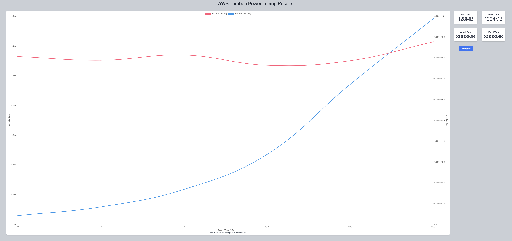
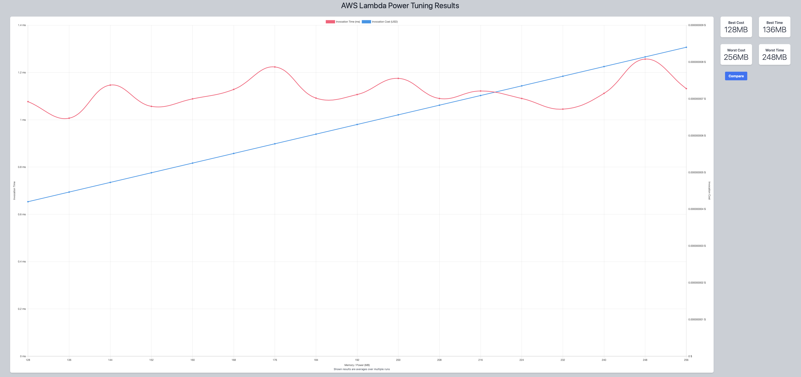
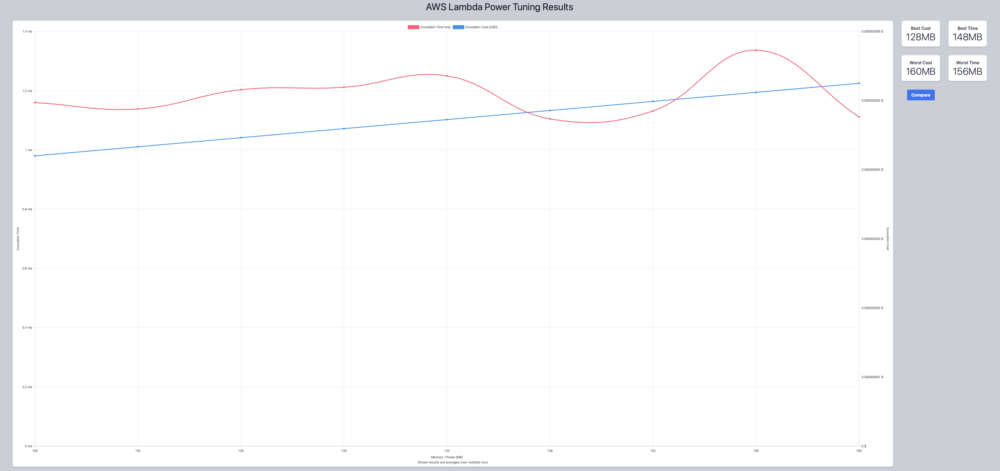
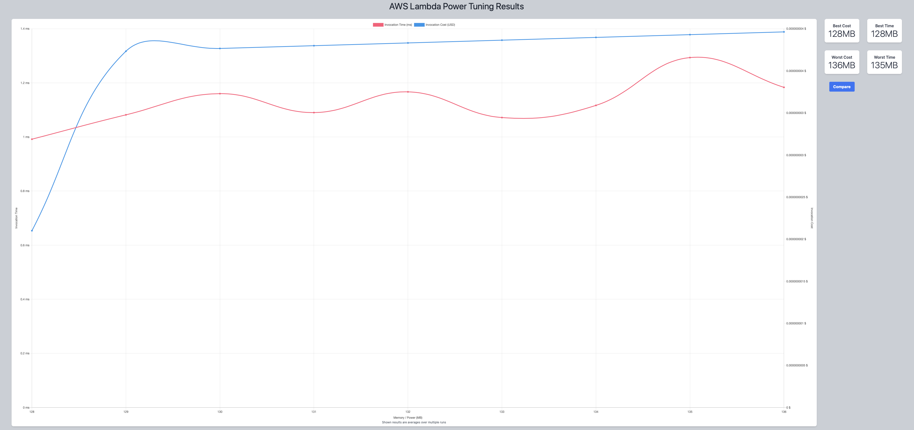

## First Run 
```
{
    "lambdaARN": "arn:aws:lambda:us-east-2:**********:function:RegressionTuningGetInput",
    "powerValues": [128, 256, 512, 1024, 2048, 3008],
    "num": 10,
    "payload": "{}",
    "parallelInvocation": true,
    "strategy": "cost"
}
```
Result of it is as below: 

```
{
  "power": 128,
  "cost": 4.2e-9,
  "duration": 1.1283333333333332,
  "stateMachine": {
    "executionCost": 0.0003,
    "lambdaCost": 0.0000027783,
    "visualization": "https://lambda-power-tuning.show/#gAAAAQACAAQACMAL;Om2QPwc6jT/otJE/w/WIP83MjD9qA50/;l0+QMZdPEDKXT5Ayl08QM5dPkDPm9NMz"
  }
}
```



## Second Run 
```
{
    "lambdaARN": "arn:aws:lambda:us-east-2:**********:function:RegressionTuningGetInput",
    "powerValues": [128, 136, 144, 152, 160, 168, 176, 184, 192, 200, 208, 216, 224, 232, 240, 248, 256],
    "num": 10,
    "payload": "{}",
    "parallelInvocation": true,
    "strategy": "cost"
}
```
Result of it is as below: 

```
{
  "power": 128,
  "cost": 4.2e-9,
  "duration": 1.0766666666666669,
  "stateMachine": {
    "executionCost": 0.00057,
    "lambdaCost": 0.0000012705000000000002,
    "visualization": "https://lambda-power-tuning.show/#gACIAJAAmACgAKgAsAC4AMAAyADQANgA4ADoAPAA+AAAAQ==;N9CJP3TagD/5xZI/2kCHP4JOiz86bZA/MJacP7y7iz9Bp40/ZmaWPx+Fiz/Gko8/H4WLP4/ChT8YS44/dNqgP3TakD8=;l0+QMZFUmTGKWaIxhF6rMX1jtDF2aL0xcG3GMWlyzzFjd9gxXHzhMVaB6jFPhvMxSYv8MSHIAjKeSgcyGs0LMpdPEDI="
  }
}
```



## Third Run 
```
{
    "lambdaARN": "arn:aws:lambda:us-east-2:**********:function:RegressionTuningGetInput",
    "powerValues": [128, 132, 136, 140, 144, 148, 152, 156, 160, 164, 168, 172, 176, 180, 184, 188, 192],
    "num": 10,
    "payload": "{}",
    "parallelInvocation": true,
    "strategy": "cost"
}
```
Result of it is as below: 

```
{
  "power": 152,
  "cost": 2.4937500000000004e-9,
  "duration": 0.9466666666666667,
  "stateMachine": {
    "executionCost": 0.00057,
    "lambdaCost": 9.79190625e-7,
    "visualization": "https://lambda-power-tuning.show/#gACEAIgAjACQAJQAmACcAKAApACoAKwAsAC0ALgAvADAAA==;heuRPwrXgz+JiJg/LPmVP2PJjz/e3Y0/v1hyP0RElD8YS44/S36RP9ejoD+PwpU/w/WIPwrXsz+dNqA/oNOGP0REhD8=;l0+QMRTSlDGRVJkxDdedMYpZojEH3KYxhF4rMQDhrzF9Y7Qx+uW4MXZovTHz6sExcG3GMe3vyjFpcs8x5vTTMWN32DE="
  }
}
```


## Fourth Run 
```
{
    "lambdaARN": "arn:aws:lambda:us-east-2:**********:function:RegressionTuningGetInput",
    "powerValues": [128, 132, 136, 140, 144, 148, 152, 156, 160],
    "num": 10,
    "payload": "{}",
    "parallelInvocation": true,
    "strategy": "cost"
}
```
Result of it is as below: 

```
{
  "power": 128,
  "cost": 4.2e-9,
  "duration": 1.1600000000000001,
  "stateMachine": {
    "executionCost": 0.00038,
    "lambdaCost": 5.916093750000001e-7,
    "visualization": "https://lambda-power-tuning.show/#gACEAIgAjACQAJQAmACcAKAA;4XqUP+i0kT/UBpo/5RebPwAAoD+kcI0/dNqQP+UXqz8YS44/;l0+QMRTSlDGRVJkxDdedMYpZojEH3KYxhF6rMQDhrzF9Y7Qx"
  }
}
```



## Fifth Run 
```
{
    "lambdaARN": "arn:aws:lambda:us-east-2:**********:function:RegressionTuningGetInput",
    "powerValues": [128, 129, 130, 131, 132, 133, 134, 135, 136],
    "num": 10,
    "payload": "{}",
    "parallelInvocation": true,
    "strategy": "cost"
}
```
Result of it is as below: 

```
{
  "power": 128,
  "cost": 2.1e-9,
  "duration": 0.9916666666666667,
  "stateMachine": {
    "executionCost": 0.00038,
    "lambdaCost": 4.104515625000001e-7,
    "visualization": "https://lambda-power-tuning.show/#gACBAIIAgwCEAIUAhgCHAIgA;3t19Pw50ij/hepQ/H4WLP1VVlT9gLIk/7+6OP/KLpT93d5c/;l08QMTZwkTHWkJIxdbGTMRTSlDGz8pUxUhOXMfEzmDGRVJkx"
  }
}
```




---
**Result**

The best size taken for this lambda function is 128.

---

