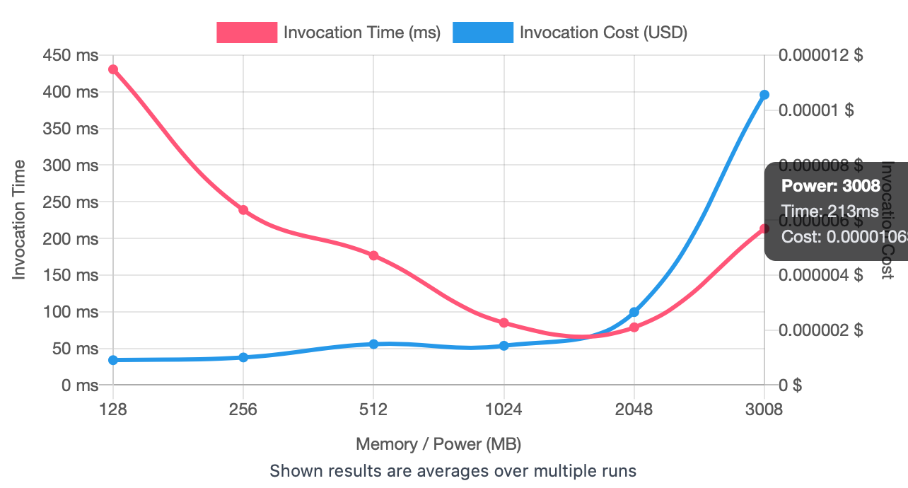
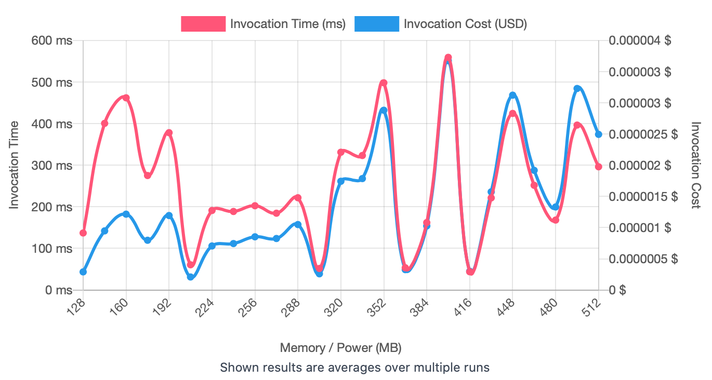
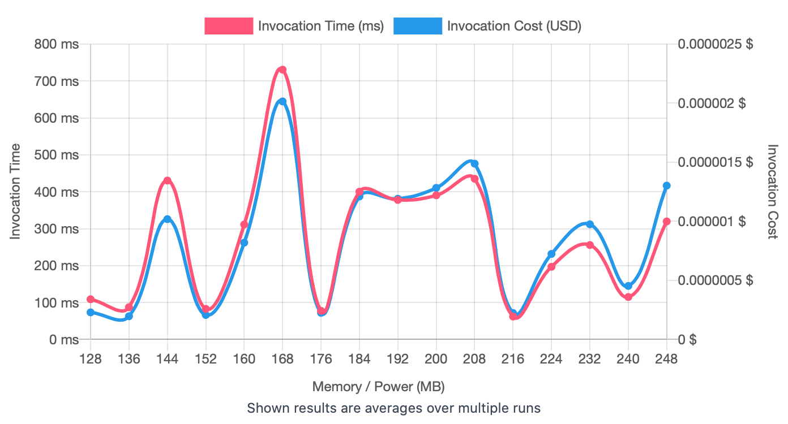
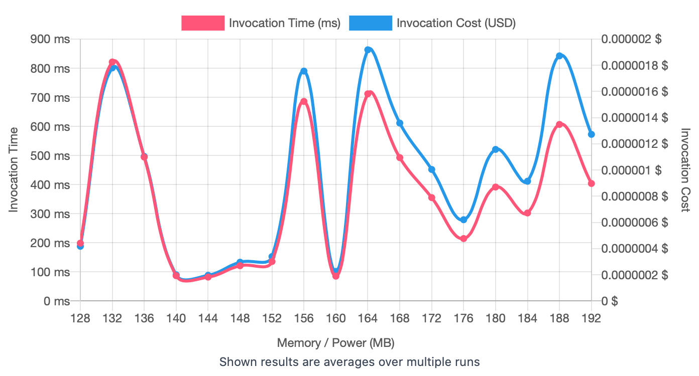
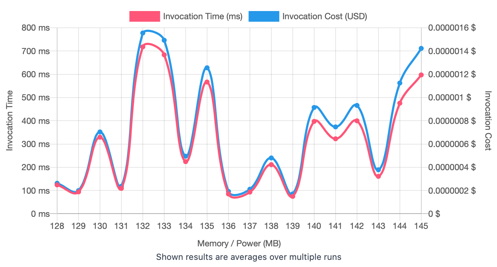

## First Run 
```
{
    "lambdaARN": "arn:aws:lambda:us-east-2:**********:function:RegressionTuningCreateDataset",
    "powerValues": [128, 256, 512, 1024, 2048, 3008],
    "num": 20,
    "payload": "{}",
    "parallelInvocation": true,
    "strategy": "cost"
}
```
Result of it is as below: 

```
{
  "power": 128,
  "cost": 9.051000000000001e-7,
  "duration": 430.62083333333334,
  "stateMachine": {
    "executionCost": 0.0003,
    "lambdaCost": 0.0006628797000000001,
    "visualization": "https://lambda-power-tuning.show/#gAAAAQACAAQACMAL;d0/XQ5PPbkNqkzBDltypQkFnnULUVlVD;APZyNU66hjUPjsc1tam/NT8iMja4LjE3"
  }
}
```



## Second Run 
```
{
    "lambdaARN": "arn:aws:lambda:us-east-2:417140135939:function:RegressionTuningCreateDataset",
    "powerValues": [128, 144, 160, 176, 192, 208, 224, 240, 256, 272, 288, 304, 320, 336, 352, 368, 384, 400, 416, 432, 448, 464, 480, 496, 512],
    "num": 20,
    "payload": "{}",
  	"parallelInvocation": true,
    "strategy": "cost"
}
```
Result of it is as below: 

```
 {
  "power": 208,
  "cost": 2.0816250000000002e-7,
  "duration": 60.612500000000004,
  "stateMachine": {
    "executionCost": 0.00078,
    "lambdaCost": 0.0011608343250000001,
    "visualization": "https://lambda-power-tuning.show/#gACQAKAAsADAANAA4ADwAAABEAEgATABQAFQAWABcAGAAZABoAGwAcAB0AHgAfABAAI=;nRYJQ/lVyEOnFedD8qOJQ9cjvUMzc3JCMDY/QxHRPEMAoEpDvJs4QwrXXUMwFk9C+aWlQ/2yoUPoHPlDw7VVQuEaIkNE4AtE4TovQj16XUPNTNRDAMB7QyIiKEPhSsZDWSqUQw==;z5WbNEFOfjX4H6M1/e1VNWA8oDVGg180dmg9NS3ERzU63mQ1OZxdNabJjDXLPIs0BvHpNTa47zWpY0E2iQivNATUiTUFoHY26zihNHku0zWeoVE2Ab0ANoSgsjUSzVg2VmwnNg=="
  }
}
```



## Third Run 
```
{
    "lambdaARN": "arn:aws:lambda:us-east-2:417140135939:function:RegressionTuningCreateDataset",
    "powerValues": [128, 136, 144, 152, 160, 168, 176, 184, 192, 200, 208, 216, 224, 232, 240, 248],
    "num": 20,
    "payload": "{}",
  	"parallelInvocation": true,
    "strategy": "cost"
}
```
Result of it is as below: 

```
{
  "power": 136,
  "cost": 1.9635e-7,
  "duration": 87.2625,
  "stateMachine": {
    "executionCost": 0.00055,
    "lambdaCost": 0.0004525418625,
    "visualization": "https://lambda-power-tuning.show/#gACIAJAAmACgAKgAsAC4AMAAyADQANgA4ADoAPAA+AA=;N7DZQmaGrkJxNddD7LGlQgCgm0PlszZEM9OaQlIYyEO867xDDizDQ+Wf2UMAAHhCM8NEQ0jBf0NI4eVCq8qfQw==;jsd1NEfUUjRgqog1kz5eNEDZWzVTNgc2YNVxNBx5ojUk0J81eDKsNSOyxzU2uG80L1dCNSHIgjUTGvM0YcCuNQ=="
  }
}

```



## Fourth Run 
```
{
    "lambdaARN": "arn:aws:lambda:us-east-2:417140135939:function:RegressionTuningCreateDataset",
    "powerValues": [128, 132, 136, 140, 144, 148, 152, 156, 160, 164, 168, 172, 176, 180, 184, 188, 192],
    "num": 20,
    "payload": "{}",
  	"parallelInvocation": true,
    "strategy": "cost"
}

```
Result of it is as below: 

```
{
  "power": 144,
  "cost": 1.9608750000000001e-7,
  "duration": 82.15333333333334,
  "stateMachine": {
    "executionCost": 0.00057,
    "lambdaCost": 0.00049725151875,
    "visualization": "https://lambda-power-tuning.show/#gACEAIgAjACQAJQAmACcAKAApACoAKwAsAC0ALgAvADAAA==;M8NGQ6tSTUSPQvdD7+6tQoJOpEK4fvJCiZgHQ2Z2K0QsuapCRAAyRFVl9kMsqbFDbZBWQ6vSw0MAQJdDfrUXRCLqyUM=;vVvgNEbt7jVCPZQ1VpBWNB+MUjS3CZ80bBS2NHem6zWwZXI0Ib4ANhZhtjVd1YY16aUmNbFfmzVriHU110j7NTTOqjU="
  }
}

```



## Fifth Run 
```
{
    "lambdaARN": "arn:aws:lambda:us-east-2:417140135939:function:RegressionTuningCreateDataset",
    "powerValues": [128, 129, 130, 131, 132, 133, 134, 135, 136, 137, 138, 139, 140, 141, 142, 143, 144, 145],
    "num": 20,
    "payload": "{}",
  	"parallelInvocation": true,
    "strategy": "cost"
}

```
Result of it is as below: 

```
{
  "power": 139,
  "cost": 1.7103515625000003e-7,
  "duration": 74.67333333333333,
  "stateMachine": {
    "executionCost": 0.0006,
    "lambdaCost": 0.00040985419453125,
    "visualization": "https://lambda-power-tuning.show/#gACBAIIAgwCEAIUAhgCHAIgAiQCKAIsAjACNAI4AjwCQAJEA;pHD4QlL4u0JIuaRDUljaQrx7M0SW5CpEGxhgQ1KsDURxPapClly6QpZMU0O/WJVCtaHGQ0suoUPJ38dDieggQ7jG7UN3TxVE;uu2MNNCcVTSz7jw1Adl9NJqy0DU7Usg1+8cENYaNqDWiCU40HtxiNA/YADXJpTc0V2R1NX+SSDX2JXo1mMnKND7vljWu7741"
  }
}

```




---
**Result**

The best size taken for this lambda function is 139.

---

