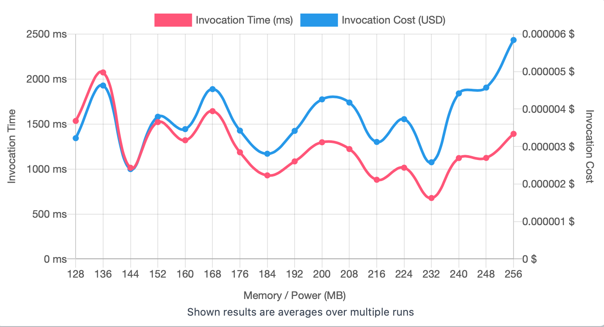

## First Run 
```
{
    "lambdaARN": "arn:aws:lambda:us-east-2:**********:function:RegressionTuningCreateDataset",
    "powerValues": [128, 256, 512, 1024, 2048, 3008],
    "num": 20,
    "payload": "{}",
    "parallelInvocation": true,
    "strategy": "cost"
}
```
Result of it is as below: 

```
{
  "power": 128,
  "cost": 5.334e-7,
  "duration": 253.3033333333333,
  "stateMachine": {
    "executionCost": 0.0003,
    "lambdaCost": 0.0008803399500000002,
    "visualization": "https://lambda-power-tuning.show/#gAAAAQACAAQACMAL;p019Q64HK0QmF7pDPfocQ/JLMkNZcutC;+C4PNXwSQTb3Q1I2nwExNk3PyTbEZcM2"
  }
}
```


## Second Run 
```
{
    "lambdaARN": "arn:aws:lambda:us-east-2:417140135939:function:RegressionTuningCreateDataset",
    "powerValues": [128, 136, 144, 152, 160, 168, 176, 184, 192, 200, 208, 216, 224, 232, 240, 248, 256],
    "num": 20,
    "payload": "{}",
  	"parallelInvocation": true,
    "strategy": "cost"
}
```
Result of it is as below: 

```
{
  "power": 144,
  "cost": 0.0000023979375000000005,
  "duration": 1014.0933333333334,
  "stateMachine": {
    "executionCost": 0.00057,
    "lambdaCost": 0.0016758570937500002,
    "visualization": "https://lambda-power-tuning.show/#gACIAJAAmACgAKgAsAC4AMAAyADQANgA4ADoAPAA+AAAAQ==;5de/RJObAUX5hX1E/TS+ROj4pETUbs1EvD2URJZgaETNnIdEdC6iRDfCmERjOVxEKbB9REh5KUThNoxEGHOMRHHfrUQ=;T1NYNuRGmzZB7CA2+7V+Nj+IaDZbC5g2wNFlNmlnPDZ/XGU2EemONvwJjDZOhFE2D1N6NgQvLTZCPZQ2InSZNh4IxDY="
  }
}
```



## Third Run 
```
{
    "lambdaARN": "arn:aws:lambda:us-east-2:417140135939:function:RegressionTuningCreateDataset",
    "powerValues": [128, 129, 130, 131, 132, 133, 134, 135, 136, 137, 138, 139, 140, 141, 142, 143, 144, 145, 146, 147, 148, 149, 150],
    "num": 20,
    "payload": "{}",
  	"parallelInvocation": true,
    "strategy": "cost"
}
```
Result of it is as below: 

```
{
  "power": 148,
  "cost": 0.0000011557875000000002,
  "duration": 475.7141666666667,
  "stateMachine": {
    "executionCost": 0.00073,
    "lambdaCost": 0.00158197349296875,
    "visualization": "https://lambda-power-tuning.show/#gACBAIIAgwCEAIUAhgCHAIgAiQCKAIsAjACNAI4AjwCQAJEAkgCTAJQAlQCWAA==;JtubREtKdkSFD0RElpRsRA7M7EQA5EFE+clcRIKuo0TvelBEqxKRRHR+ckR3r4FEzeLQRJPblUS1MXJEH9GERG28I0Sg20FEN3asRDdwOkRq2+1DWUZZRJPXskQ=;7LwvNowKDDYPt+A1XZYINuKziTbXQ+M1rmsCNnO2QjbAwvk1Xh8vNmlhEzbt2h42ktyANoAiOjb+fhc21lwnNoyxzzUnxfc1mNRdNg568TWOIJs1J7kONqdUbDY="
  }
}

```


---
**Result**

The best size taken for this lambda function is 148.

---

