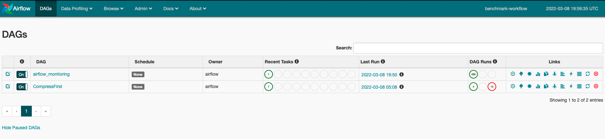
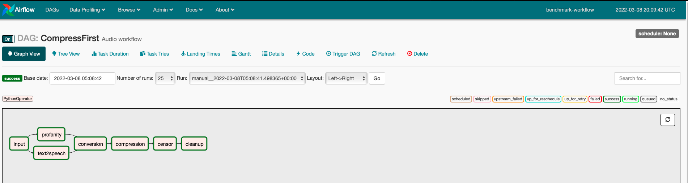
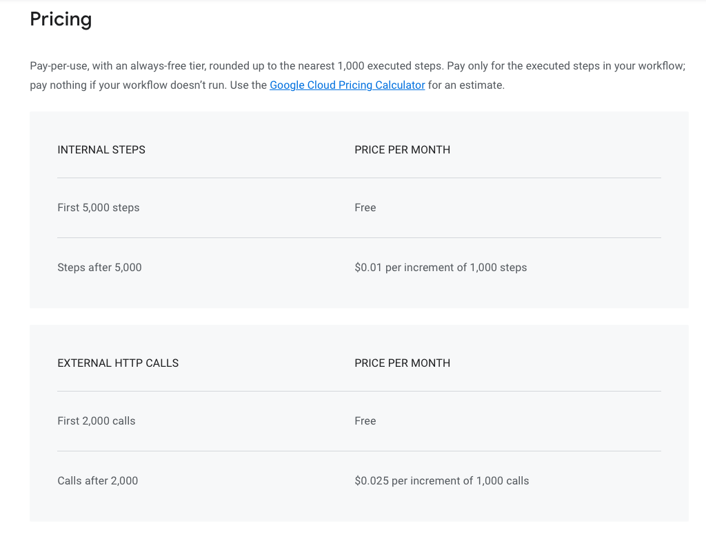

# Text-to-speech Workflow ([Originl source](https://github.com/SimonEismann/FunctionsAndWorkflows)):

As provided in its [original source](https://github.com/SimonEismann/FunctionsAndWorkflows), this benchmark is implemented using [Google Cloud Functions](https://cloud.google.com/functions) and [Google Composer](https://cloud.google.com/composer). 

The functions used in this workflow can be found at the following links: 
* [Text2speech](https://console.cloud.google.com/functions/details/northamerica-northeast1/text2speech_raw?env=gen1&authuser=1&project=ubc-serverless-ghazal)
* [Conversion](https://console.cloud.google.com/functions/details/northamerica-northeast1/conversion_raw?env=gen1&authuser=1&project=ubc-serverless-ghazal)
* [Compression](https://console.cloud.google.com/functions/details/northamerica-northeast1/compression_raw?env=gen1&authuser=1&project=ubc-serverless-ghazal)
* [Profanty](https://console.cloud.google.com/functions/details/northamerica-northeast1/Profanity-Detection-Raw?env=gen1&authuser=1&project=ubc-serverless-ghazal)
* [Censor](https://console.cloud.google.com/functions/details/northamerica-northeast1/censor_raw?env=gen1&authuser=1&project=ubc-serverless-ghazal)

You can find the Composer environment [here](https://console.cloud.google.com/composer/environments/detail/northamerica-northeast1/benchmark-workflow?authuser=1&project=ubc-serverless-ghazal) and the code for the workflow is under the [DAGs folder bucket](https://console.cloud.google.com/storage/browser/northamerica-northeast1-ben-2f02ddc6-bucket/dags?project=ubc-serverless-ghazal&authuser=1).

## How to trigger the workflow? 
1. Go to the [composer environment](https://console.cloud.google.com/composer/environments/detail/northamerica-northeast1/benchmark-workflow?authuser=1&project=ubc-serverless-ghazal).
2. Click on the [Airflow web UI](https://jca03030db0161f0ap-tp.appspot.com/).

3. Click on the Trigger button. 
4. When it is finished running, click on the DAG's name to find more information about tasks' durations, landing times, etc. 

<figure>

<figcaption align = "center"><b>Tree View</b></figcaption>
</figure>

## Note: 
For comparison purposes, another implementation of Text-to-speech workflow using [Google Cloud Workflow](https://cloud.google.com/workflows) is in progress. You can find the current version of the workflow [here](https://console.cloud.google.com/workflows/workflow/us-central1/text2speech?authuser=1&project=ubc-serverless-ghazal). 

Ideally, both these options (i.e Composer and Workflows) will be compared by latency and cost. Their pricing policies are as below: 
<figure>

<figcaption><b>Google Workflows Pricing</b></figcaption>
</figure>

[Link](https://cloud.google.com/composer#section-6) to Google Composer pricing policy (consumption based).
